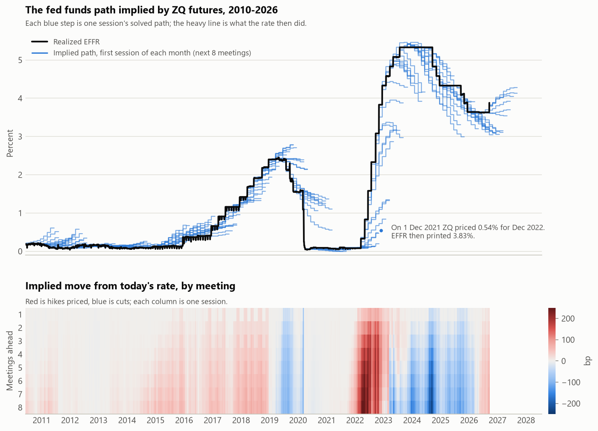
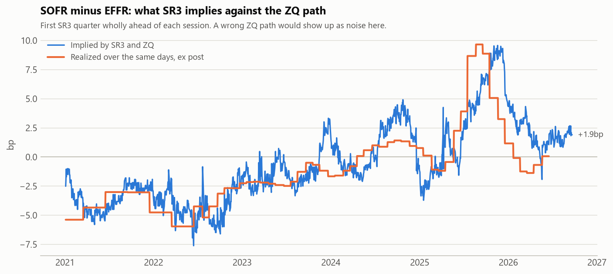

# GlobalPolicyEngine

The finished project measures where markets misprice central-bank policy paths across currencies and trades the gap. What exists today is the first half of the USD leg: the **market** path, bootstrapped out of fed funds futures settlements on every session since 2021, and checked against realized EFFR, a captured CME FedWatch screen and the SOFR futures strip. The model path, the signal and the backtest are not started.

<picture>
  <source media="(prefers-color-scheme: dark)" srcset="reports/figures/implied_paths_USD_dark.png">
  
</picture>

## Status

Working end to end for USD:

- A cache under `data/` that one command rebuilds from nothing: ZQ and SR3 settlements out of a Databento GLBX.MDP3 archive on disk, and EFFR, SOFR and the target range from FRED. Every observation carries a reference date and a publication date, and a revised value is a new vintage, not an overwrite.
- The FOMC meeting calendar, scraped and committed, covering 2020-01-29 through 2027-12-09 (65 meetings, including the two March 2020 inter-meeting cuts) with announcement date, effective date, and a `scheduled` flag.
- A piecewise-constant EFFR path over the next eight meetings on every ZQ session from 2021-01-04 to 2026-09-21: 1,439 sessions, no solver failures, 99.65% of Fed business days. The five missing days are three Good Fridays and two Fridays CME closed for a Saturday holiday; the coverage report lists them.
- A SOFR discount curve bootstrapped in QuantLib from SR3 futures and SOFR fixings, and a cross-check of the ZQ path against SR3 (below).
- `uv run pytest -q` gives 148 passed, 4 skipped.

## Install

Python >=3.11 (developed on 3.13). Dependencies are `pandas`, `pyarrow`, `databento`, `requests`, `pyyaml`, `matplotlib` and `QuantLib`, the last pinned to an exact version because its bindings change signatures between releases. `beautifulsoup4` is dev-only, used by the FOMC scraper, which never runs inside the test suite.

```bash
uv sync
```

The package is src-layout (`src/policypath/`) and is installed editable by `uv sync`, so it is imported as `policypath`, never off `sys.path`.

## Quick start

The test suite runs on committed fixtures and needs neither the network nor the Databento archive:

```bash
uv run pytest -q
```

Rebuilding everything takes two commands. The first needs the archive (paid, gitignored -- see [Data](#data)) and a free FRED key in `.env`. A first build takes about eight minutes; after that it is incremental, and a second run adds nothing:

```bash
uv run --env-file .env python scripts/update_data.py
```

The second reads only the cache. It writes the path panel to `data/panel/`, and the coverage report, the SR3 cross-check and the figures to `reports/`:

```bash
uv run python scripts/build_panel.py
```

One session, solved exactly as the panel solves it:

```bash
uv run python scripts/run_implied_path.py 2024-09-17
```

The macro side needs only the FRED key, not the archive. Pull every ALFRED vintage, then catalogue what each series covers and build the real-time nowcast from the cache (`reports/vintages_USD.md`, `reports/nowcast_USD.md` and its figures):

```bash
uv run --env-file .env python scripts/update_data.py --macro-only
uv run python scripts/catalogue_vintages.py
uv run python scripts/build_nowcast.py
```

One date's nowcast, as it could have been read that evening:

```bash
uv run python scripts/run_nowcast.py 2024-01-20
```

## How the path is solved

`policypath.curves.policy_path.implied_path` takes the implied average rate per contract month (`100 - price`) and the meeting effective dates, and returns the overnight rate in force in each regime between them.

A ZQ contract settles to the arithmetic average of EFFR over every *calendar* day of its delivery month. So each contract month is one linear equation in the regime rates, with coefficients equal to the share of the month's days that each regime covers. The solver builds that weight matrix (months x regimes) and solves all months jointly by least squares.

Mid-month, part of the front contract is already history. Days whose EFFR is published enter the front month's average as known numbers, and the path starts on the first day that is not. On session t that is t itself: the NY Fed publishes t - 1's fixing on the morning of t, and the market settling on t did not know t's own. `calendars.known_daily` turns published fixings into known calendar days, so weekends and Fed holidays carry the last fixing and a Columbus Day session knows only through the Thursday.

Substituting history exposes one weakness. When the next meeting is days away, the rate from today until then lives in a few days of the front contract, and price noise in that contract is multiplied by days-in-month over days-left. On 2024-09-17, two days before the cut took effect, that put today's rate 10bp away from the 5.33% EFFR actually fixing. So a first regime shorter than 10 days is pinned to the last fixing. Across the 46 announcement days since 2021, where the decision is known before ZQ settles, that took the error in the implied step from 5.8bp mean and 34bp worst to 0.5bp and 1.6bp. The more obvious fix, dropping the front contract when it is near expiry, gained nothing once short regimes were pinned, and on its own it only moved the amplification into the next contract. It is off.

## Checking the path against SR3

The SOFR futures strip is an independent market on a different overnight rate. For every session, `curves/basis.py` compounds the ZQ-implied EFFR path over each SR3 reference quarter, using realized SOFR on the days already fixed. It then solves for the constant spread that reprices the SR3 settle: the SOFR - EFFR basis the two markets imply together. A wrong ZQ path would make that spread jump around at random. Instead, for the first SR3 quarter wholly ahead of each session, it moves 0.4-0.7bp a day. It sits within 1.1-1.5bp on average of the basis that later printed over 2021-24, and diverges where funding is known to have moved: the 2025 repo squeeze, which the market priced late and then expected to last.

<picture>
  <source media="(prefers-color-scheme: dark)" srcset="reports/figures/sr3_basis_USD_dark.png">
  
</picture>

One-month SOFR futures (SR1) would allow the identical meeting-by-meeting extraction on SOFR. They are not in the archive; the solver and the cache take them as they are once pulled.

## Data

- **`databento/`** is gitignored and not distributed: it is a paid batch archive, ~705 MB, one definition and one statistics file per day from 2020-12-31 to 2026-09-21 (1,795 days each). Only `sources/rates.py` reads it.
- **`data/`** is gitignored and entirely derived. `data/cache/` holds one parquet vintage log per `(source, currency, series)` plus `manifest.json`, which records the ranges already covered and is what makes `update_data.py` incremental. CME sends a preliminary settle around 16:00 ET and the final that evening, or on the Sunday for a Friday session. Both are kept, so a read at the close sees the preliminary. The panel uses each session's settles as they stood by the end of the next business day, and records when the last one arrived.
- **`reports/`** is generated: `build_panel.py` writes `coverage_USD.md`, `sr3_check_USD.md` and the figures above; `catalogue_vintages.py` writes `vintages_USD.md`; `build_nowcast.py` writes `nowcast_USD.md` and its figures.
- **`tests/data/`** is committed precisely so the suite runs for anyone who clones the repo without that archive. Everything in it is small enough to read in a diff. Regenerate with `uv run --env-file .env python tests/data/build_fixtures.py` (needs the archive and the network).
- **`tests/data/fedwatch/`** holds hand-typed captures of the CME FedWatch tool. FedWatch publishes no history and it is not recoverable after the fact, so this gets filled in going forward rather than backfilled. Each capture stores the futures strip *and* the probabilities from the same screen, so comparing them isolates bootstrap-vs-bootstrap difference from data timing. Rows are laid out exactly as the tool displays them so a capture can be checked against the screenshot cell by cell, and every file opens with a one-line provenance note on line 1 (the readers skip it by position).

## Conventions

Five rules the code is written to and should keep being written to:

1. Every function that touches macro data takes an `as_of`. No "latest values" convenience overloads, no full-sample fits.
2. Network calls live only in `sources/`. Everything else reads from cache or committed fixtures. Observations carry both a reference date and a publication date.
3. Currency-specific behaviour lives in config, not in branches. Branching on the currency inside a module is a bug; adding a currency should need only a config block and a meetings file.
4. `tests/test_policy_path.py` passes on every commit.
5. Reports are generated, never hand-edited.
