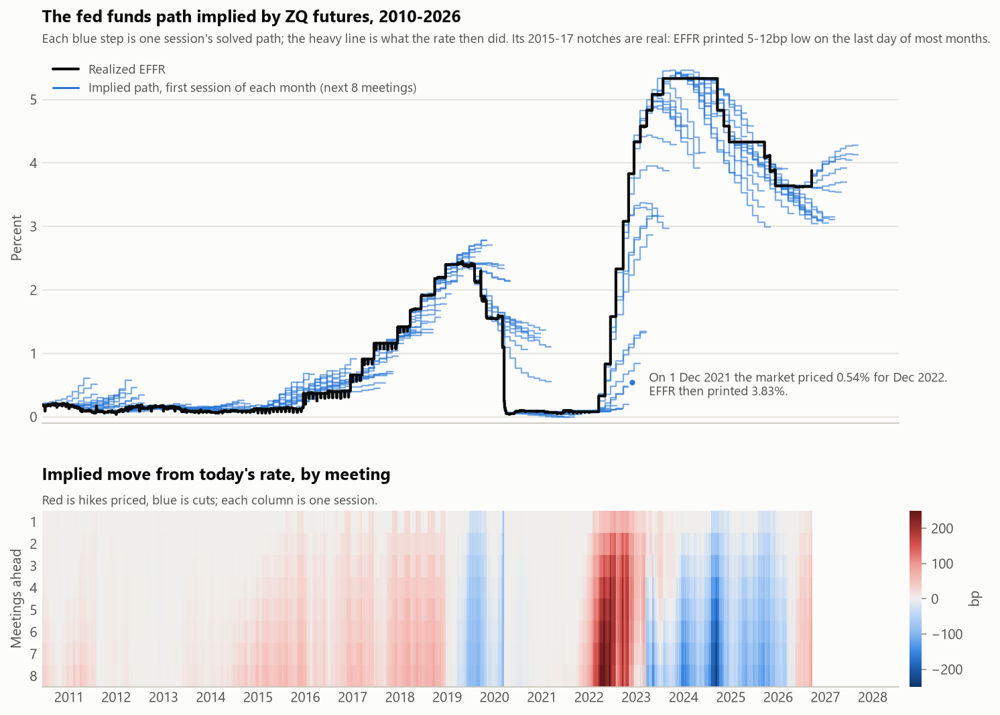
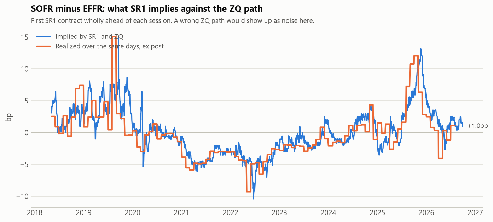
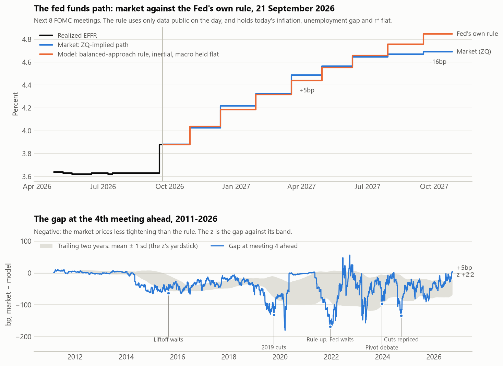
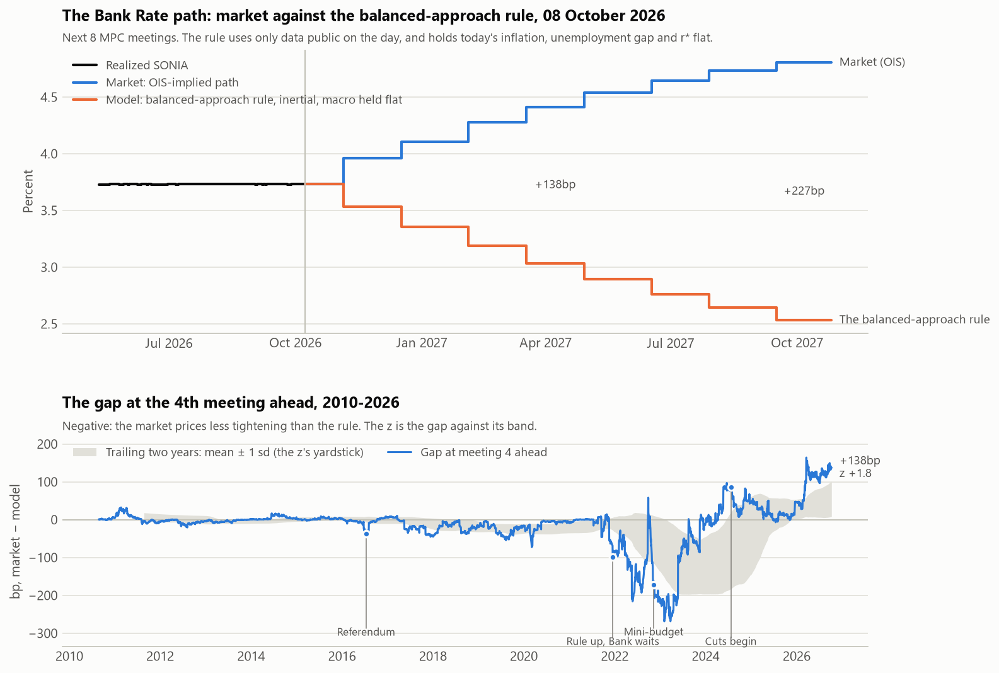
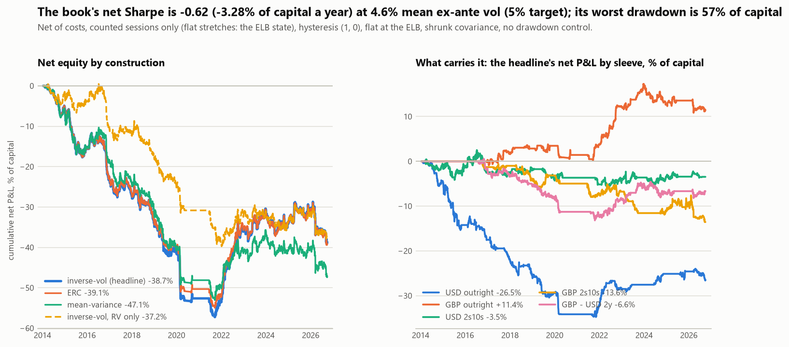

# GlobalPolicyEngine

Does the market price the Fed's own rule? This project measures the policy path the market is pricing against the path a rule the central bank publishes would take, in USD and GBP, and trades the difference. A third currency waits on a data purchase; the reasoning is in [notes/DECISIONS.md](notes/DECISIONS.md) (S1).

The market persistently prices the policy path below the Fed's own rule (applied to UK inputs for GBP), but even with this, the gap is not a tradable signal. Once that gap is standardized (z) it does not forecast rate changes in USD, and points the wrong way there. In GBP the story is different: it does forecast them, but the gains are concentrated in a specific window (2022-2023). The book loses money before costs, and about half of the cost comes from rolls and re-strikes.

**Four findings**

1. **The level.** The market prices the policy path persistently below the Fed's own published rule: in USD, in every one of the 13 years, by 25 to 86bp at the fourth meeting.
2. **The signal.** The gap does not forecast at the book level, and in USD it points the wrong way (IC(21) -0.12), because the Fed moves toward the market, not the reverse.
3. **The carry filter.** A carry filter that skips entries whose expected quarter, carry and roll included, is below zero would improve the Sharpe ratio by 0.10 (paired SE 0.05); the book still loses (-0.51), and the filter is off in the headline.
4. **The costs.** Maintenance (rolls and re-strikes) is 46% of the cost; rolls alone, which are forced by trading the fourth meeting ahead, are 33%.

**The headline numbers**

| Net Sharpe ratio | Net return | Worst drawdown | Costs per year | GBP outright net Sharpe | Sample |
| --- | --- | --- | --- | --- | --- |
| -0.60 (SE 0.32; gross -0.14) | -3.19% of capital a year | 57.5%, April 2014 - September 2021 | 2.47%, 46% of it maintenance | +0.50; +0.04 excluding 2022-2023 | 2,978 sessions, 104 trades, 13 Jan 2014 - 1 Oct 2026 |

<picture>
  <source media="(prefers-color-scheme: dark)" srcset="reports/figures/implied_paths_USD_dark.png">
  
</picture>

## Why this question

The market's implied path is measured against a path created from one of the rules the Fed publishes in its Monetary Policy Report. The reference is the Fed's own published rule, so there are no free parameters to tune and it is auditable. The Bank of England publishes no such rule, so for GBP the same rule is applied to UK inputs.

There is significant value in testing a rule of this nature. If the market ignored a rule the Fed itself publishes, that would say something about how much the rule guides policy. The answer runs the other way: the gap closes because the Fed moves toward the market.

The measurement, for each currency, is the implied path the market was pricing against what the rule says. The difference is taken at the fourth meeting ahead for each central bank and z-scored on a trailing two-year window, after a year of history. The z is scored by its rank IC against the policy-rate change over the next h sessions (5, 21, 63), outside the ELB (effective lower bound).

| Term | Definition |
| --- | --- |
| USD r* | SEP (Summary of Economic Projections) longer-run median; Taylor's 2% before the first SEP (226 sessions) |
| GBP r* | Constant -1.6%, the average real Bank Rate from 2009-2026. A hindsight number. It moves the bp gap and mostly leaves z unchanged, except near the floor |
| z | The gap (market minus rule) at the fourth meeting ahead, standardized against its trailing two-year window after one year of history |
| IC | Rank correlation of z with the rate change over the next h sessions (5, 21, 63), outside the ELB state |
| ELB state | Policy rate and rule both at the floor; the book is flat there |
| Hysteresis rule | Enter at \|z\| >= 1, exit at 0; fixed before results |
| Book construction | Inverse-vol weights, shrunk covariance, 5% vol target on the whole book, no drawdown control |
| DV01 | Dollar value of a 1 basis point move |
| Sleeve | One traded expression of the signal, e.g. the USD outright |

## Status

Working end to end for USD and GBP:

- A cache under `data/` that one command rebuilds from nothing: ZQ, SR1 and SR3 settlements out of a Databento GLBX.MDP3 archive on disk, and EFFR, SOFR and the target range from FRED. Every observation carries a reference date and a publication date, and a revised value is a new vintage, not an overwrite. A revision the source can't date, and no longer serves once replaced, exists only in this cache, so `scripts/backup_cache.py` snapshots it after each update.
- The FOMC meeting calendar, scraped and committed, with announcements from 2010-01-27 through 2027-12-08 (146 meetings). Each has an announcement date, an effective date, a `scheduled` flag and, for the 17-18 March 2020 meeting the Fed brought forward to the Sunday, the day it was called off. Each session sees the calendar as it stood that day: the two March 2020 emergency cuts are pillars only from their announcement, and the meeting they replaced is one until it was cancelled.
- A piecewise-constant EFFR path over the next eight meetings on every ZQ session from 2010-06-07 to 2026-10-01: 4,118 sessions, no solver failures, 99.68% of Fed business days. The 13 missing days are Good Fridays, Fridays CME closed for a Saturday holiday, and two days (2020-02-27, 2020-06-30) Databento flags as degraded, with no ZQ settle in the archive. The coverage report lists them.
- A SOFR discount curve bootstrapped in QuantLib from SR3 futures and SOFR fixings, and a cross-check of the ZQ path against SR1 (below).
- A real-time macro nowcast on every Fed business day from 2011-03-04, the first day every input has an ALFRED vintage (CBO's natural rate from 2011-02-02, average hourly earnings from 2011-03-04).
- A model path on each of the 3,929 sessions since then: the Fed's balanced-approach rule from the Monetary Policy Report, in its inertial form, fed by that day's nowcast, with r* from the FOMC's longer-run dot and an explicit floor at the lower bound. The gap between the two paths, per meeting and z-scored on its trailing two years.
- GBP through the same interface (below): the Bank of England's fitted OIS curve on every London business day from 2009-08-03 (4,336 sessions, no failures), a real-time UK nowcast from the ONS's own revisions triangles from 2010-08-26, and the same rule. The GBP path lands on the Bank's own MPR conditioning paths to 1.00bp on average over 29 reports.
- Every currency-specific value in `config/currencies.yml`, validated against a schema when it loads, and a test that fails if a shared module names a currency in code. Adding a currency is a config block, a meetings file, and a source module only if its data comes from a new provider.
- A regression harness (`scripts/regress.py`) that freezes every stage's output and checks it bit for bit. Both currencies' full samples are identical to week 5 after the week 6 refactor, and again after weeks 7-12. The look-ahead tests run per currency.
- Five sleeves that trade the gap (below): the USD and GBP outrights at the fourth meeting, USD and GBP 2s10s on an orthogonalised slope, and the GBP - USD 2y differential. Each has real instruments (ZQ contracts, OIS forwards, par Treasuries and gilts), carry and roll with three independent checks on the P&L, and a breakeven that says, at the close, whether a signal pays for its bleed.
- Costs, turnover and a hysteresis rule for every sleeve, with a stated treatment of the lower bound. Then one book, all five sleeves sized together under a shrunk covariance and a 5% vol target, and a robustness grid that moves one choice at a time off the chosen specification.
- A credit bridge for USD: three tests of the gap against Baa - Aaa and four other spreads, with the predictive test's sign registered before the first run.
- A weekly one-page brief, generated from cache: both currencies' paths, the gaps, the GBP - USD differential, each sleeve's trade with its carry and roll, and what changed since last week and why.
- Attribution and a one-page tear sheet, from one command: the book's P&L by component, by level factor, as carry against rate and by regime; the lower bound's treatment against its two alternatives; the IC at a week, a month and a quarter; and every number again without 2022 (`metrics.ex_2022`). 63% of the variance of the daily gross P&L is the exposure to the front end, so the book is closer to a duration timer than it is to a relative value trade; without 2022 the net Sharpe ratio falls to -0.98.
- Every choice so far, with its date and reason, in [notes/DECISIONS.md](notes/DECISIONS.md). The ones left to the author are marked *proposed* and listed in [notes/author_review.md](notes/author_review.md).
- `uv run pytest -q` runs the full suite on committed fixtures, and passes on both the Mac and Windows. The committed fixture reference, frozen on the Mac, is checked to `regress.PLATFORM_ULPS` rather than bit for bit, so the last-bit floating-point differences between machines pass; see notes/DECISIONS.md (A18).

Not built yet: the generated limitations section and final hygiene pass (week 13).

## Install

Python >=3.12 (developed on 3.13; the code uses 3.12 f-string syntax). Dependencies are `pandas`, `pyarrow`, `databento`, `requests`, `pyyaml`, `matplotlib`, `openpyxl` and `QuantLib`, the last pinned to an exact version because its bindings change signatures between releases. `beautifulsoup4` is dev-only, used by the FOMC scraper, which never runs inside the test suite.

```bash
uv sync
```

The package is src-layout (`src/policypath/`) and is installed editable by `uv sync`, so it is imported as `policypath`, never off `sys.path`.

## Quick start

The test suite runs on committed fixtures and needs neither the network nor the Databento archive:

```bash
uv run pytest -q
```

Every report below is one command. It first brings the cache up to date for every enabled currency, then stops unless each currency's market data was pulled the same day, so no report is cut at an older date for one currency than another. Then it builds in the order listed. `--cache-only` builds from the cache as it is (the check still runs), and `--from <script>` resumes at a step:

```bash
uv run all
```

Step by step, rebuilding everything takes two commands. The first updates every enabled currency (`--ccy` names fewer) and needs the archive (paid, gitignored -- see [Data](#data)) and a free FRED key in `.env`. A first build takes about thirteen minutes; after that it is incremental, and a second run adds nothing:

```bash
uv run --env-file .env python scripts/update_data.py
```

The second reads only the cache. It writes the path panel to `data/panel/`, and the coverage report, the SR1 cross-check and the figures to `reports/`:

```bash
uv run python scripts/build_panel.py
```

One session, solved exactly as the panel solves it:

```bash
uv run python scripts/run_implied_path.py 2024-09-17
```

The macro side needs only the FRED key, not the archive. Pull every ALFRED vintage, then catalogue what each series covers and build the real-time nowcast from the cache (`reports/vintages_USD.md`, `reports/nowcast_USD.md` and its figures):

```bash
uv run --env-file .env python scripts/update_data.py --macro-only
uv run python scripts/catalogue_vintages.py
uv run python scripts/build_nowcast.py
```

One date's nowcast, as it could have been read that evening:

```bash
uv run python scripts/run_nowcast.py 2024-01-20
```

With the panel and the nowcast built, one more command writes the model path, the gap signal, the backtest, `reports/model_USD.md`, its figures and the dated one-page note `reports/onepager_USD_<session>.pdf`. Another prints one session's market and model paths side by side:

```bash
uv run python scripts/build_model.py
uv run python scripts/run_model_path.py 2021-11-01
```

GBP needs no archive, but its update needs the FRED key too, for the dollar-sterling rate (DEXUSUK). Pull the Bank of England's curves, SONIA and Bank Rate and the ONS vintages, then build the panel, the nowcast and the model, and check the path against the Bank's MPR conditioning paths:

```bash
uv run --env-file .env python scripts/update_data.py --ccy GBP
uv run python scripts/build_panel.py --ccy GBP
uv run python scripts/build_nowcast.py --ccy GBP
uv run python scripts/build_model.py --ccy GBP
uv run python scripts/check_mpr.py
```

With both currencies' panels, nowcasts and models built, the strategy layer reads only `data/panel/` and the cache. The expression and carry come first, since the brief's trades table reads them. Then the credit bridge:

```bash
uv run python scripts/build_expression.py
uv run python scripts/build_credit.py
```

The weekly brief, for every currency in `config/brief.yml`, one page to `reports/brief_<date>.pdf`. `--date` gives the brief that could have been sent on a past day:

```bash
uv run python scripts/build_brief.py
```

Costs and the hysteresis grid, per sleeve (`reports/costs.md`):

```bash
uv run python scripts/build_strategy.py
```

The book, then the robustness grid. The grid stops unless its baseline equals the book's headline in `reports/results/portfolio.json`, so the book goes first. A first grid build rebuilds every row's signal (about 100s); after that it reuses the ones whose inputs have not changed, and `--rows` rebuilds only the rows it names:

```bash
uv run python scripts/build_portfolio.py
uv run python scripts/build_robustness.py
```

The tear sheet, one page to `reports/tearsheet_<last session>.pdf`, with the attribution behind it in `reports/metrics.md` and `reports/results/metrics.json`. It runs the book in memory from the panels and the cache (about 10s), so it needs none of the reports above:

```bash
uv run python scripts/build_tearsheet.py
```

The numbers sheet, last: every number the note quotes, read from the reports above and their JSON, each linked to the report line that prints it, in `reports/numbers.md`. It needs no data and stops if a report no longer prints a number its JSON holds. The test suite fails while the committed sheet is behind the reports, so rerun it after any build above:

```bash
uv run python scripts/build_numbers.py
```

Before changing anything that computes, freeze every stage's output over the full sample, then check after each change. A check stops at the last session the freeze covered, so an updated cache compares like for like. It exits non-zero on any difference, however small. The committed fixtures have their own reference, which the test suite checks:

```bash
uv run python scripts/regress.py freeze
```

```bash
uv run python scripts/regress.py check
```

## USD: the path from Fed Funds futures

`policypath.curves.policy_path.implied_path` takes the implied average rate per contract month (`100 - price`) and the meeting effective dates, and returns the overnight rate in force in each regime between them.

Each ZQ contract (CME 30-Day Fed Funds futures) settles to the arithmetic average of EFFR over every calendar day of its delivery month. Due to this, each contract month is one linear equation in the regime rates, each weighted by its share of the month's days. A regime spans several contract months, and each month mixes several regimes, so they must be solved together to ensure consistency: the solver builds that weight matrix (months x regimes) and solves all months jointly by least squares.

However, an issue arises in how information is captured by these contracts. Mid-month, part of the contract is already history. To reflect this, days whose EFFR (Effective Fed Funds Rate) is published enter as known numbers. On session t that is every day before t: the NY Fed publishes t - 1's fixing on the morning of t, and the market settling on t did not know t's own. `calendars.known_daily` turns published fixings into known calendar days, so weekends and Fed holidays carry the last fixing.

This process of substituting in known days creates an additional challenge. When the next meeting is days away, the rate from today until then lives in a few days of the front contract, and price noise in that contract is multiplied by days-in-month over days-left. To address this, a first regime shorter than 10 days is pinned to the last fixing. Measured against the actual decision on 46 announcement days since 2021, the error in the implied steps fell sharply, from 5.8bp mean and 34bp worst to 0.5bp and 1.6bp. Dropping the front contract near expiry gained nothing once short regimes were pinned, and it is off.

## Checking the path against SR1

To check the result, it is compared with SR1 (CME One-Month SOFR futures), an independent market on a different overnight rate that settles on SOFR exactly as ZQ settles on EFFR. For each session `curves/basis.py` averages the ZQ-implied EFFR path over each SR1 contract month and solves for the constant spread that reprices the SR1 settle: the SOFR - EFFR basis the two markets imply together. That is then compared with the basis later realized. Over 2,116 sessions it misses by +0.52bp on average, 1.86bp in absolute terms, and is within 3bp on 80% of them. Two independent markets agree to within about 2bp, so the ZQ path is not an artefact of the solver.

The same code runs on SR3 by setting `sofr.crosscheck` in `config/currencies.yml`; SR3 stays what the SOFR discount curve is built from, since SR1 lists only about 13 months out.

<picture>
  <source media="(prefers-color-scheme: dark)" srcset="reports/figures/sofr_basis_USD_dark.png">
  
</picture>

## GBP: the path from the Bank of England's OIS curve

There is no ZQ outside the US. For GBP, the Bank of England publishes a fitted OIS (overnight index swap) spot curve, continuously compounded, at monthly maturities out to five years. Its log discount factors are interpolated, and the expected rate between two meetings is the forward over that window. Today until the first meeting is pinned to the rate in force: the last SONIA fixing, moved by any Bank Rate change since. `market.path(date, ccy)` returns the same object for both currencies, from the backend the config names.

This is validated against the MPR (Monetary Policy Report) conditioning path. The GBP path is a step function that moves on each meeting's effective date. The Bank of England averages its smooth instantaneous forward curve, which prices a move before the meeting. In a quarter with a hike priced the Bank's average ends higher, and with a cut, lower: the differences correlate -0.59 with the move priced inside the quarter. Across 29 reports covering 87 quarters, the mean absolute difference is 1.00bp, the mean signed difference -0.46bp, and the worst 7.2bp. This leaves a known definitional difference, not an error.

## The rule and r*

`model/` puts a second path next to the market's on every session. One of the rules the Fed publishes in its Monetary Policy Report is the balanced-approach rule, a variant of the Taylor rule. It carries a 2 on the unemployment gap, double the Taylor rule's, and is symmetric:

R* = r* + π + 0.5(π - 2) + 2(u* - u)

R_k = 0.922 R_(k-1) + 0.078 max(ELB, R*), with R_0 the rate in force.

The MPR's inertial rule uses 0.85 per quarter, the weight on the last period's rate: 0.922 per meeting (sqrt(0.85)). Today's inputs are held flat across the path, so the model asks: if nothing changes, where does the rule take policy? The rule's notional rate is floored at the lower bound in a named step, and the unfloored value is kept, so the 977 USD sessions where the rule asks for a negative rate stay visible.

Each input is what was published on the day. π is the 12-month core PCE, bridged from CPI for months PCE hasn't printed yet; the bridge has an RMSE of 0.075pp against PCE's first print over 185 months. u* is CBO's estimate as vintaged on that day, from ALFRED. `tests/test_no_lookahead.py` reruns the whole chain cut off on day D, then appends deliberately corrupted data after D and checks that nothing on or before D moves.

For GBP the inputs are headline CPI (12-month), LFS unemployment as first printed, and constants for u* (4.5%) and r* (-1.6%). It is headline CPI and not core because headline is what the MPC targets.

USD r* comes from the SEP. Each SEP is a dated document that is never revised, so it is real time without any vintage machinery. This isn't the same for GBP, which uses a constant -1.6%, the average real Bank Rate. Both are tested in the robustness grid, using HLW (Holston-Laubach-Williams r*) in real time for USD (book net Sharpe ratio -0.52) and constants ±1pp for GBP (-0.58 and -0.63).

<picture>
  <source media="(prefers-color-scheme: dark)" srcset="reports/figures/model_vs_market_USD_dark.png">
  
</picture>

## The level

The market trades persistently below the rule. For USD, that is 13 out of 13 years outside the ELB, by -25bp to -86bp. By regime it is -37bp hiking, -53bp on hold and -62bp cutting. In effect, this matches the pattern of the market pricing below the FOMC's dots.

The gaps are larger for GBP (-122 to +102bp). It isn't persistent; it depends on the regime: -81bp while hiking, +28bp while cutting. It sat below the rule in 8 of 11 years, then above from 2024 (+36, +19, +102bp). With a fixed r*, the post-2024 flip is as consistent with r* being wrong as with the market repricing, and this measurement can't separate them.

The UK labour data is the weak input, and the brief says so rather than smoothing it. The LFS was suspended from October 2023 to January 2024, and the last official vintage is held through the suspension.

<picture>
  <source media="(prefers-color-scheme: dark)" srcset="reports/figures/model_vs_market_GBP_dark.png">
  
</picture>

## The signal and the null

The USD gap has no forecasting value and instead points the wrong way: the USD outright's IC(21) is -0.12 across 2,930 sessions. The results for GBP are strong, with the GBP outright at +0.38 across 2,273 sessions (t 4.7). The three curve and cross sleeves are small (|t| <= 1.6). Outside the GBP outright, nothing here rejects the null.

| Sleeve | IC(5) | IC(21) | IC(63) | Sessions (21) | Non-overlapping IC(21) |
| --- | --- | --- | --- | --- | --- |
| USD outright | -0.059 (-1.7) | -0.116 (-1.7) | -0.185 (-1.5) | 2,930 | -0.115 [-0.18, -0.06] |
| GBP outright | +0.203 (+4.7) | +0.380 (+4.7) | +0.505 (+4.1) | 2,273 | +0.378 [+0.32, +0.43] |
| USD 2s10s | +0.055 (+1.6) | +0.088 (+1.3) | +0.167 (+1.4) | 2,930 | +0.088 [+0.02, +0.17] |
| GBP 2s10s | -0.001 (-0.0) | +0.043 (+0.6) | +0.029 (+0.3) | 2,273 | +0.043 [-0.05, +0.13] |
| GBP - USD 2y | -0.015 (-0.4) | -0.035 (-0.4) | -0.036 (-0.3) | 2,195 | -0.033 [-0.11, +0.01] |

*Newey-West t in parentheses; the non-overlapping range in brackets.*

The t is Newey-West to lag h, but z is persistent, so the products of z and the rate change stay autocorrelated past h, and t overstates the precision. The non-overlapping check gives GBP +0.32 to +0.43, clear of zero, and USD -0.18 to -0.06.

The interpretation is that the market leads the Fed. A negative IC means that when the market sits below the rule, the rule falls toward the market over the following weeks, because the Fed's rate moves; the market doesn't rise toward the rule. The dots move toward the market too (+0.68 per bp of gap over 63 sessions, t +4.7, against +0.09, t +0.5, the other way). The gap carries no usable information at the book level; the GBP outright is the one exception, and it is not claimed as a tradable signal (below).

## From a gap to a trade: carry and roll

`strategy/` turns each signal into positions in instruments you could hold. A unit is +1 USD of DV01 on the sleeve's first leg; positive means receive. z > 0 always means the market prices more tightening than its reference, so the sleeve receives. The USD outright holds the ZQ month that the fourth meeting's regime settles in, with its DV01 derived from the contract spec, never typed in code. The GBP outright holds the OIS forward over that regime. The curve and cross sleeves hold par Treasuries and gilts, struck at each close. Every leg's P&L splits into carry, roll and the rate's move. Three checks guard it: the split must add up on every session; an independent full revaluation from each instrument's own price must land inside a bound set by convexity; and synthetic convergence tests pin the direction. The build refuses to write the report if any of the three fails.

**A correct signal can still be a losing trade** (`reports/expression.md`). Of the 3,938 signal sessions whose next quarter went the signal's way on the rate, 19% still lost money once carry and roll were counted. Carry and roll ran against 53% of the signals, and those signals didn't earn less. "Right but bleeding" best applies to the GBP outright and the USD 2s10s. Others, such as the USD outright and the GBP 2s10s, are wrong and bleeding. The GBP - USD 2y collected carry but was wrong on the rate.

<picture>
  <source media="(prefers-color-scheme: dark)" srcset="reports/figures/carry_dark.png">
  
</picture>

## Costs, rolls and breakeven

Every sleeve runs under a hysteresis rule: it enters at |z| >= 1 and exits when z crosses zero. The pair was fixed in config before any grid ran. The book stays flat while the policy rate and the rule are both at the lower bound, because the model has no view there. Costs are charged on every change in DV01, on every roll into a new futures month or forward window, and on each quarterly re-strike of a par leg. ZQ is costed at two back-month ticks plus the fee, 1.048bp a round trip. That is a tick, not a measured spread: there is no bid-offer data, as the archive holds settles, not quotes. Every other leg's cost is assumed (0.5bp for Treasuries, 1bp for gilts and the OIS forward), since those legs are valued off fitted curves.

Turnover explains the costs exactly: 19.8 turns a year × 284k per bp of mean gross DV01 × 0.44bp one way = 2.47% of capital a year, the cost charged. Maintenance is 46% of the cost. Rolls alone are 33%, and they are forced: each outright trades the fourth meeting ahead, so every time a meeting passes the position moves to a new contract. The par legs are also re-struck every quarter (13%).

Gross is already -0.72% a year, so no cost treatment makes the book pay. Even charging rolls at half price, which saves 0.4% (-3.19% to -2.78%), does not change the outcome. There is no breakeven for the portfolio. To net zero, the rate calls must pay the costs less carry and roll: they earned +1.36% a year against +4.55% needed, 3.3 times short. Only the GBP outright clears: its position has a correlation of +0.036 with the daily rate move, against a needed +0.022.

## The book

`strategy/portfolio.py` sizes the five sleeves together. The covariance is an EWMA of the sleeves' unit P&L (lambda 0.97), with a Newey-West lag term for London closing before New York, shrunk toward its diagonal. The headline construction is inverse-vol, marked *proposed* for the author. It targets 5% ex-ante vol on USD 100m, with gross DV01 capped at 0.4% of capital per bp. Risk parity (ERC) and mean-variance run beside it. Books that share most of their positions are compared by the paired SE of the difference, not by either Sharpe's own SE.

The book's Sharpe ratio is -0.14 gross and -0.60 net (SE 0.32): -3.19% of capital a year (`reports/portfolio.md`). The worst drawdown, 57.5% from April 2014 to September 2021, is more reflective of a grind than of a break: the worst 21-session loss is only 10.8%. The losses are concentrated in the USD outright, which accounts for -25.9% cumulative. ERC (-0.62) and mean-variance (-0.75) differ from the headline by less than two paired SEs.

| Sleeve | Gross SR | Net SR | Net a year | Ex-2022 | Ex-2022-23 |
| --- | --- | --- | --- | --- | --- |
| **Book** | **-0.14 (0.29)** | **-0.60 (0.32)** | **-3.19%** | **-0.98 (0.37)** | **-1.11 (0.40)** |
| USD outright | -0.50 (0.31) | -0.88 (0.34) | -2.19% | -1.09 (0.38) | -1.23 (0.42) |
| GBP outright | +0.73 (0.33) | +0.50 (0.31) | +0.99% | +0.15 (0.31) | +0.04 (0.32) |
| USD 2s10s | +0.01 (0.29) | -0.12 (0.29) | -0.29% | -0.15 (0.31) | -0.19 (0.32) |
| GBP 2s10s | -0.36 (0.30) | -0.62 (0.32) | -1.15% | -0.73 (0.34) | -0.58 (0.34) |
| GBP - USD 2y | -0.15 (0.29) | -0.27 (0.30) | -0.54% | -0.48 (0.32) | -0.62 (0.34) |

The GBP outright is the only sleeve that earns, and it earns in one window: a net Sharpe ratio of +1.76 (SE 0.87) while hiking, on 4 trades; excluding 2022-2023 it nets +0.04. Its success depends on this window, a hindsight r* constant, and is sensitive to the coefficients (+0.67 to +0.13).

63% of the variance of the daily gross P&L is the exposure to the front end, so the book is closer to a duration timer than it is to a relative value trade. The risk is the level's; the loss is the rest's.

<picture>
  <source media="(prefers-color-scheme: dark)" srcset="reports/figures/book_equity_dark.png">
  
</picture>

Nothing was re-tuned in response. The hysteresis pair was set in config before the grid ran, and the ELB treatment and construction were fixed before the results.

## Carry filter

The carry filter was specified in advance as a diagnostic. At each entry it asks whether the expected quarter (the share of the gap that has historically closed, plus carry and roll on the rest) is below zero, and skips the entry if so. It skips 16 of 104 entries (15%). That lifts the book's net Sharpe ratio from -0.61 to -0.51 on the common sample, +0.10 with a paired SE of 0.05. The effect is statistically real, about two paired SEs, and economically irrelevant. The book still loses, and the filter stays off in the headline.

## Robustness

`strategy/robustness.py` moves one choice at a time off the chosen specification and rebuilds the signal through the chain's own entry points. The 13 rows cover r* (HLW in real time, constants), estimated rule coefficients, the z window, NSS curve fitting for GBP, converge-to-target conditioning, the raw slope, and the carry filter. The marks, instruments, costs and covariance stay the baseline's, and a check on every row confirms it. Every row counts the same 2,874 sessions.

No single choice turns the loss into a gain: across the 13 rows the net Sharpe ratio runs from -0.70 to -0.29 (`reports/robustness.md`). The aggregate hides the sleeve: the GBP outright, the one sleeve that earns in every row, falls from +0.67 to +0.13-0.15 under estimated coefficients. The chosen specification was fixed in config before the grid ran, so it is the reference, not a cell picked from it.

## The credit bridge

`credit.py` asks whether the policy-path gap says anything about USD credit. The primary spread is Moody's Baa - Aaa, which is maturity-matched. Baa against the 30y and 10y Treasury and ICE BofA's IG and HY OAS run alongside. Spread changes stand in for excess returns. The expected sign of the predictive test, and the rule it has to pass, were registered before the first run (D1).

The results (`reports/credit_USD.md`). Contemporaneously, a repricing of the policy path explains 0.3% of the weekly variation in Baa - Aaa. Predictively, a unit of z at the fourth meeting comes before Baa - Aaa narrowing 2.2bp over the next quarter, NW t -2.09. That passes the registered rule, but only just. It fails under Hansen-Hodrick weights (-1.72) or Bartlett at lag 126, and without 7 of the 15 years. A time-rotation placebo puts it at the edge of chance, and the report says so. The conditional test (early against late hiking) has the hypothesised sign in one cycle and not the other, well under its minimum detectable difference.

## What would change my view

- The GBP outright holding up outside 2022-2023
- Quote-based ZQ costs, or calendar-spread roll pricing, that turn GBP net clearly positive
- A sign-flipped USD trade, betting that the market leads the Fed, that earns out of sample, registered before it is judged
- A more harmonized r* across currencies
- A calendar-anchored signal, which would remove the forced roll
- More currencies, such as EUR or AUD

## Limitations

- GBP r* is a hindsight constant (-1.6%, the 2009-26 average real Bank Rate)
- GBP u* is a constant 4.5%, not a real-time estimate
- UK labour data: the LFS was suspended from October 2023 to January 2024
- The first z's after lift-off are standardized against a window that is mostly ELB sessions
- There is no bid-offer data; ZQ's cost is its tick
- Settlements may be preliminary
- Only two currencies so far, and two hiking cycles
- Overlapping windows inflate t-stats

## Data

- **`databento/`** is gitignored and not distributed: it is a paid batch archive, ~1.2 GB, one definition and one statistics file per day per Databento batch job. Six jobs cover ZQ from 2010-06-06 to 2026-09-21, SR3 from 2020-12-31 to 2026-09-21, and SR1 from 2010-06-06 to 2026-09-24 (it first listed in 2018). Every job names its daily files the same way, so each is kept in its own folder, `databento/<definitions|statistics>/<job_id>/`, with its manifest, metadata and condition files. Download a new job straight into `databento/definitions/` or `databento/statistics/`, then run `uv run python scripts/file_databento.py`. It files every file under its job by the sha256 in the job's manifest, so the ` (2)` copies a browser makes of colliding names do not matter, and it checks every job is complete. `sources/archive.py` knows which job holds which root, and only `sources/` reads the archive. The days after the last job come from Databento's historical API when `DATABENTO_API_KEY` is set (`--archive-only` skips it). It asks for the same dataset, schema and parent symbols, so the records are the batch job's, with the same receive times. Each request is priced first and the update is capped at `rates.LIVE_BUDGET_USD`; a day of all three roots is about a cent (notes/DECISIONS.md, E14-E15).
- **`data/`** is gitignored and entirely derived. `data/cache/` holds one parquet vintage log per `(source, currency, series)` plus `manifest.json`, which records the ranges already covered and is what makes `update_data.py` incremental. CME sends a preliminary settle around 16:00 ET and the final that evening, or on the Sunday for a Friday session. Both are kept, so a read at the close sees the preliminary. The panel uses each session's settles as they stood by the end of the next business day, and records when the last one arrived.
- **FRED** (free key) supplies the rest of the USD side: EFFR, SOFR and the target range, ALFRED vintages for the macro inputs, H.15 Treasury par yields for the Treasury legs, Moody's Baa and Aaa for credit, and DEXUSUK for sterling. ICE BofA's OAS series are on FRED only for the last three years (from 2023-09-29 as the cache stands), so they are a short cross-check, never the headline.
- **Bank of England and ONS** data need no key: `sources/boe.py` (IADB series, the OIS curve archive, the nominal gilt curve for the gilt legs) and `sources/ons.py` (revisions triangles, the release calendar). The MPC calendar is scraped by `sources/pull_mpc.py` into the committed `config/meetings/mpc.csv`. `tests/data/boe/conditioning_paths.csv` is ground truth taken once from the Bank's Projections Databank.
- **`data/reference/`** is gitignored too: the full-sample outputs `scripts/regress.py freeze` wrote, one folder per currency, with a `meta.json` saying what code and which sessions they cover.
- **`reports/`** is generated: `build_panel.py` writes `coverage_USD.md`, `sofr_check_USD.md` and the figures above; `catalogue_vintages.py` writes `vintages_USD.md`; `build_nowcast.py` writes `nowcast_USD.md` and its figures; `build_model.py` writes `model_USD.md`, the model figures and the one-pager; `build_expression.py`, `build_strategy.py`, `build_portfolio.py`, `build_robustness.py` and `build_credit.py` write `expression.md`, `costs.md`, `portfolio.md`, `robustness.md` and `credit_USD.md`, their figures, and the numbers behind them as JSON in `reports/results/`, which later stages (the robustness grid's baseline check, the note) read instead of re-deriving.
- **`tests/data/`** is committed precisely so the suite runs for anyone who clones the repo without that archive. Everything in it is small enough to read in a diff. That includes a handful of single-day ZQ, SR1 and SR3 settlement strips from CME, taken from the licensed archive; everything added since week 7 is synthetic. To rebuild the full sample you need your own Databento licence for GLBX.MDP3. Regenerate with `uv run --env-file .env python tests/data/build_fixtures.py` (needs the archive and the network; `--market-only` leaves the ALFRED fixtures as they are).
- **`tests/data/fedwatch/`** holds hand-typed captures of the CME FedWatch tool. FedWatch publishes no history and it is not recoverable after the fact, so this gets filled in going forward rather than backfilled. Each capture stores the futures strip *and* the probabilities from the same screen, so comparing them isolates bootstrap-vs-bootstrap difference from data timing. Rows are laid out exactly as the tool displays them so a capture can be checked against the screenshot cell by cell, and every file opens with a one-line provenance note on line 1 (the readers skip it by position).

## Conventions

Five rules the code is written to and should keep being written to:

1. Every function that touches macro data takes an `as_of`. No "latest values" convenience overloads, no full-sample fits.
2. Network calls live only in `sources/`. Everything else reads from cache or committed fixtures. Observations carry both a reference date and a publication date.
3. Currency-specific behaviour lives in config, not in branches. Branching on the currency inside a module is a bug, and `tests/test_no_currency_branches.py` fails on one. Adding a currency should need only a config block (the schema in `config.py` says what is missing), a meetings file, and a source module if its data comes from a new provider.
4. The test suite passes on every commit, and `scripts/regress.py check` is identical after every refactor. A change that moves a number is a decision: it gets a row in `notes/DECISIONS.md` before the reference is refrozen.
5. Reports are generated, never hand-edited.
