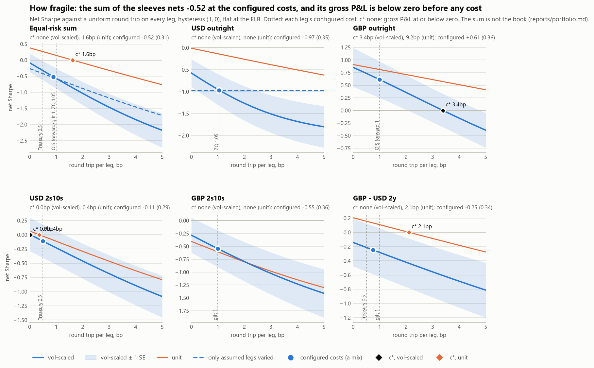
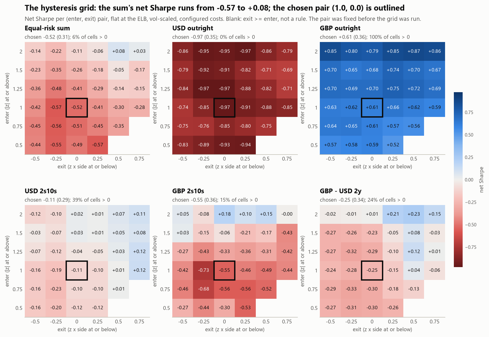

# Costs, turnover and hysteresis: what the signal is worth net, and how fragile that is

Generated by `scripts/build_strategy.py` from `data/panel/` and the cache, sessions 2011-08-26 .. 2026-10-09. Do not edit by hand. The rules are in `strategy/positions.py`, the costs in `strategy/costs.py`, sigma in `strategy/risk.py`, Sharpe and its SE in `backtest/metrics.py`; every choice is a row in notes/DECISIONS.md, section K (costs).

## The answer

**In one line: fragile.** The sum of the sleeves loses money net of costs, its sign turns on the sizing (-0.52 vol-scaled, +0.19 unit), the unit-sized gain is 2022 and 2023's, the halves disagree (-1.45 to Dec 2019, +0.24 after) and the one sleeve that clears its costs (GBP outright) does so on an assumed cost.

- **Net of costs, the sum of the sleeves loses money.** The equal-risk sum (hysteresis (1, 0), flat at the ELB, vol-scaled) has a gross Sharpe of -0.08 (0.29) and a net one of -0.52 (0.31) at the configured costs (SE in brackets; 2,898 of the 2,984 sessions counted have a position): the gross Sharpe is already at or below zero, and costs only deepen it. The configured costs are a mix, 0.90bp a round trip per leg traded on average. Unit-sized (the equal-DV01 sum), +0.38 (0.30) gross and +0.19 (0.29) net: costs roughly halve it. The sum's own breakeven is none (gross <= 0) vol-scaled and 1.62bp unit-sized.
- **1 of the 5 sleeves clears its costs** (vol-scaled breakeven c* = 2 x gross P&L / DV01 traded, against each sleeve's configured round trip). GBP outright: c* 3.39bp, 3.4 times its configured 1.00bp; USD 2s10s: c* 0.03bp, below its configured 0.50bp; USD outright, GBP 2s10s and GBP - USD 2y: no breakeven, their gross P&L at or below zero before any cost. GBP outright nets +0.61 (0.36), within two SEs of zero; 66% of its net P&L is 2022, and its best two years, 2022 and 2023, make 101% of it: its other 9 years net -0.27% of capital.
- **The sizing decides the sign.** Unit-sized, a sleeve's P&L is largest where its vol is: 2022 and 2023 net +1,213bp, against +307bp for the unit sum's 13 years, so its other 11 years net -906bp. Vol-scaled, every year carries the same risk: those two years make +52.85% of capital and the other years -118.17%. The unit result is those years'.
- **Maintenance, not the signal, is most of what is traded.** Unit-sized, 56% of the DV01 the sleeves trade is maintenance: moving to the new fourth meeting's instrument each time a meeting passes, and re-striking the par legs every quarter, from 34% (GBP 2s10s) to 77% (USD outright). Maintenance is charged at each roll and each re-strike while a position is held, so a hysteresis pair saves it only by holding less.
- **1 of the 8 legs has a tick-based cost, and the rest are assumed.** USD outright's ZQ leg trades a listed contract, costed at its tick (not a measured spread: the archive has no quotes); the others are valued off fitted curves or Treasury CMT, so their cost is an assumption. The assumed legs carry 64% of the DV01 traded. Holding the tick-based legs at their tick and making every assumed leg free, the sum nets -0.26; varying only the assumed legs, its breakeven is none (gross <= 0). The sleeve that clears its costs (GBP outright) has only assumed costs, so the result that survives rests on an assumed cost, not a listed tick.
- **The hysteresis grid is stable by the report's test, and it tilts.** At the chosen (1.0, 0.0) the sum nets -0.52 (0.31); over it and its 8 neighbours the range is 0.28, under one SE. Over all 33 cells it runs from -0.57 to +0.08 (median -0.35), 6% of cells above zero; averaged over exits it goes from -0.51 at enter 0.5 to -0.07 at 2. The pair stays where config fixed it. Every cell trades one signal, so a smooth surface is expected with or without an edge: stability is necessary, not evidence.
- **The two halves disagree.** At the chosen cell the sum's first half (to Dec 2019) nets -1.45 (0.59) and its second +0.24 (0.42).
- **The ELB treatment moves the sum by less than an SE.** The sum nets -0.52 (0.31) flat at the ELB, -0.51 (0.31) ELB sessions excluded and -0.59 (0.29) held through the ELB (hysteresis, vol-scaled). It matters most for GBP outright: +0.61 (0.36) flat at the ELB, +0.65 (0.36) ELB sessions excluded and +0.04 (0.26) held through the ELB. The state is the model's: it moves with r*.
- **Net, the sum made money in 4 of 13 years.** Over the 13 years it nets -65.32% of capital (five sleeves each at the book's risk); its best year, 2022, made +42.00%.

## How it is run

Unless a number says otherwise it is the book's own spec: **hysteresis (1, 0), flat at the ELB, vol-scaled**. Hysteresis enters at |z| >= 1 and leaves where z x side <= 0, the pair fixed in config before the grid below was run. Flat at the ELB: no position while the policy rate and the rule are both on the floor (the model has no view), the close and the re-open charged, those flat sessions left out. Vol-scaled: each sleeve alone at the book's risk, 5% of USD 100m a year, sigma the EWMA (lambda 0.97) sd of its unit P&L strictly before the session, floored at 0.5 x its trailing two-year median, re-scaled only outside a 10% band; P&L in % of capital. Unit: one USD of DV01 a unit, P&L in bp. Sharpe is mean over sd of daily net P&L, flat days in, annualised by the calendar's observed sessions a year; the SE in brackets is sqrt((1 + SR^2/2)/years), the least the uncertainty can be. Active: sessions with a position. Each run is evaluated over its own counted sessions, which the treatment and the sleeve's start set: the rules tables give each run's first counted month, and the grid's halves split each run's counted sessions at the date given.

## What each leg costs

One way is half the round trip, per unit of book DV01 traded. A cost is charged on the change in DV01 in the same instrument, on the whole position out and in when the instrument changes (a futures month, a forward's window), and on a par leg's re-strike every few months while it is held (the P&L marks a constant-maturity bond, which a desk replaces by rolling a bond it holds). Rolls are charged as two outright one-ways, not a calendar spread: the conservative end.

| sleeve | leg | instrument | round trip (bp) | one way (bp) | from | cost is | re-struck |
| --- | --- | --- | --- | --- | --- | --- | --- |
| USD outright | USD outright | ZQ | 1.048 | 0.524 | 2 ticks of 0.005 + 1 USD a side a contract | tick-based (a listed contract) | no |
| GBP outright | GBP outright | OIS forward | 1.000 | 0.500 | 1bp a round trip | assumed | no |
| USD 2s10s | USD 2y | Treasury | 0.500 | 0.250 | 0.5bp a round trip | assumed | every 3 months |
| USD 2s10s | USD 10y | Treasury | 0.500 | 0.250 | 0.5bp a round trip | assumed | every 3 months |
| GBP 2s10s | GBP 2y | gilt | 1.000 | 0.500 | 1bp a round trip | assumed | every 3 months |
| GBP 2s10s | GBP 10y | gilt | 1.000 | 0.500 | 1bp a round trip | assumed | every 3 months |
| GBP - USD 2y | GBP 2y | gilt | 1.000 | 0.500 | 1bp a round trip | assumed | every 3 months |
| GBP - USD 2y | USD 2y | Treasury | 0.500 | 0.250 | 0.5bp a round trip | assumed | every 3 months |

ZQ, from the contract spec in config: 2 back-month ticks of 0.005 (the fourth meeting's month is never the front one) = 1.000bp, plus 1 USD a side over 41.6667 USD per bp a contract = 0.048bp: 1.048bp a round trip, 0.524bp one way per unit of DV01. 2 ticks a round trip is 1 a side, the cost of crossing a market 2 ticks wide; the floor, crossing a one-tick market, is one tick a round trip. The tick is CME's minimum price increment, not a measured bid-offer: the archive holds settles, not quotes, so there is no spread to measure, and a quote-based estimate would be a data purchase. The fee is assumed.

## The cost sensitivity

Net Sharpe with every leg at a uniform round trip c (for a future, the fee inside c, not added), hysteresis (1, 0), flat at the ELB. The configured column charges each leg its own cost; c* is where the net Sharpe crosses 0, in closed form.

### Vol-scaled (primary)

| sleeve | 0bp | 0.25bp | 0.5bp | 0.75bp | 1bp | 1.25bp | 1.5bp | 2bp | 2.5bp | 3bp | 4bp | 5bp | configured | c* |
| --- | --- | --- | --- | --- | --- | --- | --- | --- | --- | --- | --- | --- | --- | --- |
| USD outright | -0.57 | -0.67 | -0.77 | -0.86 | -0.95 | -1.03 | -1.12 | -1.26 | -1.40 | -1.51 | -1.68 | -1.80 | -0.97 (0.35) | none (gross <= 0) |
| GBP outright | +0.85 | +0.80 | +0.74 | +0.67 | +0.61 | +0.55 | +0.49 | +0.36 | +0.23 | +0.10 | -0.15 | -0.39 | +0.61 (0.36) | 3.39bp |
| USD 2s10s | +0.01 | -0.05 | -0.11 | -0.17 | -0.23 | -0.29 | -0.35 | -0.46 | -0.57 | -0.68 | -0.89 | -1.09 | -0.11 (0.29) | 0.03bp |
| GBP 2s10s | -0.28 | -0.35 | -0.41 | -0.48 | -0.55 | -0.61 | -0.67 | -0.79 | -0.91 | -1.02 | -1.23 | -1.41 | -0.55 (0.36) | none (gross <= 0) |
| GBP - USD 2y | -0.14 | -0.18 | -0.21 | -0.25 | -0.28 | -0.32 | -0.35 | -0.42 | -0.49 | -0.56 | -0.69 | -0.81 | -0.25 (0.34) | none (gross <= 0) |
| Equal-risk sum | -0.08 | -0.20 | -0.33 | -0.45 | -0.57 | -0.69 | -0.80 | -1.03 | -1.25 | -1.46 | -1.85 | -2.18 | -0.52 (0.31) | none (gross <= 0) |

### Unit (secondary)

| sleeve | 0bp | 0.25bp | 0.5bp | 0.75bp | 1bp | 1.25bp | 1.5bp | 2bp | 2.5bp | 3bp | 4bp | 5bp | configured | c* |
| --- | --- | --- | --- | --- | --- | --- | --- | --- | --- | --- | --- | --- | --- | --- |
| USD outright | -0.01 | -0.04 | -0.07 | -0.10 | -0.14 | -0.17 | -0.20 | -0.26 | -0.32 | -0.38 | -0.50 | -0.62 | -0.14 (0.29) | none (gross <= 0) |
| GBP outright | +0.91 | +0.89 | +0.86 | +0.84 | +0.81 | +0.79 | +0.76 | +0.71 | +0.66 | +0.61 | +0.51 | +0.41 | +0.81 (0.38) | 9.20bp |
| USD 2s10s | +0.07 | +0.02 | -0.02 | -0.07 | -0.11 | -0.16 | -0.20 | -0.29 | -0.38 | -0.47 | -0.63 | -0.79 | -0.02 (0.29) | 0.37bp |
| GBP 2s10s | -0.40 | -0.46 | -0.51 | -0.56 | -0.61 | -0.66 | -0.70 | -0.80 | -0.89 | -0.98 | -1.15 | -1.30 | -0.61 (0.36) | none (gross <= 0) |
| GBP - USD 2y | +0.21 | +0.18 | +0.16 | +0.13 | +0.11 | +0.08 | +0.06 | +0.01 | -0.04 | -0.09 | -0.18 | -0.28 | +0.13 (0.33) | 2.11bp |
| Equal-risk sum | +0.38 | +0.32 | +0.26 | +0.20 | +0.15 | +0.09 | +0.03 | -0.09 | -0.20 | -0.32 | -0.55 | -0.77 | +0.19 (0.29) | 1.62bp |

### Only the assumed legs varied, the tick-based at their tick cost (vol-scaled)

A sleeve with no tick-based leg has the curve above; one with only tick-based legs is flat here.

| sleeve | 0bp | 0.25bp | 0.5bp | 0.75bp | 1bp | 1.25bp | 1.5bp | 2bp | 2.5bp | 3bp | 4bp | 5bp | configured | c* |
| --- | --- | --- | --- | --- | --- | --- | --- | --- | --- | --- | --- | --- | --- | --- |
| USD outright | -0.97 | -0.97 | -0.97 | -0.97 | -0.97 | -0.97 | -0.97 | -0.97 | -0.97 | -0.97 | -0.97 | -0.97 | -0.97 (0.35) | none (gross <= 0) |
| GBP outright | +0.85 | +0.80 | +0.74 | +0.67 | +0.61 | +0.55 | +0.49 | +0.36 | +0.23 | +0.10 | -0.15 | -0.39 | +0.61 (0.36) | 3.39bp |
| USD 2s10s | +0.01 | -0.05 | -0.11 | -0.17 | -0.23 | -0.29 | -0.35 | -0.46 | -0.57 | -0.68 | -0.89 | -1.09 | -0.11 (0.29) | 0.03bp |
| GBP 2s10s | -0.28 | -0.35 | -0.41 | -0.48 | -0.55 | -0.61 | -0.67 | -0.79 | -0.91 | -1.02 | -1.23 | -1.41 | -0.55 (0.36) | none (gross <= 0) |
| GBP - USD 2y | -0.14 | -0.18 | -0.21 | -0.25 | -0.28 | -0.32 | -0.35 | -0.42 | -0.49 | -0.56 | -0.69 | -0.81 | -0.25 (0.34) | none (gross <= 0) |
| Equal-risk sum | -0.26 | -0.34 | -0.42 | -0.50 | -0.58 | -0.65 | -0.73 | -0.88 | -1.03 | -1.18 | -1.46 | -1.72 | -0.52 (0.31) | none (gross <= 0) |

## Turnover

Unit-sized, hysteresis (1, 0), flat at the ELB: DV01 traded a year, every leg summed (a unit round trip on one leg is 2). Signal: trades where the rule's side changed. Maintenance: rolls (the instrument changed under a held position) and par re-strikes, the part beyond a same-instrument trade. Entries: new sides a year; held: the mean sessions a side is held; in market: the share of counted sessions with a position.

| sleeve | signal | maintenance | rolls | re-strikes | total | maintenance share | entries a year | held (sessions) | in market | gross a year | cost a year | c* |
| --- | --- | --- | --- | --- | --- | --- | --- | --- | --- | --- | --- | --- |
| USD outright | 3.2 | 10.6 | 10.6 | 0.0 | 13.7 | 77% | 1.6 | 100 | 64% | -0.5bp | 7.2bp | none (gross <= 0) |
| GBP outright | 3.4 | 10.5 | 10.5 | 0.0 | 13.9 | 76% | 1.8 | 98 | 68% | +64.1bp | 7.0bp | 9.20bp |
| USD 2s10s | 11.4 | 6.1 | 0.0 | 6.1 | 17.6 | 35% | 2.9 | 59 | 68% | +3.2bp | 4.4bp | 0.37bp |
| GBP 2s10s | 10.1 | 5.3 | 0.0 | 5.3 | 15.4 | 34% | 2.5 | 61 | 61% | -15.0bp | 7.7bp | none (gross <= 0) |
| GBP - USD 2y | 5.1 | 10.7 | 0.0 | 10.7 | 15.8 | 68% | 1.3 | 149 | 80% | +16.6bp | 5.9bp | 2.11bp |

### The no-trade band (vol-scaled)

Turns: DV01 traded a year over the mean gross DV01 held (a whole round trip is 2). Rescaling: trades where only the vol multiplier moved. With the 10% band, and without it.

| sleeve | band: turns a year | band: rescaling share | band: net | no band: turns a year | no band: rescaling share | no band: net |
| --- | --- | --- | --- | --- | --- | --- |
| USD outright | 15.5 | 13% | -0.97 (0.35) | 17.2 | 22% | -0.98 (0.36) |
| GBP outright | 19.1 | 12% | +0.61 (0.36) | 20.2 | 17% | +0.61 (0.36) |
| USD 2s10s | 10.3 | 9% | -0.11 (0.29) | 11.9 | 22% | -0.13 (0.29) |
| GBP 2s10s | 8.4 | 10% | -0.55 (0.36) | 10.0 | 25% | -0.59 (0.36) |
| GBP - USD 2y | 9.3 | 13% | -0.25 (0.34) | 11.3 | 28% | -0.28 (0.34) |
| Equal-risk sum | 17.8 | 12% | -0.52 (0.31) | 20.2 | 22% | -0.56 (0.31) |

### Par legs re-struck monthly against quarterly (a stated sensitivity)

| sleeve | re-struck every | re-strikes a year (unit DV01) | cost a year (unit) | net Sharpe, vol-scaled | net Sharpe, unit | c*, vol-scaled |
| --- | --- | --- | --- | --- | --- | --- |
| USD 2s10s | 1 month | 26.3 | 9.4bp | -0.23 (0.30) | -0.13 (0.29) | 0.02bp |
| USD 2s10s | 3 months | 6.1 | 4.4bp | -0.11 (0.29) | -0.02 (0.29) | 0.03bp |
| GBP 2s10s | 1 month | 23.3 | 16.7bp | -0.82 (0.38) | -0.84 (0.39) | none (gross <= 0) |
| GBP 2s10s | 3 months | 5.3 | 7.7bp | -0.55 (0.36) | -0.61 (0.36) | none (gross <= 0) |
| GBP - USD 2y | 1 month | 36.0 | 15.4bp | -0.39 (0.35) | +0.01 (0.33) | none (gross <= 0) |
| GBP - USD 2y | 3 months | 10.7 | 5.9bp | -0.25 (0.34) | +0.13 (0.33) | none (gross <= 0) |

## The hysteresis grid

The pair (1, 0) was fixed in `config/strategy.yml` before this grid was first run and is not chosen from it. Each cell is the same signal under another pair, vol-scaled, flat at the ELB; cells with exit >= enter are not rules. Neighbours are the up-to-8 adjacent cells. 'Stable' means the range of net Sharpe over the chosen cell and its neighbours is under one SE at the chosen cell, and nothing weaker earns the word. A smooth surface is expected either way: every cell trades one signal.

| sleeve | chosen | neighbours min / median / max | range incl. chosen | grid min / median / max | cells > 0 | halves split | first half | second half | stable? |
| --- | --- | --- | --- | --- | --- | --- | --- | --- | --- |
| Equal-risk sum | -0.52 (0.31) | -0.57 / -0.46 / -0.29 | 0.28 | -0.57 / -0.35 / +0.08 | 6% | 2019-12-10 | -1.45 (0.59) | +0.24 (0.42) | yes |
| USD outright | -0.97 (0.35) | -0.97 / -0.86 / -0.76 | 0.21 | -0.97 / -0.85 / -0.69 | 0% | 2019-11-20 | -1.95 (0.70) | +0.27 (0.42) | yes |
| GBP outright | +0.61 (0.36) | +0.57 / +0.65 / +0.75 | 0.18 | +0.52 / +0.67 / +0.87 | 100% | 2022-03-16 | +0.69 (0.52) | +0.53 (0.50) | yes |
| USD 2s10s | -0.11 (0.29) | -0.23 / -0.10 / -0.04 | 0.19 | -0.23 / -0.07 / +0.12 | 39% | 2019-11-20 | -0.38 (0.43) | +0.14 (0.41) | yes |
| GBP 2s10s | -0.55 (0.36) | -0.73 / -0.51 / -0.33 | 0.40 | -0.73 / -0.36 / +0.18 | 15% | 2022-03-16 | -0.54 (0.50) | -0.55 (0.50) | no |
| GBP - USD 2y | -0.25 (0.34) | -0.33 / -0.28 / -0.10 | 0.23 | -0.33 / -0.18 / +0.23 | 24% | 2022-04-01 | -0.96 (0.57) | +0.51 (0.50) | yes |

Each cell: net / gross Sharpe, turns a year (vol-scaled). The chosen cell in bold.

### Equal-risk sum

| enter \ exit | -0.5 | -0.25 | 0 | 0.25 | 0.5 | 0.75 |
| --- | --- | --- | --- | --- | --- | --- |
| 0.5 | -0.44 / +0.06, 17 | -0.55 / -0.03, 18 | -0.49 / +0.07, 21 | -0.57 / +0.02, 23 |  |  |
| 0.75 | -0.45 / +0.02, 17 | -0.56 / -0.08, 18 | -0.51 / -0.03, 19 | -0.45 / +0.04, 21 | -0.35 / +0.19, 23 |  |
| 1 | -0.42 / +0.01, 16 | -0.57 / -0.14, 17 | **-0.52 / -0.08, 18** | -0.41 / +0.02, 18 | -0.30 / +0.16, 20 | -0.28 / +0.23, 22 |
| 1.25 | -0.36 / +0.04, 16 | -0.48 / -0.08, 16 | -0.41 / -0.01, 17 | -0.29 / +0.10, 18 | -0.14 / +0.27, 19 | -0.15 / +0.28, 19 |
| 1.5 | -0.23 / +0.13, 15 | -0.35 / +0.02, 16 | -0.26 / +0.11, 17 | -0.18 / +0.18, 17 | -0.05 / +0.32, 17 | -0.17 / +0.21, 18 |
| 2 | -0.14 / +0.19, 14 | -0.22 / +0.11, 14 | -0.11 / +0.22, 15 | -0.06 / +0.26, 14 | +0.08 / +0.40, 14 | +0.03 / +0.36, 14 |

### USD outright

| enter \ exit | -0.5 | -0.25 | 0 | 0.25 | 0.5 | 0.75 |
| --- | --- | --- | --- | --- | --- | --- |
| 0.5 | -0.83 / -0.44, 22 | -0.89 / -0.49, 21 | -0.93 / -0.51, 22 | -0.94 / -0.50, 20 |  |  |
| 0.75 | -0.75 / -0.38, 20 | -0.76 / -0.39, 18 | -0.85 / -0.45, 19 | -0.80 / -0.41, 17 | -0.75 / -0.31, 17 |  |
| 1 | -0.74 / -0.39, 16 | -0.85 / -0.49, 15 | **-0.97 / -0.57, 15** | -0.91 / -0.54, 14 | -0.88 / -0.48, 13 | -0.85 / -0.42, 13 |
| 1.25 | -0.84 / -0.50, 15 | -0.97 / -0.61, 14 | -0.97 / -0.61, 14 | -0.88 / -0.53, 13 | -0.82 / -0.46, 12 | -0.71 / -0.33, 11 |
| 1.5 | -0.79 / -0.47, 14 | -0.92 / -0.57, 13 | -0.91 / -0.56, 13 | -0.82 / -0.49, 12 | -0.71 / -0.36, 10 | -0.69 / -0.34, 9 |
| 2 | -0.86 / -0.52, 10 | -0.95 / -0.62, 10 | -0.95 / -0.61, 10 | -0.97 / -0.66, 9 | -0.86 / -0.54, 8 | -0.79 / -0.47, 7 |

### GBP outright

| enter \ exit | -0.5 | -0.25 | 0 | 0.25 | 0.5 | 0.75 |
| --- | --- | --- | --- | --- | --- | --- |
| 0.5 | +0.57 / +0.91, 27 | +0.58 / +0.91, 27 | +0.59 / +0.97, 29 | +0.52 / +0.88, 28 |  |  |
| 0.75 | +0.64 / +0.96, 24 | +0.65 / +0.96, 24 | +0.61 / +0.91, 24 | +0.57 / +0.87, 23 | +0.56 / +0.86, 23 |  |
| 1 | +0.63 / +0.90, 20 | +0.62 / +0.88, 20 | **+0.61 / +0.85, 19** | +0.66 / +0.89, 19 | +0.62 / +0.86, 18 | +0.59 / +0.83, 18 |
| 1.25 | +0.70 / +0.92, 18 | +0.69 / +0.90, 18 | +0.70 / +0.90, 18 | +0.75 / +0.94, 17 | +0.72 / +0.92, 17 | +0.69 / +0.88, 16 |
| 1.5 | +0.70 / +0.88, 17 | +0.65 / +0.83, 17 | +0.68 / +0.85, 16 | +0.74 / +0.91, 16 | +0.70 / +0.87, 16 | +0.67 / +0.83, 14 |
| 2 | +0.85 / +0.99, 13 | +0.80 / +0.94, 13 | +0.79 / +0.93, 12 | +0.85 / +0.98, 12 | +0.87 / +1.00, 12 | +0.86 / +0.98, 11 |

### USD 2s10s

| enter \ exit | -0.5 | -0.25 | 0 | 0.25 | 0.5 | 0.75 |
| --- | --- | --- | --- | --- | --- | --- |
| 0.5 | -0.16 / -0.03, 13 | -0.20 / -0.06, 14 | -0.12 / +0.03, 14 | -0.12 / +0.05, 15 |  |  |
| 0.75 | -0.16 / -0.02, 12 | -0.23 / -0.09, 13 | -0.10 / +0.04, 12 | -0.10 / +0.05, 12 | +0.01 / +0.18, 14 |  |
| 1 | -0.16 / -0.03, 11 | -0.19 / -0.07, 11 | **-0.11 / +0.01, 10** | -0.10 / +0.02, 10 | +0.01 / +0.14, 11 | +0.12 / +0.28, 13 |
| 1.25 | -0.07 / +0.05, 10 | -0.12 / -0.01, 10 | -0.04 / +0.07, 9 | -0.05 / +0.06, 9 | +0.03 / +0.15, 10 | +0.12 / +0.25, 10 |
| 1.5 | -0.03 / +0.08, 9 | -0.07 / +0.03, 9 | +0.03 / +0.13, 8 | +0.01 / +0.11, 8 | +0.05 / +0.15, 8 | +0.08 / +0.20, 8 |
| 2 | -0.12 / -0.02, 7 | -0.10 / -0.01, 7 | +0.02 / +0.10, 6 | +0.01 / +0.09, 6 | +0.07 / +0.15, 6 | +0.11 / +0.19, 6 |

### GBP 2s10s

| enter \ exit | -0.5 | -0.25 | 0 | 0.25 | 0.5 | 0.75 |
| --- | --- | --- | --- | --- | --- | --- |
| 0.5 | -0.27 / +0.02, 12 | -0.44 / -0.12, 12 | -0.30 / +0.04, 12 | -0.53 / -0.11, 15 |  |  |
| 0.75 | -0.46 / -0.19, 10 | -0.68 / -0.40, 10 | -0.56 / -0.27, 10 | -0.56 / -0.24, 10 | -0.52 / -0.17, 10 |  |
| 1 | -0.42 / -0.18, 9 | -0.73 / -0.47, 9 | **-0.55 / -0.28, 8** | -0.46 / -0.20, 8 | -0.49 / -0.20, 8 | -0.44 / -0.10, 9 |
| 1.25 | -0.27 / -0.04, 7 | -0.43 / -0.18, 7 | -0.33 / -0.08, 7 | -0.36 / -0.12, 7 | -0.31 / -0.04, 7 | -0.42 / -0.14, 7 |
| 1.5 | +0.03 / +0.24, 6 | -0.15 / +0.08, 6 | -0.06 / +0.16, 6 | -0.21 / +0.01, 6 | -0.17 / +0.06, 5 | -0.43 / -0.20, 5 |
| 2 | +0.05 / +0.23, 5 | -0.08 / +0.13, 5 | +0.18 / +0.38, 4 | +0.10 / +0.30, 4 | +0.15 / +0.35, 4 | -0.00 / +0.19, 4 |

### GBP - USD 2y

| enter \ exit | -0.5 | -0.25 | 0 | 0.25 | 0.5 | 0.75 |
| --- | --- | --- | --- | --- | --- | --- |
| 0.5 | -0.27 / -0.15, 11 | -0.31 / -0.20, 10 | -0.30 / -0.18, 10 | -0.26 / -0.13, 11 |  |  |
| 0.75 | -0.29 / -0.18, 11 | -0.33 / -0.22, 10 | -0.30 / -0.19, 10 | -0.18 / -0.07, 10 | -0.13 / +0.02, 12 |  |
| 1 | -0.24 / -0.13, 10 | -0.28 / -0.17, 10 | **-0.25 / -0.14, 9** | -0.15 / -0.05, 9 | +0.04 / +0.17, 10 | -0.06 / +0.07, 11 |
| 1.25 | -0.27 / -0.17, 9 | -0.32 / -0.22, 9 | -0.29 / -0.18, 9 | -0.10 / +0.01, 9 | +0.12 / +0.24, 9 | +0.01 / +0.13, 9 |
| 1.5 | -0.27 / -0.17, 9 | -0.26 / -0.16, 8 | -0.23 / -0.13, 8 | -0.05 / +0.05, 8 | +0.08 / +0.18, 8 | -0.03 / +0.08, 8 |
| 2 | -0.02 / +0.06, 6 | -0.01 / +0.07, 6 | +0.01 / +0.08, 6 | +0.21 / +0.28, 6 | +0.23 / +0.31, 5 | +0.15 / +0.22, 4 |

Unit-sized, the sum's chosen cell is +0.19 (0.29) net, the grid from +0.16 to +0.57, 100% of cells above zero, stable by the same test (`reports/results/costs.json`).

## Rules and ELB treatments, before and after costs

Gross and net Sharpe (SE), at the configured costs, and the sessions with a position of those counted, from the first counted month. Flat: no position in the ELB state, its flat sessions left out. Exclude: the hold run with the positions decided in the state left out, their P&L and the cost of putting them on. Hold: positions through the state, every session counted. Linear is s = z (the crude backtest's sizing).

### Vol-scaled

| sleeve | rule | flat: gross | flat: net | flat: active, from | exclude: gross | exclude: net | exclude: active, from | hold: gross | hold: net | hold: active, from |
| --- | --- | --- | --- | --- | --- | --- | --- | --- | --- | --- |
| USD outright | linear | -0.43 (0.31) | -1.02 (0.36) | 2,956 of 2,958, 2014-01 | -0.43 (0.31) | -1.03 (0.36) | 2,956 of 2,958, 2014-01 | -0.36 (0.27) | -1.07 (0.33) | 3,683 of 3,683, 2012-03 |
| USD outright | hysteresis | -0.57 (0.32) | -0.97 (0.35) | 1,900 of 2,958, 2014-01 | -0.57 (0.31) | -0.97 (0.35) | 1,920 of 2,958, 2014-01 | -0.44 (0.27) | -0.98 (0.32) | 2,501 of 3,683, 2012-03 |
| GBP outright | linear | +0.99 (0.40) | +0.64 (0.36) | 2,299 of 2,303, 2016-08 | +0.99 (0.40) | +0.64 (0.36) | 2,299 of 2,303, 2016-08 | +0.67 (0.28) | +0.11 (0.26) | 3,820 of 3,820, 2011-08 |
| GBP outright | hysteresis | +0.85 (0.39) | +0.61 (0.36) | 1,575 of 2,303, 2016-08 | +0.89 (0.39) | +0.65 (0.36) | 1,626 of 2,303, 2016-08 | +0.45 (0.27) | +0.04 (0.26) | 2,756 of 3,820, 2011-08 |
| USD 2s10s | linear | +0.22 (0.30) | -0.07 (0.29) | 2,956 of 2,958, 2014-01 | +0.22 (0.30) | -0.07 (0.29) | 2,956 of 2,958, 2014-01 | +0.25 (0.28) | -0.03 (0.27) | 3,433 of 3,433, 2013-02 |
| USD 2s10s | hysteresis | +0.01 (0.29) | -0.11 (0.29) | 2,006 of 2,958, 2014-01 | -0.01 (0.29) | -0.13 (0.29) | 2,022 of 2,958, 2014-01 | +0.15 (0.27) | +0.04 (0.27) | 2,279 of 3,433, 2013-02 |
| GBP 2s10s | linear | -0.39 (0.34) | -1.04 (0.41) | 2,299 of 2,303, 2016-08 | -0.39 (0.34) | -1.03 (0.41) | 2,299 of 2,303, 2016-08 | -0.56 (0.29) | -1.32 (0.36) | 3,570 of 3,570, 2012-08 |
| GBP 2s10s | hysteresis | -0.28 (0.34) | -0.55 (0.36) | 1,397 of 2,303, 2016-08 | -0.28 (0.34) | -0.54 (0.35) | 1,397 of 2,303, 2016-08 | -0.41 (0.28) | -0.66 (0.29) | 1,904 of 3,570, 2012-08 |
| GBP - USD 2y | linear | +0.15 (0.34) | -0.11 (0.33) | 2,221 of 2,224, 2016-08 | +0.15 (0.34) | -0.11 (0.33) | 2,221 of 2,224, 2016-08 | +0.13 (0.26) | -0.17 (0.26) | 3,602 of 3,602, 2012-03 |
| GBP - USD 2y | hysteresis | -0.14 (0.34) | -0.25 (0.34) | 1,783 of 2,224, 2016-08 | -0.14 (0.34) | -0.24 (0.34) | 1,783 of 2,224, 2016-08 | -0.01 (0.26) | -0.13 (0.26) | 2,708 of 3,602, 2012-03 |
| Equal-risk sum | linear | +0.15 (0.29) | -0.69 (0.32) | 2,981 of 2,984, 2014-01 | +0.15 (0.29) | -0.68 (0.32) | 2,981 of 2,984, 2014-01 | +0.08 (0.27) | -0.94 (0.32) | 3,433 of 3,433, 2013-02 |
| Equal-risk sum | hysteresis | -0.08 (0.29) | -0.52 (0.31) | 2,898 of 2,984, 2014-01 | -0.08 (0.29) | -0.51 (0.31) | 2,918 of 2,984, 2014-01 | -0.04 (0.27) | -0.59 (0.29) | 3,398 of 3,433, 2013-02 |

### Unit

| sleeve | rule | flat: gross | flat: net | flat: active, from | exclude: gross | exclude: net | exclude: active, from | hold: gross | hold: net | hold: active, from |
| --- | --- | --- | --- | --- | --- | --- | --- | --- | --- | --- |
| USD outright | linear | +0.05 (0.29) | -0.23 (0.30) | 2,956 of 2,958, 2014-01 | +0.05 (0.29) | -0.23 (0.30) | 2,956 of 2,958, 2014-01 | +0.04 (0.26) | -0.24 (0.27) | 3,683 of 3,683, 2012-03 |
| USD outright | hysteresis | -0.01 (0.29) | -0.14 (0.29) | 1,900 of 2,958, 2014-01 | -0.01 (0.29) | -0.14 (0.29) | 1,920 of 2,958, 2014-01 | -0.01 (0.26) | -0.16 (0.26) | 2,501 of 3,683, 2012-03 |
| GBP outright | linear | +0.96 (0.40) | +0.79 (0.38) | 2,299 of 2,303, 2016-08 | +0.96 (0.40) | +0.79 (0.38) | 2,299 of 2,303, 2016-08 | +0.76 (0.29) | +0.55 (0.28) | 3,820 of 3,820, 2011-08 |
| GBP outright | hysteresis | +0.91 (0.39) | +0.81 (0.38) | 1,575 of 2,303, 2016-08 | +0.93 (0.40) | +0.83 (0.38) | 1,626 of 2,303, 2016-08 | +0.70 (0.29) | +0.57 (0.28) | 2,756 of 3,820, 2011-08 |
| USD 2s10s | linear | +0.29 (0.30) | +0.06 (0.29) | 2,956 of 2,958, 2014-01 | +0.29 (0.30) | +0.06 (0.29) | 2,956 of 2,958, 2014-01 | +0.31 (0.28) | +0.08 (0.27) | 3,433 of 3,433, 2013-02 |
| USD 2s10s | hysteresis | +0.07 (0.29) | -0.02 (0.29) | 2,006 of 2,958, 2014-01 | +0.05 (0.29) | -0.04 (0.29) | 2,022 of 2,958, 2014-01 | +0.19 (0.27) | +0.10 (0.27) | 2,279 of 3,433, 2013-02 |
| GBP 2s10s | linear | -0.49 (0.35) | -0.93 (0.40) | 2,299 of 2,303, 2016-08 | -0.49 (0.35) | -0.93 (0.40) | 2,299 of 2,303, 2016-08 | -0.56 (0.29) | -1.11 (0.34) | 3,570 of 3,570, 2012-08 |
| GBP 2s10s | hysteresis | -0.40 (0.34) | -0.61 (0.36) | 1,397 of 2,303, 2016-08 | -0.40 (0.34) | -0.61 (0.36) | 1,397 of 2,303, 2016-08 | -0.46 (0.28) | -0.66 (0.29) | 1,904 of 3,570, 2012-08 |
| GBP - USD 2y | linear | +0.38 (0.35) | +0.18 (0.34) | 2,221 of 2,224, 2016-08 | +0.38 (0.35) | +0.18 (0.34) | 2,221 of 2,224, 2016-08 | +0.29 (0.27) | +0.06 (0.26) | 3,602 of 3,602, 2012-03 |
| GBP - USD 2y | hysteresis | +0.21 (0.34) | +0.13 (0.33) | 1,783 of 2,224, 2016-08 | +0.21 (0.34) | +0.14 (0.33) | 1,783 of 2,224, 2016-08 | +0.19 (0.26) | +0.11 (0.26) | 2,708 of 3,602, 2012-03 |
| Equal-risk sum | linear | +0.50 (0.31) | +0.05 (0.29) | 2,981 of 2,984, 2014-01 | +0.50 (0.31) | +0.05 (0.29) | 2,981 of 2,984, 2014-01 | +0.42 (0.28) | -0.13 (0.27) | 3,433 of 3,433, 2013-02 |
| Equal-risk sum | hysteresis | +0.38 (0.30) | +0.19 (0.29) | 2,898 of 2,984, 2014-01 | +0.38 (0.30) | +0.19 (0.29) | 2,918 of 2,984, 2014-01 | +0.37 (0.28) | +0.14 (0.27) | 3,398 of 3,433, 2013-02 |

### The ELB state, per sleeve (hysteresis, vol-scaled)

The state is the model's (the policy rate and the rule both on the floor), so it moves with r*. A cross sleeve is in it when either currency is. It has no minimum duration: each entry is a close under flat, each exit a chance to re-open.

| sleeve | ELB sessions | entries | exits | positions closed at entry (flat) | their cost | hold: net P&L of ELB-decided positions | hold: the rest |
| --- | --- | --- | --- | --- | --- | --- | --- |
| USD outright | 725 | 1 | 2 | 0 | 0.000% | -11.96% | -55.20% |
| GBP outright | 1519 | 3 | 4 | 1 | 0.159% | -25.24% | +28.55% |
| USD 2s10s | 475 | 1 | 2 | 1 | 0.034% | +8.66% | -6.58% |
| GBP 2s10s | 1269 | 3 | 4 | 1 | 0.152% | -15.73% | -20.80% |
| GBP - USD 2y | 1379 | 2 | 3 | 1 | 0.105% | +2.06% | -10.40% |

## By year: net P&L, hysteresis (1, 0), flat at the ELB, vol-scaled, % of capital

Each sleeve alone at the book's risk, so a year is comparable across sleeves; the sum is their total, and runs at 10.7% a year realized (five sleeves at 5% each, less what their correlations diversify). A blank is a year with no session counted (flat at the ELB, a sleeve in the ELB state all year counts none).

| year | USD outright | GBP outright | USD 2s10s | GBP 2s10s | GBP - USD 2y | Equal-risk sum |
| --- | --- | --- | --- | --- | --- | --- |
| 2014 | -14.37% |  | -1.80% |  |  | -16.17% |
| 2015 | -11.07% |  | -1.55% |  |  | -12.63% |
| 2016 | -5.91% | +0.47% | -4.52% | -3.16% | -2.50% | -15.63% |
| 2017 | -10.63% | +4.01% | -0.42% | +2.35% | -1.65% | -6.34% |
| 2018 | -10.39% | +2.74% | +1.96% | -7.04% | -5.12% | -17.84% |
| 2019 | -8.43% | +0.85% | -5.04% | +3.54% | -6.20% | -15.27% |
| 2020 | -12.19% | -5.81% | +3.17% | -4.58% | -7.20% | -26.62% |
| 2021 | +5.55% | +7.66% | -3.17% | -2.64% | -1.40% | +6.00% |
| 2022 | +8.77% | +17.95% | +3.17% | +2.43% | +9.68% | +42.00% |
| 2023 | +1.91% | +9.38% | +2.21% | -8.53% | +5.87% | +10.85% |
| 2024 | +5.17% | -7.78% | +0.98% | +1.48% | -2.71% | -2.87% |
| 2025 | +0.27% | +2.06% | +0.07% | +3.54% | +0.69% | +6.64% |
| 2026 | -3.84% | -4.47% | -0.66% | -8.51% | +0.03% | -17.45% |
| all | -55.16% | +27.06% | -5.61% | -21.11% | -10.50% | -65.32% |
| best year's share | n/a (net <= 0) | 66% (2022) | n/a (net <= 0) | n/a (net <= 0) | n/a (net <= 0) | n/a (net <= 0) |
| best two years' share | n/a (net <= 0) | 101% (2022, 2023) | n/a (net <= 0) | n/a (net <= 0) | n/a (net <= 0) | n/a (net <= 0) |

## The carry filter (a diagnostic)

Skip an entry whose expected quarter does not pay for its bleed (`positions.carry_filter`, off in the book), hysteresis (1, 0), flat at the ELB, vol-scaled. At entry its effect rests on a few episodes (reports/expression.md); this is its effect net of costs.

| sleeve | off: net | off: entries a year | on: net | on: entries a year | difference |
| --- | --- | --- | --- | --- | --- |
| USD outright | -0.97 (0.35) | 1.6 | -0.86 (0.34) | 1.4 | +0.10 |
| GBP outright | +0.61 (0.36) | 1.8 | +0.69 (0.37) | 1.8 | +0.07 |
| USD 2s10s | -0.11 (0.29) | 2.9 | -0.11 (0.29) | 2.8 | +0.00 |
| GBP 2s10s | -0.55 (0.36) | 2.5 | -0.55 (0.36) | 2.5 | +0.00 |
| GBP - USD 2y | -0.25 (0.34) | 1.3 | -0.20 (0.34) | 1.1 | +0.05 |
| Equal-risk sum | -0.52 (0.31) | n/a | -0.42 (0.30) | n/a | +0.09 |
