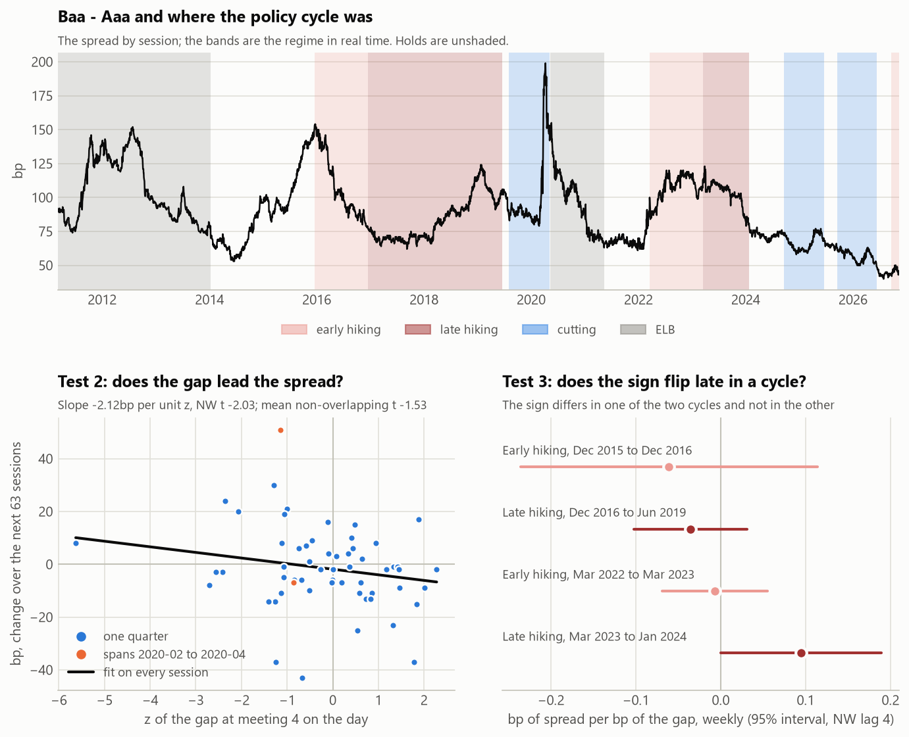

# The credit bridge: USD

Generated by `scripts/build_credit.py`. Do not edit by hand. Methods: `src/policypath/credit.py`; decisions: notes/DECISIONS.md, "Credit bridge". The expected sign of test 2 was registered before the first run (D1). A sample that leaves out a window the spread never reaches is not shown.

- Spreads: Baa - Aaa, Baa - 30y Treasury, Baa - 10y Treasury, ICE BofA IG OAS, ICE BofA HY OAS; the primary is Baa - Aaa. **Spread changes stand in for excess returns** (a spread 10bp wider on a bond of duration D is about D x 10bp lost against the benchmark, carry left out).
- Weekly: the last print on or before each Wednesday, 2011-03-16 to 2026-11-11 (818 weeks). Sessions for test 2: 2012-02-29 to 2026-11-13, 3710 with a z, of which 727 (20%) are in the ELB state. **ELB sessions are included** in the headline, and left out as a row.
- Regressors, bp: the ZQ rate, meeting 4 (held from the start of the week), minus the rule's rate, meeting 4; the two sum to the change in that meeting's gap. Then the orthogonal slope, the cross-country differential at meeting 4 (the signal of the GBP - USD 2y sleeve), and the Treasury 10s30s as a control.
- Stale marks (a session carrying the print before it): Baa - Aaa 42, Baa - 30y Treasury 42, Baa - 10y Treasury 42, ICE BofA IG OAS 3, ICE BofA HY OAS 2, 10y Treasury yield 37

## Staleness, before test 2

The weekly change's first-order autocorrelation, and its correlation with the 10y Treasury yield's change 0, 1 and 2 weeks before. Staleness shows when either the AR(1) or the one-week correlation is outside the band (±1.96/√n, D2). Where staleness shows, the yield's change the week before is a control in the component fits of test 1, and its change over the 5 sessions to t+1 in test 2. The AR(1) without each excluded window is a description only: the rule reads the full sample.

| spread | weeks | AR(1) | corr, yield 0w before | corr, yield 1w before | corr, yield 2w before | band | staleness | AR(1), without 2020-02-15 to 2020-04-30 |
| --- | --- | --- | --- | --- | --- | --- | --- | --- |
| Baa - Aaa | 818 | +0.04 | -0.07 | -0.01 | +0.01 | ±0.07 | no | +0.03 |
| Baa - 30y Treasury | 818 | +0.42 | -0.11 | -0.09 | -0.05 | ±0.07 | shows | +0.27 |
| Baa - 10y Treasury | 818 | +0.27 | -0.24 | -0.07 | -0.05 | ±0.07 | shows | +0.07 |
| ICE BofA IG OAS | 162 | +0.01 | -0.12 | -0.01 | +0.15 | ±0.15 | no | +0.01 |
| ICE BofA HY OAS | 162 | -0.09 | -0.01 | +0.10 | +0.08 | ±0.15 | no | -0.09 |

## Test 1: contemporaneous

Weekly Δspread on the regressors, coefficient (NW t, lag 4), bp per bp. One sample for the three specs of each spread. The R² of the market's part alone is how much of credit's weekly variation is a repricing of the policy path: **0.3%** for Baa - Aaa.

| spread | spec | weeks | R² % | ZQ rate, meeting 4 | minus the rule's rate, meeting 4 | orthogonal slope | differential, meeting 4 (GBP - USD 2y signal) | Treasury 10s30s | 10y Treasury yield, week before |
| --- | --- | --- | --- | --- | --- | --- | --- | --- | --- |
| Baa - Aaa | market | 763 | 0.3 | -0.026 (-1.1) |  |  |  |  |  |
| Baa - Aaa | components | 763 | 0.9 | -0.022 (-1.0) | +0.001 (+0.0) | +0.032 (+1.3) | +0.003 (+0.2) |  |  |
| Baa - Aaa | components + control | 763 | 1.5 | -0.047 (-1.6) | +0.001 (+0.0) | +0.021 (+1.0) | +0.000 (+0.0) | -0.111 (-2.0) |  |
| Baa - Aaa | components, without 2020-02-15 to 2020-04-30 | 751 | 0.0 | -0.005 (-0.2) | -0.000 (-0.0) | +0.005 (+0.3) | -0.004 (-0.4) |  |  |
| Baa - 30y Treasury | market | 763 | 2.3 | -0.098 (-2.1) |  |  |  |  |  |
| Baa - 30y Treasury | components | 763 | 5.9 | -0.064 (-2.1) | +0.095 (+1.0) | -0.080 (-1.7) | +0.047 (+1.3) |  | -0.035 (-1.2) |
| Baa - 30y Treasury | components + control | 763 | 7.4 | -0.116 (-2.0) | +0.096 (+1.0) | -0.103 (-1.8) | +0.042 (+1.3) | -0.238 (-1.4) | -0.033 (-1.1) |
| Baa - 30y Treasury | components, without 2020-02-15 to 2020-04-30 | 751 | 2.0 | -0.044 (-1.6) | -0.010 (-0.3) | -0.042 (-1.7) | +0.012 (+0.6) |  | -0.012 (-0.7) |
| Baa - 10y Treasury | market | 763 | 15.3 | -0.299 (-7.1) |  |  |  |  |  |
| Baa - 10y Treasury | components | 763 | 22.7 | -0.284 (-7.6) | +0.097 (+1.0) | -0.178 (-3.4) | +0.025 (+0.7) |  | -0.024 (-0.7) |
| Baa - 10y Treasury | components + control | 763 | 34.0 | -0.116 (-2.0) | +0.096 (+1.0) | -0.103 (-1.8) | +0.042 (+1.3) | +0.762 (+4.3) | -0.033 (-1.1) |
| Baa - 10y Treasury | components, without 2020-02-15 to 2020-04-30 | 751 | 20.1 | -0.265 (-10.6) | -0.013 (-0.4) | -0.130 (-4.4) | -0.005 (-0.2) |  | -0.002 (-0.1) |
| ICE BofA IG OAS | market | 162 | 8.0 | -0.114 (-3.9) |  |  |  |  |  |
| ICE BofA IG OAS | components | 162 | 13.7 | -0.150 (-4.0) | -0.009 (-0.2) | +0.034 (+0.8) | -0.067 (-2.0) |  |  |
| ICE BofA IG OAS | components + control | 162 | 14.2 | -0.129 (-3.2) | -0.015 (-0.3) | +0.040 (+1.0) | -0.065 (-2.0) | +0.103 (+1.2) |  |
| ICE BofA HY OAS | market | 162 | 4.0 | -0.337 (-2.1) |  |  |  |  |  |
| ICE BofA HY OAS | components | 162 | 8.9 | -0.488 (-2.3) | -0.032 (-0.2) | +0.059 (+0.4) | -0.258 (-1.9) |  |  |
| ICE BofA HY OAS | components + control | 162 | 10.9 | -0.318 (-1.5) | -0.077 (-0.4) | +0.109 (+0.7) | -0.242 (-1.9) | +0.820 (+2.3) |  |

Baa - 10y Treasury is Baa - 30y Treasury plus the Treasury 10s30s, so with the Treasury 10s30s as a control their other coefficients are identical and the control's differs by exactly one.

## Test 2: predictive

s(t+1+h) - s(t+1) on the gap at meeting 4 on session t, in z and in bp; NW lag h. The non-overlapping check fits every h-th session for each of the h start offsets (White se): the mean slope, its range, the mean t, and the share of offsets with a negative slope.

**Headline (D1): Baa - Aaa, z, h = 63, every session with a z: slope -2.12bp per unit of z, NW t -2.03, non-overlapping mean -2.16 (mean t -1.53). It passes the pre-registered rule** (slope negative, NW t ≤ -1.96, non-overlapping mean negative). The last condition asks only for a sign, and the mean slope over the offsets is close to the pooled slope by construction, so once the NW t passes it adds little: 16 of the 63 offsets clear -1.96 on their own. The pass depends on the kernel D1 registered: with Hansen-Hodrick's equal weights the t is -1.67, and with Bartlett at lag 126 it is -1.77. With no link at all (D19, below) the registered t reaches ±1.96 in 20% of placebo samples, and the headline's one-sided placebo p is 0.09.

| spread | h | on | sample | sessions | slope | NW t | non-overlapping mean [min, max] | mean t | negative % |
| --- | --- | --- | --- | --- | --- | --- | --- | --- | --- |
| Baa - Aaa | 21 | z | every session with a z | 3688 | -0.92 | -1.73 | -0.91 [-1.38, -0.52] | -1.37 | 100 |
| Baa - Aaa | 21 | z | without 2020-02-15 to 2020-04-30 | 3616 | -0.47 | -1.37 | -0.47 [-0.58, -0.36] | -1.12 | 100 |
| Baa - Aaa | 21 | z | without ELB sessions | 2961 | -0.63 | -1.16 | -0.63 [-1.32, -0.11] | -0.85 | 100 |
| Baa - Aaa | 21 | gap, bp | every session with a z | 3688 | -0.043 | -1.45 | -0.042 [-0.067, -0.022] | -1.21 | 100 |
| Baa - Aaa | 21 | gap, bp | without 2020-02-15 to 2020-04-30 | 3616 | -0.014 | -1.10 | -0.014 [-0.022, -0.007] | -0.89 | 100 |
| Baa - Aaa | 21 | gap, bp | without ELB sessions | 2961 | -0.026 | -0.73 | -0.026 [-0.067, +0.003] | -0.51 | 90 |
| Baa - Aaa | 63 | z | every session with a z | 3646 | -2.12 | -2.03 | -2.16 [-3.57, -0.40] | -1.53 | 100 |
| Baa - Aaa | 63 | z | without 2020-02-15 to 2020-04-30 | 3532 | -1.91 | -1.82 | -1.94 [-3.23, -0.76] | -1.42 | 100 |
| Baa - Aaa | 63 | z | without ELB sessions | 2919 | -1.50 | -1.49 | -1.56 [-3.81, +0.47] | -1.17 | 87 |
| Baa - Aaa | 63 | gap, bp | every session with a z | 3646 | -0.091 | -2.04 | -0.097 [-0.153, -0.007] | -1.54 | 100 |
| Baa - Aaa | 63 | gap, bp | without 2020-02-15 to 2020-04-30 | 3532 | -0.073 | -1.73 | -0.076 [-0.123, -0.015] | -1.40 | 100 |
| Baa - Aaa | 63 | gap, bp | without ELB sessions | 2919 | -0.040 | -0.82 | -0.046 [-0.118, +0.073] | -0.72 | 81 |
| Baa - 30y Treasury | 21 | z | every session with a z | 3688 | -1.24 | -2.03 | -1.22 [-1.59, -0.89] | -1.60 | 100 |
| Baa - 30y Treasury | 21 | z | without 2020-02-15 to 2020-04-30 | 3616 | -1.00 | -1.89 | -1.01 [-1.38, -0.50] | -1.59 | 100 |
| Baa - 30y Treasury | 21 | z | without ELB sessions | 2961 | -0.74 | -1.26 | -0.71 [-1.44, -0.31] | -0.92 | 100 |
| Baa - 30y Treasury | 21 | gap, bp | every session with a z | 3688 | -0.056 | -1.44 | -0.055 [-0.081, -0.035] | -1.16 | 100 |
| Baa - 30y Treasury | 21 | gap, bp | without 2020-02-15 to 2020-04-30 | 3616 | -0.032 | -1.39 | -0.033 [-0.043, -0.016] | -1.15 | 100 |
| Baa - 30y Treasury | 21 | gap, bp | without ELB sessions | 2961 | -0.035 | -0.79 | -0.035 [-0.080, -0.006] | -0.58 | 100 |
| Baa - 30y Treasury | 63 | z | every session with a z | 3646 | -3.77 | -2.40 | -3.88 [-5.99, -1.59] | -1.83 | 100 |
| Baa - 30y Treasury | 63 | z | without 2020-02-15 to 2020-04-30 | 3532 | -3.71 | -2.35 | -3.79 [-6.02, -2.21] | -1.89 | 100 |
| Baa - 30y Treasury | 63 | z | without ELB sessions | 2919 | -2.83 | -1.80 | -2.98 [-6.60, -0.04] | -1.46 | 100 |
| Baa - 30y Treasury | 63 | gap, bp | every session with a z | 3646 | -0.135 | -1.73 | -0.148 [-0.251, -0.024] | -1.43 | 100 |
| Baa - 30y Treasury | 63 | gap, bp | without 2020-02-15 to 2020-04-30 | 3532 | -0.123 | -1.79 | -0.129 [-0.215, -0.067] | -1.49 | 100 |
| Baa - 30y Treasury | 63 | gap, bp | without ELB sessions | 2919 | -0.076 | -0.82 | -0.089 [-0.255, +0.060] | -0.81 | 76 |
| Baa - 10y Treasury | 21 | z | every session with a z | 3688 | -1.05 | -1.60 | -1.02 [-1.63, -0.56] | -1.20 | 100 |
| Baa - 10y Treasury | 21 | z | without 2020-02-15 to 2020-04-30 | 3616 | -0.78 | -1.38 | -0.79 [-1.08, -0.40] | -1.12 | 100 |
| Baa - 10y Treasury | 21 | z | without ELB sessions | 2961 | -0.51 | -0.80 | -0.47 [-1.20, +0.12] | -0.50 | 90 |
| Baa - 10y Treasury | 21 | gap, bp | every session with a z | 3688 | -0.037 | -0.86 | -0.037 [-0.070, -0.009] | -0.65 | 100 |
| Baa - 10y Treasury | 21 | gap, bp | without 2020-02-15 to 2020-04-30 | 3616 | -0.008 | -0.28 | -0.009 [-0.022, +0.008] | -0.24 | 76 |
| Baa - 10y Treasury | 21 | gap, bp | without ELB sessions | 2961 | -0.008 | -0.15 | -0.007 [-0.055, +0.033] | -0.02 | 52 |
| Baa - 10y Treasury | 63 | z | every session with a z | 3646 | -3.67 | -2.54 | -3.80 [-6.37, -1.10] | -1.81 | 100 |
| Baa - 10y Treasury | 63 | z | without 2020-02-15 to 2020-04-30 | 3532 | -3.44 | -2.43 | -3.56 [-6.14, -1.51] | -1.82 | 100 |
| Baa - 10y Treasury | 63 | z | without ELB sessions | 2919 | -2.58 | -1.72 | -2.78 [-7.01, +0.12] | -1.32 | 98 |
| Baa - 10y Treasury | 63 | gap, bp | every session with a z | 3646 | -0.111 | -1.45 | -0.119 [-0.226, +0.006] | -1.09 | 98 |
| Baa - 10y Treasury | 63 | gap, bp | without 2020-02-15 to 2020-04-30 | 3532 | -0.076 | -1.22 | -0.080 [-0.179, -0.010] | -0.98 | 100 |
| Baa - 10y Treasury | 63 | gap, bp | without ELB sessions | 2919 | -0.028 | -0.31 | -0.036 [-0.213, +0.111] | -0.35 | 63 |
| ICE BofA IG OAS | 21 | z | every session with a z | 766 | +2.07 | +2.69 | +2.07 [+1.28, +3.42] | +2.07 | 0 |
| ICE BofA IG OAS | 21 | gap, bp | every session with a z | 766 | +0.067 | +2.64 | +0.067 [+0.040, +0.121] | +1.95 | 0 |
| ICE BofA IG OAS | 63 | z | every session with a z | 724 | +4.40 | +1.84 | +4.79 [+1.53, +11.45] | +1.22 | 0 |
| ICE BofA IG OAS | 63 | gap, bp | every session with a z | 724 | +0.131 | +2.02 | +0.145 [+0.057, +0.369] | +1.24 | 0 |
| ICE BofA HY OAS | 21 | z | every session with a z | 766 | +6.78 | +1.99 | +6.78 [-0.28, +13.25] | +1.50 | 5 |
| ICE BofA HY OAS | 21 | gap, bp | every session with a z | 766 | +0.212 | +2.02 | +0.215 [-0.022, +0.476] | +1.46 | 5 |
| ICE BofA HY OAS | 63 | z | every session with a z | 724 | +16.86 | +1.964 | +19.01 [+2.20, +49.21] | +1.26 | 0 |
| ICE BofA HY OAS | 63 | gap, bp | every session with a z | 724 | +0.478 | +2.14 | +0.551 [+0.068, +1.468] | +1.24 | 0 |

**The headline without each calendar year** (every change that touches the year left out, as for each excluded window; a check added after the run, D17, not a registered cell). The slope is negative without 15 of the 15 years (-3.05 to -1.27), and the headline fails D1's rule without 8 of them. It leans most on 2014 (without it -1.44, t -1.11) and 2020 (-1.27, t -1.23). Without 7 of the 15 years it still passes.

| year left out | sessions | slope | NW t | non-overlapping mean | mean t | D1's rule |
| --- | --- | --- | --- | --- | --- | --- |
| 2012 | 3433 | -2.47 | -2.38 | -2.53 | -1.82 | passes |
| 2013 | 3330 | -2.07 | -1.960 | -2.10 | -1.47 | does not pass |
| 2014 | 3330 | -1.44 | -1.11 | -1.57 | -0.84 | does not pass |
| 2015 | 3329 | -1.65 | -1.52 | -1.67 | -1.14 | does not pass |
| 2016 | 3331 | -2.03 | -1.85 | -2.07 | -1.40 | does not pass |
| 2017 | 3332 | -2.27 | -2.02 | -2.33 | -1.50 | passes |
| 2018 | 3331 | -2.71 | -2.60 | -2.75 | -1.91 | passes |
| 2019 | 3331 | -3.05 | -2.64 | -3.08 | -1.89 | passes |
| 2020 | 3332 | -1.27 | -1.23 | -1.33 | -1.00 | does not pass |
| 2021 | 3330 | -1.64 | -1.57 | -1.67 | -1.16 | does not pass |
| 2022 | 3332 | -1.77 | -1.65 | -1.79 | -1.24 | does not pass |
| 2023 | 3332 | -1.95 | -1.84 | -1.98 | -1.39 | does not pass |
| 2024 | 3331 | -2.21 | -2.08 | -2.23 | -1.56 | passes |
| 2025 | 3332 | -2.27 | -2.15 | -2.31 | -1.61 | passes |
| 2026 | 3426 | -2.18 | -2.05 | -2.23 | -1.55 | passes |

**The headline under four more checks added after the run** (D18; checks, not registered cells). The overlapping changes are an MA(62): Bartlett at lag 63 gives their autocovariances about two thirds of their weight, and Hansen-Hodrick's equal weights to lag 62 give them all of it. Clipping z at ±3 and leaving out the 561 sessions whose z divides by the floored sd ask whether the headline rests on a few inflated z's.

| check | sessions | slope | t | clears -1.96 |
| --- | --- | --- | --- | --- |
| registered (D1): Newey-West, Bartlett, lag 63 | 3646 | -2.12 | -2.03 | yes |
| Newey-West, Bartlett, lag 126 | 3646 | -2.12 | -1.77 | no |
| Hansen-Hodrick, equal weights, lag 62 | 3646 | -2.12 | -1.67 | no |
| z clipped at ±3 | 3646 | -2.40 | -2.06 | yes |
| without the sessions whose sd is at its floor | 3085 | -2.51 | -2.25 | yes |

**How often the registered test rejects with no link** (D19; a check added after the run, not a registered cell). Baa - Aaa's daily changes from the first z on are rotated in time against z, by every 5th shift of at least 252 sessions (642 shifts). Each series keeps its own volatility and persistence, and no shift lines one up with the other. The registered NW t reaches ±1.96 in 20% of the shifts, where 5% is nominal, and -1.96 in 10%, where 2.5% is. At the placebo's own 2.5% the line is -2.45, which the headline's -2.03 does not clear. 9% of the shifted t's are at or below the headline's: its one-sided placebo p is 0.09.

## Test 3: conditional

Weekly ΔBaa - Aaa on the weekly change in the level (the gap at the held meeting 4), by the regime at the start of the week (`regimes.py`, real time; ELB weeks out). One regression with a slope and intercept per regime (regimes with 13+ weeks), NW lag 4. The hypothesis (D3): early hiking negative, late hiking positive. The minimum detectable difference (mde) is the size 80% power would find at 5%.

**The sign differs in one of the two cycles and not in the other: early negative and late positive, as the hypothesis has it.** Late minus early, pooled: +0.027 (se 0.051, t +0.54); the minimum detectable difference is 0.143.

| regime | weeks | slope | NW se | t |
| --- | --- | --- | --- | --- |
| early hiking | 112 | -0.009 | 0.031 | -0.30 |
| late hiking | 176 | +0.018 | 0.033 | +0.54 |
| hold after hikes | 40 | -0.016 | 0.016 | -0.98 |
| cutting | 117 | -0.057 | 0.056 | -1.03 |
| hold after cuts | 172 | -0.022 | 0.020 | -1.14 |
| late minus early |  | +0.027 | 0.051 | +0.54 |

Per episode (a run of one regime with enough weeks), NW lag 4:

| regime | first | last | weeks | slope | se | t | mde |
| --- | --- | --- | --- | --- | --- | --- | --- |
| hold after cuts | 2014-01-22 | 2015-12-16 | 100 | -0.022 | 0.047 | -0.46 | 0.131 |
| early hiking | 2015-12-23 | 2016-12-21 | 53 | -0.061 | 0.089 | -0.69 | 0.250 |
| late hiking | 2016-12-28 | 2019-06-26 | 131 | -0.036 | 0.034 | -1.05 | 0.096 |
| cutting | 2019-08-14 | 2020-05-13 | 40 | -0.074 | 0.072 | -1.02 | 0.203 |
| hold after cuts | 2021-05-19 | 2022-03-23 | 45 | -0.028 | 0.026 | -1.08 | 0.072 |
| early hiking | 2022-03-30 | 2023-03-22 | 52 | -0.007 | 0.032 | -0.21 | 0.088 |
| late hiking | 2023-03-29 | 2024-01-31 | 45 | +0.095 | 0.048 | +1.958 | 0.135 |
| hold after hikes | 2024-02-07 | 2024-09-25 | 34 | -0.020 | 0.020 | -1.00 | 0.056 |
| cutting | 2024-10-02 | 2025-06-25 | 39 | -0.035 | 0.027 | -1.30 | 0.075 |
| hold after cuts | 2025-07-02 | 2025-09-24 | 13 | -0.010 | 0.025 | -0.40 | 0.069 |
| cutting | 2025-10-01 | 2026-06-17 | 38 | -0.027 | 0.021 | -1.28 | 0.060 |
| hold after cuts | 2026-06-24 | 2026-09-23 | 14 | +0.032 | 0.026 | +1.24 | 0.073 |

On the market's part alone (ZQ rate, meeting 4): The sign differs in each of the two cycles: the hypothesis's way in one of them.

| regime | weeks | slope | NW se | t |
| --- | --- | --- | --- | --- |
| early hiking | 112 | -0.008 | 0.032 | -0.25 |
| late hiking | 176 | +0.039 | 0.049 | +0.80 |
| hold after hikes | 40 | +0.002 | 0.022 | +0.07 |
| cutting | 117 | -0.121 | 0.056 | -2.17 |
| hold after cuts | 172 | -0.032 | 0.034 | -0.95 |
| late minus early |  | +0.047 | 0.066 | +0.72 |

| regime | first | last | weeks | slope | se | t | mde |
| --- | --- | --- | --- | --- | --- | --- | --- |
| hold after cuts | 2014-01-22 | 2015-12-16 | 100 | -0.174 | 0.101 | -1.73 | 0.282 |
| early hiking | 2015-12-23 | 2016-12-21 | 53 | +0.122 | 0.184 | +0.66 | 0.515 |
| late hiking | 2016-12-28 | 2019-06-26 | 131 | -0.071 | 0.038 | -1.86 | 0.107 |
| cutting | 2019-08-14 | 2020-05-13 | 40 | -0.186 | 0.038 | -4.85 | 0.107 |
| hold after cuts | 2021-05-19 | 2022-03-23 | 45 | +0.040 | 0.067 | +0.60 | 0.187 |
| early hiking | 2022-03-30 | 2023-03-22 | 52 | -0.016 | 0.027 | -0.60 | 0.076 |
| late hiking | 2023-03-29 | 2024-01-31 | 45 | +0.118 | 0.052 | +2.28 | 0.145 |
| hold after hikes | 2024-02-07 | 2024-09-25 | 34 | -0.020 | 0.019 | -1.05 | 0.054 |
| cutting | 2024-10-02 | 2025-06-25 | 39 | -0.018 | 0.031 | -0.56 | 0.087 |
| hold after cuts | 2025-07-02 | 2025-09-24 | 13 | -0.054 | 0.045 | -1.20 | 0.125 |
| cutting | 2025-10-01 | 2026-06-17 | 38 | +0.017 | 0.050 | +0.33 | 0.141 |
| hold after cuts | 2026-06-24 | 2026-09-23 | 14 | +0.014 | 0.023 | +0.62 | 0.064 |

Every spread:

| spread | late minus early, level | late minus early, market | verdict (level) |
| --- | --- | --- | --- |
| Baa - Aaa | +0.027 (+0.5) | +0.047 (+0.7) | The sign differs in one of the two cycles and not in the other: early negative and late positive, as the hypothesis has it. |
| Baa - 30y Treasury | -0.027 (-0.5) | -0.023 (-0.4) | The sign differs in one of the two cycles and not in the other: early negative and late positive, as the hypothesis has it. |
| Baa - 10y Treasury | -0.026 (-0.4) | -0.111 (-1.5) | The sign does not differ in either of the two cycles. |
| ICE BofA IG OAS |  |  | The sample has no complete hiking cycle, so the sign cannot be compared. |
| ICE BofA HY OAS |  |  | The sample has no complete hiking cycle, so the sign cannot be compared. |

