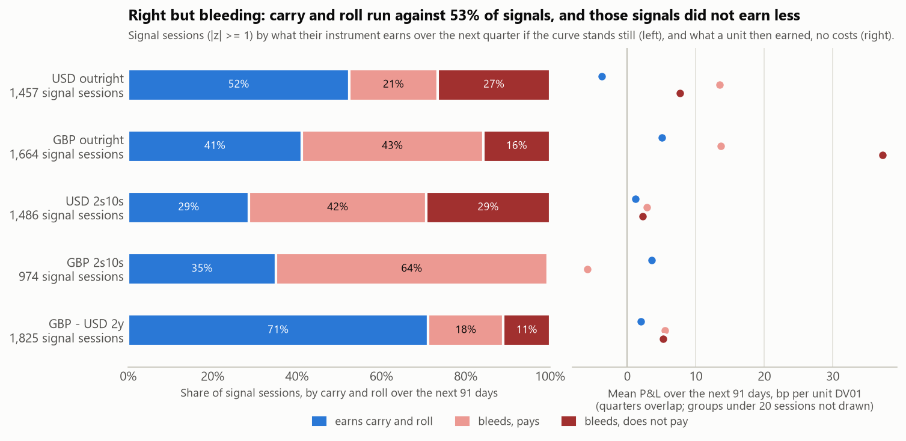

# Expression, carry and roll: what each signal trades, and what holding it costs

Generated by `scripts/build_expression.py` from `data/panel/` and the cache, sessions 2011-08-24 .. 2026-09-29. Do not edit by hand. The formulas and signs are in `strategy/carry.py`; every choice is a row in notes/DECISIONS.md, section C (expression and carry). A unit is +1 USD of DV01 on the sleeve's first leg, positive = receive; P&L in bp of it. Linear rule (position = z), **no costs**.

A signal is a session with |z| >= 1. Its breakeven is what the instrument it selects earns over the next 91 days if the curve stands still: carry plus roll, CR_h, signed for the side. Its edge is the de-meaned gap, |z| x the gap's trailing sd, the bp the signal expects to close; for USD 2s10s, GBP 2s10s and GBP - USD 2y that is the component's bp, a proxy for the legs' move. With phi_h the share of the gap that has closed over past quarters (expanding window), the expected quarter is E_h = phi_h x edge + (1 - phi_h) x CR_h. Right but bleeding: CR_h < 0 < edge. Does not pay: E_h < 0.

## The answer

- **A correct signal can still be a losing trade.** Of the 3,938 signal sessions whose next quarter went the signal's way on the rate, 19% (734) still lost money once carry and roll were counted, from 7% (GBP - USD 2y) to 36% (USD outright). On those the rate made +6.1bp a unit on average and carry and roll took -13.6bp. 428 of them are on the unfunded sleeves (USD outright, GBP outright), where carry is 0: there right on the rate means the held contracts beat the frozen curve's roll, and the loss means their own rates moved against the side, by less than the roll implied. The plainest case at an episode entry: GBP - USD 2y, receive on 29 Jun 2018 at z +1.1 (2y gilt vs 2y Treasury). The rate moved the signal's way by +8.5bp over the quarter, carry and roll took -11.0bp, and the quarter ended -2.5bp.
- **Right but bleeding, known at the close.** On 53% of the 7,406 signal sessions the instrument's carry and roll over the next quarter, if the curve stood still, ran against the side, from 29% (GBP - USD 2y) to 71% (USD 2s10s). 17% did not pay for their bleed: the expected quarter (the share of the gap that has historically closed, plus carry and roll on the rest) was negative, from 1% (GBP 2s10s) to 29% (USD 2s10s).
- **The breakeven's verdict turns on 2022.** Bleeding signal sessions earned +7.4bp a unit over the next quarter, the others +1.4bp; bleeding did worse in 1 of the 5 sleeves. Those that did not pay earned +11.6bp, the rest +3.1bp (worse in 0 of the 5). Leaving out every quarter that overlaps 2022 (6,296 signal sessions left): bleeding +0.8bp against +1.4bp (worse in 3 of 5 sleeves), not paying -0.7bp against +1.5bp (worse in 2 of 4). Leaving out every quarter that overlaps Dec 2021 to Aug 2023 (5,935 signal sessions left): bleeding -2.8bp against -0.9bp (worse in 3 of 5 sleeves), not paying -3.5bp against -1.4bp (worse in 3 of 4). In the full sample neither flag did worse; without 2022 both flags did worse. Carry and roll are a cost to charge against the edge either way; whether they are a reason to stand aside, this sample cannot say. The quarters overlap (about 64 sessions share each one), so these are descriptions, not tests.
- **The carry filter, a diagnostic.** At entry, where a filter would act, the 16 of 117 episode entries that did not pay earned -5.0bp over their next quarter against +3.2bp for the rest, the other way from the sessions. Skipping them would have added 80bp, +77bp of it from 2 GBP outright entries. 16 entries are too few to decide on: the carry filter stays a diagnostic (`positions.carry_filter: false`), and week 8 measures it under the hysteresis rule with costs.
- **The expected quarter overstates.** +10.5bp a signal session on average, against +4.6bp realized (it is higher in 4 of the 5 sleeves). E_h counts every bp of the gap that closes as P&L, but only the market's part pays; the rule's part pays nothing. Over the whole sample a quarter closed 0.44 of the USD outright gap, 0.25 by the market and +0.19 by the rule (toward the market), and E_h there is +10.9bp against +3.0bp realized; a quarter closed 0.13 of the GBP outright gap, 0.45 by the market and -0.32 by the rule (away from the market), and E_h there is +5.5bp against +13.9bp realized.

## The breakeven, per sleeve

Sessions with a z, a phi_h and a complete next quarter; signals are those with |z| >= 1. CR_h is for the instrument selected on the session, held the whole quarter; the next quarter's P&L re-selects as the sleeve does. Right: the quarter's rate component was in the side's favour.

### How often

| sleeve | set | sessions | earns carry and roll | bleeds, pays | bleeds, does not pay | bleeds (CR_h < 0 < edge) | right next quarter | right but lost |
| --- | --- | --- | --- | --- | --- | --- | --- | --- |
| USD outright | signals | 1,457 | 52% | 21% | 27% | 48% | 40% | 36% |
| USD outright | all | 3,293 | 53% | 14% | 33% | 47% | 48% | 28% |
| GBP outright | signals | 1,664 | 41% | 43% | 16% | 59% | 63% | 21% |
| GBP outright | all | 3,437 | 47% | 27% | 26% | 53% | 58% | 20% |
| USD 2s10s | signals | 1,486 | 29% | 42% | 29% | 71% | 63% | 19% |
| USD 2s10s | all | 3,043 | 33% | 33% | 34% | 67% | 58% | 19% |
| GBP 2s10s | signals | 974 | 35% | 64% | 1% | 65% | 53% | 13% |
| GBP 2s10s | all | 3,187 | 41% | 53% | 7% | 59% | 46% | 13% |
| GBP - USD 2y | signals | 1,825 | 71% | 18% | 11% | 29% | 47% | 7% |
| GBP - USD 2y | all | 3,218 | 61% | 17% | 23% | 39% | 50% | 10% |
| pooled | signals | 7,406 | 47% | 35% | 17% | 53% | 53% | 19% |
| pooled | all | 16,178 | 47% | 29% | 24% | 53% | 52% | 18% |

### What they earned over the next 91 days, bp per unit (mean, overlapping quarters)

| sleeve | set | sessions | expected E_h | realized | earns carry and roll | bleeds, pays | bleeds, does not pay | bleeding | not bleeding |
| --- | --- | --- | --- | --- | --- | --- | --- | --- | --- |
| USD outright | signals | 1,457 | +10.9 | +3.0 | -3.7 | +13.5 | +7.7 | +10.3 | -3.7 |
| USD outright | all | 3,293 | +7.4 | -0.3 | -6.3 | +13.1 | +3.5 | +6.3 | -6.3 |
| GBP outright | signals | 1,664 | +5.5 | +13.9 | +5.0 | +13.7 | +37.2 | +20.0 | +5.0 |
| GBP outright | all | 3,437 | +3.9 | +7.4 | +6.3 | +11.6 | +5.1 | +8.4 | +6.3 |
| USD 2s10s | signals | 1,486 | +4.9 | +2.2 | +1.2 | +2.9 | +2.3 | +2.6 | +1.2 |
| USD 2s10s | all | 3,043 | +3.1 | +0.6 | -3.8 | +5.4 | +0.2 | +2.8 | -3.8 |
| GBP 2s10s | signals | 974 | +21.3 | -2.3 | +3.6 | -5.8 | +26.7 | -5.5 | +3.6 |
| GBP 2s10s | all | 3,187 | +10.4 | -4.5 | -3.4 | -6.3 | +2.7 | -5.2 | -3.4 |
| GBP - USD 2y | signals | 1,825 | +13.6 | +3.0 | +2.0 | +5.5 | +5.2 | +5.4 | +2.0 |
| GBP - USD 2y | all | 3,218 | +8.7 | +2.5 | +4.1 | +0.9 | -0.8 | -0.0 | +4.1 |
| pooled | signals | 7,406 | +10.5 | +4.6 | +1.4 | +5.3 | +11.6 | +7.4 | +1.4 |
| pooled | all | 16,178 | +6.7 | +1.2 | -0.1 | +2.7 | +2.2 | +2.4 | -0.1 |

### Right but bleeding by year: share of all 7,898 signal sessions, with a phi_h or not

| year | USD outright | GBP outright | USD 2s10s | GBP 2s10s | GBP - USD 2y |
| --- | --- | --- | --- | --- | --- |
| 2011 | n/a | 0% | n/a | n/a | n/a |
| 2012 | 4% | 0% | n/a | 100% | 0% |
| 2013 | 69% | 7% | 74% | 0% | 0% |
| 2014 | 100% | 2% | 18% | 1% | 32% |
| 2015 | 100% | 0% | 85% | 100% | 100% |
| 2016 | 28% | 5% | 100% | 61% | 1% |
| 2017 | 0% | 89% | 61% | 0% | 0% |
| 2018 | 27% | 100% | 51% | 100% | 4% |
| 2019 | 14% | 0% | 81% | 8% | 21% |
| 2020 | 82% | 90% | 44% | 96% | 11% |
| 2021 | 48% | 49% | 0% | 99% | 64% |
| 2022 | 54% | 98% | 90% | 83% | 43% |
| 2023 | 0% | 86% | 0% | 100% | 64% |
| 2024 | 6% | 100% | 100% | 100% | 32% |
| 2025 | 0% | n/a | 94% | 100% | n/a |
| 2026 | 3% | 4% | 0% | 45% | 58% |

### The carry filter (a diagnostic): episodes under the (enter 1, exit 0) pair

Each episode's entry is scored at its entry session; the filter skips the entries that do not pay. The P&L is each entry's next 91 days, a unit on its side.

| sleeve | entries | skipped | skipped: mean | kept: mean | all: sum | kept: sum | the filter's effect |
| --- | --- | --- | --- | --- | --- | --- | --- |
| USD outright | 21 | 4 | -1.5 | +4.3 | +67 | +73 | +6 |
| GBP outright | 18 | 2 | -38.3 | +18.4 | +218 | +295 | +77 |
| USD 2s10s | 32 | 7 | +3.0 | +0.2 | +26 | +5 | -21 |
| GBP 2s10s | 31 | 0 | n/a | -5.5 | -170 | -170 | +0 |
| GBP - USD 2y | 15 | 3 | -6.2 | +10.2 | +103 | +122 | +19 |

117 of the 126 episodes have a phi_h at entry and a complete next quarter; the rest started before phi_h existed or are too recent. One row per episode, with its breakeven and next quarter: `reports/results/signals.csv`.

## Now

Each sleeve on its latest session. Positions for a USD 10,000-per-bp unit on the signal's side, in each instrument's own units.

| sleeve | session | z | side | instrument | gap_bp | edge_bp | carry_bp | roll_bp | CR_h_bp | phi_h | E_h_bp | verdict |
| --- | --- | --- | --- | --- | --- | --- | --- | --- | --- | --- | --- | --- |
| USD outright | 2026-09-21 | +2.19 | receive | ZQ Apr 2027 | +4.6 | +49.5 | +0.0 | +26.3 | +26.3 | 0.44 | +36.5 | earns carry and roll |
| GBP outright | 2026-09-29 | +1.95 | receive | OIS forward 18 Mar-29 Apr 2027 | +142.6 | +89.4 | +0.0 | +36.3 | +36.3 | 0.13 | +43.1 | earns carry and roll |
| USD 2s10s | 2026-09-21 | +0.40 | receive | 2y vs 10y Treasury | -18.8 | +6.0 | +7.6 | +7.1 | +14.8 | 0.08 | +14.1 | earns carry and roll |
| GBP 2s10s | 2026-09-29 | +0.01 | receive | 2y vs 10y gilt | +11.7 | +0.2 | +7.9 | +2.9 | +10.8 | 0.71 | +3.3 | earns carry and roll |
| GBP - USD 2y | 2026-09-21 | +1.08 | receive | 2y gilt vs 2y Treasury | +134.8 | +38.4 | +0.7 | -4.2 | -3.5 | 0.17 | +3.8 | bleeds, pays |

| sleeve | leg | side | instrument | dv01 | position |
| --- | --- | --- | --- | --- | --- |
| USD outright | USD outright | receive | ZQ Apr 2027 | +10,000 | 240 contracts |
| GBP outright | GBP outright | receive | OIS forward 18 Mar-29 Apr 2027 | +10,000 | GBP 671.8m |
| USD 2s10s | USD 2y | receive | 2y Treasury | +10,000 | USD 53.0m |
| USD 2s10s | USD 10y | pay | 10y Treasury | -10,000 | USD 12.8m |
| GBP 2s10s | GBP 2y | receive | 2y gilt | +10,000 | GBP 40.0m |
| GBP 2s10s | GBP 10y | pay | 10y gilt | -10,000 | GBP 9.9m |
| GBP - USD 2y | GBP 2y | receive | 2y gilt | +10,000 | GBP 39.6m |
| GBP - USD 2y | USD 2y | pay | 2y Treasury | -10,000 | USD 53.0m |

## Instruments

| sleeve | leg | on a receive | instrument | marks | funded | DV01 (latest) |
| --- | --- | --- | --- | --- | --- | --- |
| USD outright | USD outright | receive | the ZQ month the fourth meeting's regime settles in | databento ZQ settles | no | 41.6667 USD per bp, a contract |
| GBP outright | GBP outright | receive | the OIS forward over the fourth meeting's regime | boe OIS_SPOT | no | 11.23 GBP per bp, 1m notional |
| USD 2s10s | USD 2y | receive | a 2y Treasury at par, struck at each close | fred DGS1, DGS2, DGS3, DGS5, DGS7, DGS10 | yes | 188.64 USD per bp, 1m notional |
| USD 2s10s | USD 10y | pay | a 10y Treasury at par, struck at each close | fred DGS1, DGS2, DGS3, DGS5, DGS7, DGS10 | yes | 780.93 USD per bp, 1m notional |
| GBP 2s10s | GBP 2y | receive | a 2y gilt at par, struck at each close | boe GLC_SPOT | yes | 188.71 GBP per bp, 1m notional |
| GBP 2s10s | GBP 10y | pay | a 10y gilt at par, struck at each close | boe GLC_SPOT | yes | 765.90 GBP per bp, 1m notional |
| GBP - USD 2y | GBP 2y | receive | a 2y gilt at par, struck at each close | boe GLC_SPOT | yes | 188.99 GBP per bp, 1m notional |
| GBP - USD 2y | USD 2y | pay | a 2y Treasury at par, struck at each close | fred DGS1, DGS2, DGS3, DGS5, DGS7, DGS10 | yes | 188.64 USD per bp, 1m notional |

ZQ DV01, from the contract spec in config: 5,000,000 x 30/360 x 1bp = 41.6667 USD per bp a contract. CME quotes 41.67 (`contracts.ZQ.quoted`), the derived value rounded to the cent. Ticks: 0.0025 (front month) = 10.4167 and 0.005 = 20.8333; CME quotes 10.4175 and 20.8350, its rounded DV01 times the tick. No DV01 is typed in code (a test checks).

## The three checks

1. The bookkeeping identity: the linear total equals carry + roll + rate on every session. It telescopes, so it catches a relative sign or maturity mix-up and does not prove the signs.
2. An independent full revaluation from each instrument's own price: ZQ contracts x the price change x point value, a forward struck at its rate and discounted, a bond struck at par and repriced. The residual must sit inside a bound from convexity and the drift of DV01 (0 for ZQ). A flipped carry sign leaves about twice the carry, far outside it, and so does an FX ratio in the attribution that disagrees with the valuation's spot. It cannot see what both sides share: a quote read upside down at its source, or a leg traded the wrong way round. The quote's orientation is held by `expression.fx.plausible` (the build refuses a spot outside it) and the direction by check 3.
3. Convergence, which pins the direction: synthetic tests move the market to the model and every sleeve with z > 0 gains (`tests/test_carry.py`); and the end-to-end reproduction below.

Every sleeve, leg and direction; a pay is the receive negated. Stale: sessions with no print of their own, carried from the last (no rate change, carry still accrues).

| sleeve | leg | direction | sessions | identity_max_bp | full_residual_max_bp | bound_at_max_bp | outside_bound | stale | fx_stale |
| --- | --- | --- | --- | --- | --- | --- | --- | --- | --- |
| USD outright | USD outright | receive | 3920 | 8.9e-16 | 0.000 | 0.000 | 0 | 0 | 0 |
| USD outright | USD outright | pay | 3920 | 8.9e-16 | 0.000 | 0.000 | 0 | 0 | 0 |
| GBP outright | GBP outright | receive | 4064 | 7.1e-15 | 0.252 | 0.254 | 0 | 0 | 134 |
| GBP outright | GBP outright | pay | 4064 | 7.1e-15 | 0.252 | 0.254 | 0 | 0 | 134 |
| USD 2s10s | USD 2y | receive | 3920 | 3.6e-15 | 0.270 | 0.272 | 0 | 34 | 0 |
| USD 2s10s | USD 10y | receive | 3920 | 3.6e-15 | 0.437 | 0.446 | 0 | 34 | 0 |
| USD 2s10s | USD 2y | pay | 3920 | 3.6e-15 | 0.270 | 0.272 | 0 | 34 | 0 |
| USD 2s10s | USD 10y | pay | 3920 | 3.6e-15 | 0.437 | 0.446 | 0 | 34 | 0 |
| GBP 2s10s | GBP 2y | receive | 4064 | 7.1e-15 | 0.411 | 0.414 | 0 | 0 | 134 |
| GBP 2s10s | GBP 10y | receive | 4064 | 7.1e-15 | 0.691 | 0.734 | 0 | 0 | 134 |
| GBP 2s10s | GBP 2y | pay | 4064 | 7.1e-15 | 0.411 | 0.414 | 0 | 0 | 134 |
| GBP 2s10s | GBP 10y | pay | 4064 | 7.1e-15 | 0.691 | 0.734 | 0 | 0 | 134 |
| GBP - USD 2y | GBP 2y | receive | 3840 | 7.1e-15 | 0.411 | 0.414 | 0 | 0 | 40 |
| GBP - USD 2y | USD 2y | receive | 3840 | 3.6e-15 | 0.270 | 0.272 | 0 | 31 | 0 |
| GBP - USD 2y | GBP 2y | pay | 3840 | 7.1e-15 | 0.411 | 0.414 | 0 | 0 | 40 |
| GBP - USD 2y | USD 2y | pay | 3840 | 3.6e-15 | 0.270 | 0.272 | 0 | 31 | 0 |

- Largest identity residual: 7.1e-15bp. Sessions outside the revaluation bound: 0. The largest residual is 0.691bp (GBP 2s10s, GBP 10y), against a bound there of 0.734bp. Residuals sit just inside their bounds (the closest, GBP - USD 2y, USD 2y, at 0.999 of it), as they should: each bound is the size the leftover is predicted to have (a forward's move in rate times its move in discount factor; a par leg's DV01 drift plus convexity), so a residual at its bound is what the linear marks leave out and nothing else, and a flipped carry sign would sit far outside it. The build refuses to write this report if any check fails.
- End to end: GBP outright under the linear rule, fx forced to 1, against the week 6 backtest (`data/panel/GBP_backtest.parquet`): 3,815 sessions from its first z, largest difference 1.4e-14bp. The held forward is the path's own meeting rate.

### Convexity: what the linear P&L leaves out

Legs are DV01-linear marks re-struck at each close, so convexity is not in the P&L. The full revaluation's residual (full - linear) of a unit receive, summed by year, bp, measures it:

| year | USD outright | GBP outright | USD 2s10s | GBP 2s10s | GBP - USD 2y |
| --- | --- | --- | --- | --- | --- |
| 2010 |  | +0.00 |  | -1.17 |  |
| 2011 | +0.00 | +0.02 | -4.47 | -3.94 | -0.14 |
| 2012 | +0.00 | +0.01 | -2.50 | -2.88 | +0.19 |
| 2013 | -0.00 | +0.00 | -2.84 | -2.53 | +0.26 |
| 2014 | -0.00 | +0.01 | -1.65 | -1.74 | -0.08 |
| 2015 | -0.00 | +0.00 | -3.32 | -3.34 | -0.08 |
| 2016 | +0.00 | +0.03 | -2.10 | -3.22 | -0.15 |
| 2017 | +0.00 | +0.02 | -1.25 | -1.50 | -0.06 |
| 2018 | +0.00 | +0.02 | -1.16 | -1.48 | -0.12 |
| 2019 | +0.00 | +0.02 | -1.86 | -1.90 | -0.27 |
| 2020 | -0.00 | +0.04 | -3.87 | -2.37 | +0.04 |
| 2021 | -0.00 | +0.07 | -2.08 | -1.54 | +0.15 |
| 2022 | +0.00 | +0.90 | -4.75 | -6.97 | +1.02 |
| 2023 | +0.00 | +0.36 | -3.84 | -4.52 | -0.74 |
| 2024 | +0.00 | +0.09 | -2.63 | -2.40 | -0.32 |
| 2025 | -0.00 | +0.07 | -2.12 | -2.19 | -0.33 |
| 2026 | +0.00 | +0.24 | -0.96 | -1.62 | +0.55 |

Mean a year: USD outright +0.0bp, GBP outright +0.1bp, USD 2s10s -2.6bp, GBP 2s10s -2.7bp, GBP - USD 2y -0.0bp.

## P&L by component: linear rule, no costs, bp x z

Whole sample:

| sleeve | carry | roll | rate | total |
| --- | --- | --- | --- | --- |
| USD outright | +0.0 | +214.4 | -185.5 | +28.9 |
| GBP outright | +0.0 | -422.4 | +1625.3 | +1202.9 |
| USD 2s10s | -232.9 | -102.1 | +677.1 | +342.1 |
| GBP 2s10s | -127.1 | +3.1 | -535.0 | -659.0 |
| GBP - USD 2y | +150.1 | +57.5 | +281.2 | +488.8 |

### USD outright

| year | carry | roll | rate | total |
| --- | --- | --- | --- | --- |
| 2012 | +0.0 | -1.3 | +0.2 | -1.0 |
| 2013 | +0.0 | +2.4 | +5.0 | +7.4 |
| 2014 | +0.0 | -34.0 | +15.3 | -18.7 |
| 2015 | +0.0 | -45.6 | +14.5 | -31.1 |
| 2016 | +0.0 | +20.0 | -32.4 | -12.4 |
| 2017 | +0.0 | +60.8 | -123.9 | -63.1 |
| 2018 | +0.0 | +17.2 | -57.4 | -40.3 |
| 2019 | +0.0 | +124.4 | -256.6 | -132.2 |
| 2020 | +0.0 | +3.7 | -237.0 | -233.3 |
| 2021 | +0.0 | -26.8 | +78.7 | +51.9 |
| 2022 | +0.0 | -38.3 | +149.4 | +111.1 |
| 2023 | +0.0 | +30.9 | +221.2 | +252.1 |
| 2024 | +0.0 | +76.0 | +52.4 | +128.4 |
| 2025 | +0.0 | +9.0 | +42.9 | +52.0 |
| 2026 | +0.0 | +16.0 | -57.8 | -41.8 |

### GBP outright

| year | carry | roll | rate | total |
| --- | --- | --- | --- | --- |
| 2011 | +0.0 | +5.7 | -3.6 | +2.1 |
| 2012 | +0.0 | +13.1 | +8.9 | +22.0 |
| 2013 | +0.0 | +3.5 | +1.5 | +5.0 |
| 2014 | +0.0 | +57.2 | +9.3 | +66.5 |
| 2015 | +0.0 | +2.7 | +13.1 | +15.9 |
| 2016 | +0.0 | +16.3 | -53.6 | -37.4 |
| 2017 | +0.0 | -26.9 | +71.6 | +44.7 |
| 2018 | +0.0 | -16.2 | +44.6 | +28.4 |
| 2019 | +0.0 | +20.4 | +13.8 | +34.2 |
| 2020 | +0.0 | -11.2 | -88.3 | -99.5 |
| 2021 | +0.0 | -37.7 | +146.1 | +108.4 |
| 2022 | +0.0 | -344.4 | +1116.2 | +771.8 |
| 2023 | +0.0 | -32.0 | +336.5 | +304.5 |
| 2024 | +0.0 | -159.1 | +62.8 | -96.2 |
| 2025 | +0.0 | -7.0 | +23.1 | +16.1 |
| 2026 | +0.0 | +93.2 | -76.9 | +16.3 |

### USD 2s10s

| year | carry | roll | rate | total |
| --- | --- | --- | --- | --- |
| 2013 | -4.3 | +1.0 | +3.0 | -0.3 |
| 2014 | -4.0 | +16.9 | -85.3 | -72.3 |
| 2015 | -6.7 | -23.4 | +60.1 | +30.1 |
| 2016 | -8.3 | -19.5 | -51.6 | -79.5 |
| 2017 | -2.4 | +0.9 | +47.6 | +46.1 |
| 2018 | -5.7 | -0.2 | +54.7 | +48.7 |
| 2019 | -10.8 | -8.2 | -104.1 | -123.1 |
| 2020 | -2.9 | -0.5 | +182.5 | +179.2 |
| 2021 | -2.2 | +2.7 | +17.0 | +17.6 |
| 2022 | -144.1 | -61.3 | +382.0 | +176.5 |
| 2023 | +9.8 | +35.8 | +82.9 | +128.5 |
| 2024 | -46.2 | -46.8 | +90.5 | -2.5 |
| 2025 | -9.4 | -4.7 | +27.7 | +13.6 |
| 2026 | +4.4 | +5.0 | -29.9 | -20.4 |

### GBP 2s10s

| year | carry | roll | rate | total |
| --- | --- | --- | --- | --- |
| 2012 | -0.3 | -0.2 | -1.6 | -2.2 |
| 2013 | +7.1 | +3.0 | -22.5 | -12.4 |
| 2014 | -2.3 | +22.8 | -97.1 | -76.6 |
| 2015 | +1.6 | -1.2 | +16.0 | +16.4 |
| 2016 | -9.5 | -4.0 | -153.6 | -167.1 |
| 2017 | +7.4 | +7.2 | +12.1 | +26.7 |
| 2018 | -2.9 | -0.9 | -18.2 | -22.0 |
| 2019 | +4.1 | +4.5 | +22.0 | +30.5 |
| 2020 | -3.6 | -1.5 | -42.0 | -47.1 |
| 2021 | -8.0 | -3.7 | +10.3 | -1.4 |
| 2022 | -76.5 | -3.1 | -202.2 | -281.8 |
| 2023 | -4.5 | -1.4 | -61.7 | -67.6 |
| 2024 | -14.2 | -9.7 | +17.0 | -7.0 |
| 2025 | -27.4 | -6.5 | +75.2 | +41.4 |
| 2026 | +2.1 | -2.3 | -88.7 | -88.9 |

### GBP - USD 2y

| year | carry | roll | rate | total |
| --- | --- | --- | --- | --- |
| 2012 | +5.8 | +3.1 | +1.7 | +10.6 |
| 2013 | +0.1 | +1.9 | -4.5 | -2.6 |
| 2014 | +4.3 | +14.9 | +61.8 | +81.0 |
| 2015 | -13.3 | -9.9 | -9.7 | -32.9 |
| 2016 | +27.2 | +14.0 | -91.6 | -50.5 |
| 2017 | +30.1 | +19.5 | -101.4 | -51.7 |
| 2018 | +15.5 | +7.1 | -30.7 | -8.2 |
| 2019 | +13.3 | +9.0 | -68.3 | -46.0 |
| 2020 | +8.5 | +2.1 | -125.3 | -114.6 |
| 2021 | +2.1 | -11.5 | +58.1 | +48.7 |
| 2022 | +45.6 | +13.0 | +342.5 | +401.1 |
| 2023 | -1.0 | -9.0 | +169.0 | +159.0 |
| 2024 | +1.1 | +12.8 | -76.0 | -62.1 |
| 2025 | +1.2 | +0.6 | +39.1 | +41.0 |
| 2026 | +9.6 | -10.0 | +116.3 | +115.9 |

## The components

The slope component is the gap at the eighth meeting minus the gap at the first, less the part the level gap (the fourth meeting's) explains over the trailing 730 days. Correlations per currency, over the sessions both have: the level's z with the slope's (raw 8 minus 1, and traded), and the daily P&L of the curve sleeve with the outright's (linear rule, and a unit receive of each).

| ccy | level z, raw slope z | level z, traded slope z | P&L, linear rule | P&L, unit receive |
| --- | --- | --- | --- | --- |
| USD | 0.85 | -0.07 | -0.02 | 0.31 |
| GBP | 0.94 | 0.17 | 0.11 | 0.22 |
