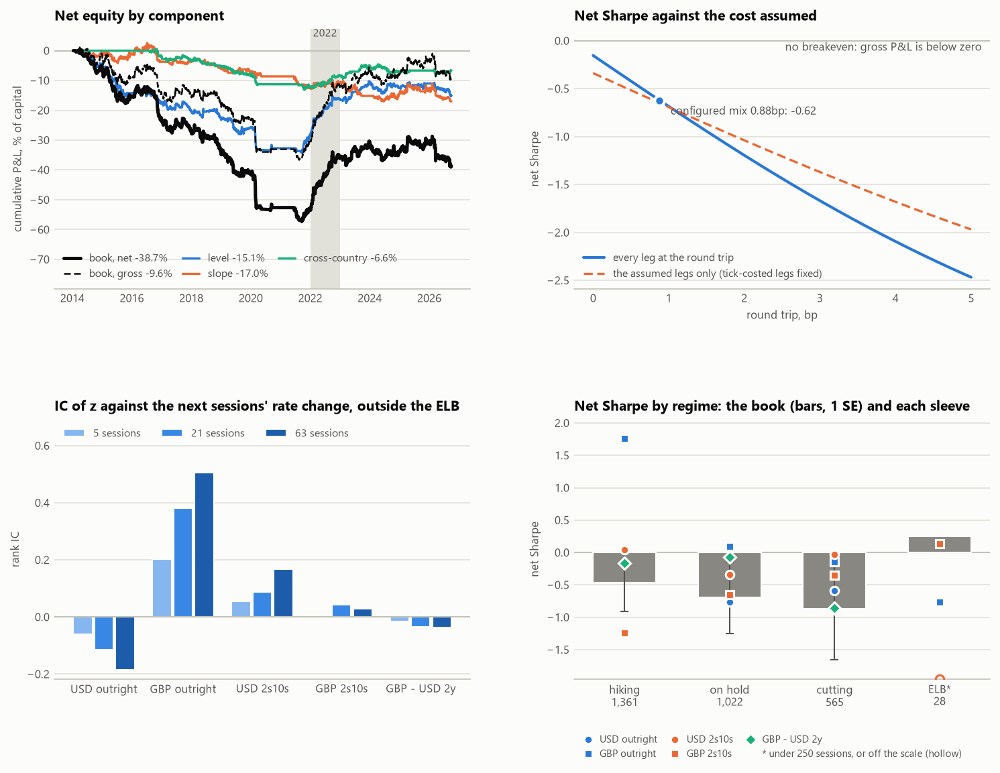

# Attribution and evaluation: where the book's P&L comes from

Generated by `scripts/build_tearsheet.py` from `data/panel/` and the cache, book sessions 2011-03-04 .. 2026-09-29, counted from 2014-01-13. Do not edit by hand. The book is week 9's headline (`reports/portfolio.md`): inverse-vol, hysteresis (1, 0), flat at the ELB, shrunk covariance, 5% vol target, no drawdown control. Net of costs unless named gross; P&L in % of capital. Every choice is a row in notes/DECISIONS.md, section A (attribution and evaluation).

## The answer

- **The level dominates: this is closer to a duration timer than to relative value.** 63% of the variance of the book's daily gross P&L is its exposure to the front ends (the outrights, and the curve and cross sleeves' betas on them); the rest, 37%, is the relative value. In P&L the level exposure made -0.03% of capital a year gross and the rest -0.78%, of a gross -0.81%: the risk is mostly the level's, the loss mostly the rest's. By sleeve group the level sleeves net -1.28% a year, the slope sleeves -1.44% and the cross-country sleeves -0.56%, the book -3.28%.
- **The book is not a carry trade.** Of its gross -0.81% of capital a year, carry and roll are -2.09% and the rate change +1.27%: its calls on the rate earn, and it pays more than that to hold them. A benchmark on the same sleeves, rule, sizing and costs, trading only the sign of each sleeve's carry and roll ahead, nets -0.79 (0.33); the book's daily net P&L correlates -0.16 with it, and 44% of the sleeve-sessions both hold a side are on the same side.
- **By sleeve, only GBP outright and USD 2s10s are right and bleeding.** The book's rate change earns +1.27% a year, GBP outright +2.44% and the other sleeves together -1.17%. USD outright (rate -0.88%, carry and roll -0.39%) and GBP 2s10s (rate -0.33%, carry and roll -0.32%) are wrong and bleeding; GBP outright (rate +2.44%, carry and roll -1.02%) and USD 2s10s (rate +0.63%, carry and roll -0.62%) are right and bleeding; GBP - USD 2y (rate -0.59%, carry and roll +0.26%) is wrong and collecting carry. The side held runs against its carry and roll ahead in GBP outright (-0.43), USD 2s10s (-0.28) and GBP 2s10s (-0.32) and with it in USD outright (+0.33) and GBP - USD 2y (+0.28) (the correlation of the side with the sign of a receive's carry and roll ahead).
- **What the rate calls would have had to earn.** Net zero needs the rate change to pay the costs less carry and roll: the book's earns +1.27% a year against +4.55% needed, 3.6 times as much. As the correlation of the position held with each session's rate move, sizes and moves as they were: USD outright -0.018 against -0.001, GBP outright +0.036 against +0.022, USD 2s10s +0.009 against +0.016, GBP 2s10s -0.004 against +0.029 and GBP - USD 2y -0.017 against -0.001. GBP outright clears it.
- **The costs are what the turnover says.** On the sessions with a position the book holds a mean gross DV01 of 284k a bp over its 8 legs and trades it 19.8 times a year at a mean 0.44bp one way: 19.8 x 284k x 0.44bp is 2.47% of capital a year, the cost charged. 46% of it is maintenance (the outrights moved to the new instrument as each meeting passes, charged as two outright one-ways, and the par legs re-struck every quarter), the most USD outright's, 0.58% a year.
- **The worst drawdown is a grind, not a break.** 57.5% of capital at 5.3% vol, from Apr 2014 to Sep 2021 (7.5 years), while the worst 21-session loss anywhere is 10.8%. Hit rates, net: USD outright 38% of days and 53% of trades, GBP outright 50% of days and 56% of trades, USD 2s10s 46% of days and 45% of trades, GBP 2s10s 48% of days and 30% of trades and GBP - USD 2y 49% of days and 42% of trades.
- **The level the z removes.** USD's market sat below the rule at the fourth meeting in every one of 13 years outside the ELB state (annual means -86 to -25bp, r* the SEP median); GBP's market sat below the rule at the fourth meeting in 8 of 11 years outside the ELB state (annual means -122 to +102bp, r* a constant -1.6%). The z trades the deviation from a trailing mean of this level; the level itself turns on r*, and what it is (a term premium, a discount on the committee following the rule, or the rule's own error) this report cannot tell.
- **By USD regime** the book nets -0.46 (0.45) hiking (1,361 sessions), -0.70 (0.55) on hold (1,022 sessions), -0.87 (0.79) cutting (565 sessions) and +0.25 (3.05) ELB (28 sessions).
- **The ELB: flat at the ELB (proposed).** The book nets -0.62 (0.32), 4 positions closed on entering the state and 6 re-opened on leaving it, at 0.89% of capital. ELB sessions excluded it would net -0.56 (0.31) (+0.06 (paired SE 0.06) against flat), +0.0% of capital from positions decided in the state; held through the ELB it would net -0.70 (0.29) (-0.06 (paired SE 0.10) against flat), -17.4% of capital from positions decided in the state.
- **Without 2022.** The book nets -0.62 (0.32) over the sample, -1.00 (0.37) without 2022 and -1.13 (0.40) without Dec 2021 to Aug 2023 (the positions not re-run: the rest of the sample's P&L).
- **The IC** of z against the next 5, 21, 63 sessions' rate change, outside the ELB state: USD outright -0.06 (t -1.8), -0.11 (t -1.6), -0.18 (t -1.5); GBP outright +0.20 (t +4.7), +0.38 (t +4.7), +0.51 (t +4.1); USD 2s10s +0.05 (t +1.6), +0.09 (t +1.3), +0.17 (t +1.4); GBP 2s10s -0.00 (t -0.0), +0.04 (t +0.6), +0.03 (t +0.3); GBP - USD 2y -0.02 (t -0.4), -0.04 (t -0.5), -0.04 (t -0.3).

## Performance

The book, then each sleeve's contribution to it (its P&L inside the book, over the book's counted sessions, so a sleeve's Sharpe counts the sessions it is flat). Hit rates are net: of the sessions with a position, and of the trades (a run of one side, from the close that opens it to the close that shuts it, its costs in; the book's are every sleeve's trades pooled). Without 2022 and 2022-23: the window's sessions left out, the positions not re-run.

|  | gross SR | net SR | net a year | vol | worst dd | hit (days) | hit (trades) | trades | turns a year | in market | ex-2022 | ex-2022-23 |
| --- | --- | --- | --- | --- | --- | --- | --- | --- | --- | --- | --- | --- |
| book | -0.15 (0.29) | -0.62 (0.32) | -3.28% | 5.3% | 57.5% | 46% | 45% | 103 | 19.8 | 97% | -1.00 (0.37) | -1.13 (0.40) |
| USD outright | -0.52 (0.31) | -0.90 (0.35) | -2.24% | 2.5% | 35.0% | 38% | 53% | 19 | 16.8 | 64% | -1.11 (0.39) | -1.25 (0.42) |
| GBP outright | +0.71 (0.33) | +0.49 (0.31) | +0.97% | 2.0% | 6.4% | 50% | 56% | 16 | 14.8 | 52% | +0.14 (0.31) | +0.02 (0.32) |
| USD 2s10s | +0.01 (0.29) | -0.12 (0.29) | -0.29% | 2.5% | 8.7% | 46% | 45% | 33 | 11.3 | 67% | -0.15 (0.31) | -0.19 (0.32) |
| GBP 2s10s | -0.36 (0.30) | -0.63 (0.32) | -1.15% | 1.8% | 13.6% | 48% | 30% | 23 | 7.8 | 47% | -0.73 (0.34) | -0.58 (0.34) |
| GBP - USD 2y | -0.16 (0.29) | -0.28 (0.30) | -0.56% | 2.0% | 13.7% | 49% | 42% | 12 | 9.4 | 61% | -0.49 (0.32) | -0.64 (0.35) |

The breakeven cost: none (gross <= 0); at the configured mix (0.88bp a round trip) the book nets -0.62.

**The worst drawdown is a grind, not a break.** 57.5% of capital at 5.3% vol, from Apr 2014 to Sep 2021 (7.5 years), while the worst 21-session loss anywhere is 10.8%. Hit rates, net: USD outright 38% of days and 53% of trades, GBP outright 50% of days and 56% of trades, USD 2s10s 46% of days and 45% of trades, GBP 2s10s 48% of days and 30% of trades and GBP - USD 2y 49% of days and 42% of trades.

## Where the costs go

Each sleeve's costs inside the book, and the book's. Mean gross DV01: every leg, on the sessions with a position, book currency per bp. Turns: DV01 traded a year over it, by cause (a whole round trip is 2): entries and exits (the sleeve's own side moved), resizing (another sleeve's did), rescaling (neither: the covariance, the vol target, the cap), rolls (the instrument changed under a held position) and re-strikes (the par legs, every quarter); rolls and re-strikes are the maintenance. The cost a year is turns x mean gross DV01 x the one-way cost, a year of counted sessions (`check_costs` holds the causes to the cost charged).

|  | legs | mean gross DV01 per bp | one way bp | entries and exits | resizing | rescaling | rolls | re-strikes | turns a year | cost a year | maintenance share |
| --- | --- | --- | --- | --- | --- | --- | --- | --- | --- | --- | --- |
| USD outright | 1 | 110k | 0.52 | 2.9 | 2.5 | 1.3 | 10.1 | 0.0 | 16.8 | 0.97% | 60% |
| GBP outright | 1 | 62k | 0.50 | 4.4 | 1.5 | 1.3 | 7.5 | 0.0 | 14.8 | 0.46% | 51% |
| USD 2s10s | 2 | 109k | 0.25 | 5.9 | 1.5 | 1.1 | 0.0 | 2.8 | 11.3 | 0.31% | 24% |
| GBP 2s10s | 2 | 126k | 0.50 | 3.6 | 1.2 | 0.9 | 0.0 | 2.2 | 7.8 | 0.49% | 28% |
| GBP - USD 2y | 2 | 68k | 0.38 | 2.7 | 1.6 | 1.1 | 0.0 | 3.9 | 9.4 | 0.24% | 42% |
| book | 8 | 284k | 0.44 | 6.6 | 2.8 | 1.9 | 5.6 | 3.0 | 19.8 | 2.47% | 46% |

**The costs are what the turnover says.** On the sessions with a position the book holds a mean gross DV01 of 284k a bp over its 8 legs and trades it 19.8 times a year at a mean 0.44bp one way: 19.8 x 284k x 0.44bp is 2.47% of capital a year, the cost charged. 46% of it is maintenance (the outrights moved to the new instrument as each meeting passes, charged as two outright one-ways, and the par legs re-struck every quarter), the most USD outright's, 0.58% a year.

## By component

Each group's P&L inside the book. The share of net variance is cov(group, book) / var(book): the shares add to one.

| group | sleeves | gross a year | costs | net a year | carry and roll | rate change | share of net variance | net SR of the contribution |
| --- | --- | --- | --- | --- | --- | --- | --- | --- |
| level | USD outright and GBP outright | +0.15% | -1.43% | -1.28% | -1.41% | +1.56% | 47% | -0.39 (0.30) |
| slope | USD 2s10s and GBP 2s10s | -0.64% | -0.80% | -1.44% | -0.94% | +0.30% | 34% | -0.47 (0.31) |
| cross-country | GBP - USD 2y | -0.32% | -0.24% | -0.56% | +0.26% | -0.59% | 19% | -0.28 (0.30) |
| book | every sleeve | -0.81% | -2.47% | -3.28% | -2.09% | +1.27% | 100% | -0.62 (0.32) |

### The level factor

Each sleeve's unit P&L on the outright unit P&L of its currencies (OLS with an intercept, full sample from the sleeve's first counted session: ex post). Its gross P&L in the book splits into position x betas x the outrights' unit P&L, the level part, and the rest. The level part is 63% of the variance of the book's daily gross P&L (correlation 0.79); the verdict turns at 50%.

| sleeve | beta on the outright(s) | R^2 | sessions | level part, gross a year | the rest, gross a year |
| --- | --- | --- | --- | --- | --- |
| USD outright | USD outright +1.00 | 1.00 | 3,675 | -1.27% | +0.00% |
| GBP outright | GBP outright +1.00 | 1.00 | 3,813 | +1.42% | +0.00% |
| USD 2s10s | USD outright +0.29 | 0.12 | 3,425 | +0.24% | -0.22% |
| GBP 2s10s | GBP outright +0.17 | 0.06 | 3,563 | -0.17% | -0.48% |
| GBP - USD 2y | GBP outright +0.75; USD outright -0.77 | 0.48 | 3,595 | -0.24% | -0.08% |
| book |  |  |  | -0.03% | -0.78% |

How far the level and slope signals agree (the traded slope is orthogonalised against the level; the raw 8-minus-1 is not):

|  | what | corr of z | same sign | sessions |
| --- | --- | --- | --- | --- |
| USD | USD outright vs USD 2s10s (orthogonal slope) | -0.07 | 56% | 3,427 |
| USD | USD outright vs USD 2s10s (raw slope) | +0.85 | 84% | 3,677 |
| USD | the book's sides, both on |  | 53% | 1,321 |
| GBP | GBP outright vs GBP 2s10s (orthogonal slope) | +0.17 | 62% | 3,565 |
| GBP | GBP outright vs GBP 2s10s (raw slope) | +0.94 | 93% | 3,815 |
| GBP | the book's sides, both on |  | 76% | 956 |

## Carry against rate

**The book is not a carry trade.** Of its gross -0.81% of capital a year, carry and roll are -2.09% and the rate change +1.27%: its calls on the rate earn, and it pays more than that to hold them. A benchmark on the same sleeves, rule, sizing and costs, trading only the sign of each sleeve's carry and roll ahead, nets -0.79 (0.33); the book's daily net P&L correlates -0.16 with it, and 44% of the sleeve-sessions both hold a side are on the same side. Without 2022 the benchmark nets -0.60. The book against it: +0.17 (paired SE 0.44). By sleeve, the share of the sessions both hold a side on which they agree: USD outright 58%, GBP outright 29%, USD 2s10s 35%, GBP 2s10s 33% and GBP - USD 2y 61%.

### By sleeve

Each sleeve inside the book, % of capital a year. Rate needed: the rate change at which the sleeve nets zero, its costs less its carry and roll. Held and bleeding: the share of the counted sessions with a position on which the carry and roll ahead of the side held (91 days, the curve frozen) is below zero. Side vs carry: the correlation of the side with the sign of a receive's carry and roll ahead, on the same sessions. rho: the correlation of the position held with each session's rate move (unit P&L's rate component), and rho* the one at which the rate change pays for the costs less carry and roll, the positions' sizes and the moves as they were (`carry_by_sleeve`). They are daily, so small: the rate change is N x (rho x sd(position) x sd(move) + mean(position) x mean(move)), and rho* is near or below zero where the second term, the average tilt times the average move, already pays most of what is needed.

| sleeve | carry and roll | rate change | costs | net | rate needed | reading | held and bleeding | side vs carry | rho | rho* |
| --- | --- | --- | --- | --- | --- | --- | --- | --- | --- | --- |
| USD outright | -0.39% | -0.88% | -0.97% | -2.24% | +1.36% | wrong and bleeding | 42% | +0.33 | -0.018 | -0.001 |
| GBP outright | -1.02% | +2.44% | -0.46% | +0.97% | +1.48% | right and bleeding | 71% | -0.43 | +0.036 | +0.022 |
| USD 2s10s | -0.62% | +0.63% | -0.31% | -0.29% | +0.93% | right and bleeding | 65% | -0.28 | +0.009 | +0.016 |
| GBP 2s10s | -0.32% | -0.33% | -0.49% | -1.15% | +0.82% | wrong and bleeding | 67% | -0.32 | -0.004 | +0.029 |
| GBP - USD 2y | +0.26% | -0.59% | -0.24% | -0.56% | -0.02% | wrong and collecting carry | 39% | +0.28 | -0.017 | -0.001 |
| book | -2.09% | +1.27% | -2.47% | -3.28% | +4.55% |  |  |  |  |  |

- **By sleeve, only GBP outright and USD 2s10s are right and bleeding.** The book's rate change earns +1.27% a year, GBP outright +2.44% and the other sleeves together -1.17%. USD outright (rate -0.88%, carry and roll -0.39%) and GBP 2s10s (rate -0.33%, carry and roll -0.32%) are wrong and bleeding; GBP outright (rate +2.44%, carry and roll -1.02%) and USD 2s10s (rate +0.63%, carry and roll -0.62%) are right and bleeding; GBP - USD 2y (rate -0.59%, carry and roll +0.26%) is wrong and collecting carry. The side held runs against its carry and roll ahead in GBP outright (-0.43), USD 2s10s (-0.28) and GBP 2s10s (-0.32) and with it in USD outright (+0.33) and GBP - USD 2y (+0.28) (the correlation of the side with the sign of a receive's carry and roll ahead).
- **What the rate calls would have had to earn.** Net zero needs the rate change to pay the costs less carry and roll: the book's earns +1.27% a year against +4.55% needed, 3.6 times as much. As the correlation of the position held with each session's rate move, sizes and moves as they were: USD outright -0.018 against -0.001, GBP outright +0.036 against +0.022, USD 2s10s +0.009 against +0.016, GBP 2s10s -0.004 against +0.029 and GBP - USD 2y -0.017 against -0.001. GBP outright clears it.
- **The carry filter would skip 16 of the rule's 104 entries** (15%; an entry whose expected quarter, the edge's past closure and carry and roll on the rest, is below zero): USD outright 4 of 19, GBP outright 2 of 16, USD 2s10s 7 of 34, GBP 2s10s 0 of 23 and GBP - USD 2y 3 of 12. The book with it on is the carry filter row of `reports/robustness.md`.

## By regime

Real-time regimes (`regimes.py`: ELB, early and late hiking, the two holds, cutting). The book by USD's regime; hiking and on hold sum their two states. Trades are every sleeve's, by the regime at the close that put them on.

| regime | sessions | with a position | trades | net | net a year | net SR |
| --- | --- | --- | --- | --- | --- | --- |
| early hiking | 513 | 496 | 19 | -0.9% | -0.42% | -0.08 (0.70) |
| late hiking | 848 | 848 | 34 | -12.1% | -3.59% | -0.72 (0.61) |
| **hiking** | 1,361 | 1,344 | 53 | -12.9% | -2.39% | -0.46 (0.45) |
| hold after hikes | 191 | 191 | 3 | -2.0% | -2.70% | -0.65 (1.26) |
| hold after cuts | 831 | 778 | 29 | -11.5% | -3.49% | -0.71 (0.62) |
| **on hold** | 1,022 | 969 | 32 | -13.6% | -3.35% | -0.70 (0.55) |
| cutting | 565 | 561 | 17 | -12.4% | -5.52% | -0.87 (0.79) |
| ELB | 28 | 19 | 1 | +0.1% | +1.16% | +0.25 (3.05) |

Each sleeve's contribution by the collapsed regime of its own currency (the cross sleeve by the book currency's): net Sharpe (sessions; trades).

| sleeve | regime of | hiking | on hold | cutting | ELB |
| --- | --- | --- | --- | --- | --- |
| USD outright | USD | -1.21 (1,361; 12) | -0.76 (1,022; 6) | -0.59 (565; 1) | n/a (28; 0) |
| GBP outright | GBP | +1.76 (850; 4) | +0.09 (768; 9) | -0.15 (665; 3) | -0.77 (693; 0) |
| USD 2s10s | USD | +0.04 (1,361; 13) | -0.35 (1,022; 14) | -0.03 (565; 6) | -4.31 (28; 0) |
| GBP 2s10s | GBP | -1.24 (850; 8) | -0.66 (768; 9) | -0.36 (665; 6) | +0.14 (693; 0) |
| GBP - USD 2y | USD | -0.17 (1,361; 9) | -0.07 (1,022; 2) | -0.86 (565; 1) | n/a (28; 0) |

The book by whether USD and GBP are in the same collapsed regime:

| regime | sessions | with a position | trades | net | net a year | net SR |
| --- | --- | --- | --- | --- | --- | --- |
| same | 1,524 | 1,516 | 59 | -4.0% | -0.66% | -0.12 (0.41) |
| different | 1,452 | 1,377 | 44 | -34.7% | -6.03% | -1.15 (0.54) |

## The ELB

The state (`regimes.elb_state`): the policy rate on its floor and the rule's notional below it, so the model path is flat at the floor and has no view. Its runs: USD: Mar 2011 to Jan 2014 (723), May 2020 to May 2021 (254); GBP: Aug 2010 to Aug 2016 (1,500), May 2020 to Aug 2020 (64), Sep 2020 to Jun 2021 (189), Aug 2021 to Sep 2021 (18). The book under each treatment, same sizing and costs (* the configured one):

| treatment | sessions counted | with a position decided in the state | net from those positions | net from the rest | net SR | net SR without those sessions | forced closes / re-opens | their cost | ex-2022 | worst dd |
| --- | --- | --- | --- | --- | --- | --- | --- | --- | --- | --- |
| flat at the ELB* | 2,976 | 0 | +0.0% | -38.7% | -0.62 (0.32) | -0.62 (0.32) | 4 / 6 | 0.89% | -1.00 | 57.5% |
| ELB sessions excluded | 2,976 | 672 | +0.0% | -32.8% | -0.56 (0.31) | -0.47 (0.35) | n/a | n/a | -0.96 | 51.6% |
| held through the ELB | 3,674 | 1,349 | -17.4% | -33.0% | -0.70 (0.29) | -0.48 (0.35) | n/a | n/a | -1.03 | 69.5% |

- **The ELB: flat at the ELB (proposed).** The book nets -0.62 (0.32), 4 positions closed on entering the state and 6 re-opened on leaving it, at 0.89% of capital. ELB sessions excluded it would net -0.56 (0.31) (+0.06 (paired SE 0.06) against flat), +0.0% of capital from positions decided in the state; held through the ELB it would net -0.70 (0.29) (-0.06 (paired SE 0.10) against flat), -17.4% of capital from positions decided in the state.
- The post-lift-off z is standardised against a trailing window that is mostly ELB sessions for up to two years after lift-off, so the first signals out of the state are measured against a quiet yardstick.

## The IC

Rank IC of z against the next h sessions of the unit P&L's rate change (and total) after the execution lag, t from a Newey-West SE with Bartlett weights to h (the overlap; a persistent z keeps the products autocorrelated past it, so the t overstates the precision). The non-overlapping cross-check is the IC on every h-th session, over the h start offsets.

| sleeve | part | sample | IC(5) t | IC(21) t | IC(63) t | non-overlapping mean [range] |
| --- | --- | --- | --- | --- | --- | --- |
| USD outright | rate | outside the ELB | -0.061 (-1.8) | -0.115 (-1.6) | -0.184 (-1.5) | -0.061 [-0.07, -0.05]; -0.114 [-0.18, -0.06]; -0.180 [-0.26, -0.10] |
| USD outright | rate | all | -0.034 (-1.1) | -0.085 (-1.4) | -0.147 (-1.3) | -0.034 [-0.04, -0.02]; -0.084 [-0.14, -0.03]; -0.146 [-0.22, -0.09] |
| USD outright | total | outside the ELB | -0.036 (-1.1) | -0.089 (-1.4) | -0.148 (-1.3) | -0.036 [-0.05, -0.02]; -0.089 [-0.19, -0.05]; -0.137 [-0.20, -0.06] |
| USD outright | total | all | -0.026 (-0.9) | -0.079 (-1.4) | -0.152 (-1.5) | -0.025 [-0.04, -0.01]; -0.078 [-0.16, -0.03]; -0.146 [-0.21, -0.09] |
| GBP outright | rate | outside the ELB | +0.202 (+4.7) | +0.381 (+4.7) | +0.506 (+4.1) | +0.203 [+0.18, +0.23]; +0.379 [+0.32, +0.43]; +0.498 [+0.36, +0.63] |
| GBP outright | rate | all | +0.130 (+3.9) | +0.248 (+3.9) | +0.316 (+3.0) | +0.130 [+0.11, +0.17]; +0.246 [+0.19, +0.30]; +0.313 [+0.16, +0.43] |
| GBP outright | total | outside the ELB | +0.119 (+2.8) | +0.238 (+3.0) | +0.321 (+2.5) | +0.119 [+0.10, +0.15]; +0.237 [+0.16, +0.30]; +0.320 [+0.17, +0.45] |
| GBP outright | total | all | +0.099 (+3.0) | +0.197 (+3.2) | +0.255 (+2.5) | +0.099 [+0.08, +0.13]; +0.195 [+0.13, +0.24]; +0.253 [+0.13, +0.36] |
| USD 2s10s | rate | outside the ELB | +0.054 (+1.6) | +0.088 (+1.3) | +0.167 (+1.4) | +0.054 [+0.03, +0.06]; +0.088 [+0.02, +0.17]; +0.162 [-0.16, +0.35] |
| USD 2s10s | rate | all | +0.064 (+2.0) | +0.116 (+1.9) | +0.216 (+2.1) | +0.064 [+0.05, +0.07]; +0.117 [+0.05, +0.20]; +0.218 [-0.08, +0.45] |
| USD 2s10s | total | outside the ELB | +0.011 (+0.3) | -0.008 (-0.1) | +0.008 (+0.1) | +0.012 [-0.01, +0.03]; -0.011 [-0.08, +0.05]; +0.001 [-0.28, +0.17] |
| USD 2s10s | total | all | +0.026 (+0.8) | +0.033 (+0.5) | +0.087 (+0.9) | +0.027 [+0.01, +0.04]; +0.031 [-0.03, +0.10]; +0.083 [-0.16, +0.28] |
| GBP 2s10s | rate | outside the ELB | -0.001 (-0.0) | +0.043 (+0.6) | +0.029 (+0.3) | -0.001 [-0.03, +0.02]; +0.043 [-0.05, +0.13]; +0.028 [-0.18, +0.26] |
| GBP 2s10s | rate | all | -0.047 (-1.5) | -0.067 (-1.1) | -0.124 (-1.4) | -0.047 [-0.08, -0.03]; -0.066 [-0.15, -0.00]; -0.123 [-0.32, +0.11] |
| GBP 2s10s | total | outside the ELB | -0.020 (-0.5) | +0.002 (+0.0) | -0.030 (-0.3) | -0.020 [-0.05, -0.00]; +0.004 [-0.06, +0.09]; -0.032 [-0.22, +0.19] |
| GBP 2s10s | total | all | -0.052 (-1.7) | -0.080 (-1.3) | -0.139 (-1.7) | -0.052 [-0.09, -0.03]; -0.079 [-0.15, -0.02]; -0.137 [-0.36, +0.05] |
| GBP - USD 2y | rate | outside the ELB | -0.016 (-0.4) | -0.035 (-0.5) | -0.036 (-0.3) | -0.016 [-0.03, +0.01]; -0.033 [-0.11, +0.01]; -0.037 [-0.13, +0.14] |
| GBP - USD 2y | rate | all | -0.005 (-0.2) | -0.022 (-0.4) | +0.019 (+0.2) | -0.005 [-0.02, +0.02]; -0.020 [-0.07, +0.02]; +0.025 [-0.07, +0.11] |
| GBP - USD 2y | total | outside the ELB | +0.012 (+0.3) | +0.017 (+0.2) | +0.023 (+0.2) | +0.012 [+0.00, +0.04]; +0.018 [-0.05, +0.08]; +0.021 [-0.08, +0.22] |
| GBP - USD 2y | total | all | +0.023 (+0.8) | +0.034 (+0.6) | +0.090 (+0.8) | +0.023 [+0.01, +0.05]; +0.035 [-0.01, +0.09]; +0.092 [-0.02, +0.17] |

## The level the z removes

The gap is market minus rule, bp; the z is its deviation from its own trailing two-year mean, so the level below is what the traded signal leaves out. By each currency's own collapsed regime (the ELB state its own row), at the first, the traded and the last meeting; then the traded meeting's mean by year outside the ELB state (years with 60 such sessions or more).

|  | regime | sessions | gap at meeting 1 | gap at meeting 4 | gap at meeting 8 |
| --- | --- | --- | --- | --- | --- |
| USD | hiking | 1,361 | -6 | -37 | -93 |
| USD | on hold | 1,024 | -15 | -53 | -85 |
| USD | cutting | 565 | -17 | -62 | -104 |
| USD | ELB | 977 | +0 | +1 | +5 |
| GBP | hiking | 851 | -16 | -81 | -177 |
| GBP | on hold | 776 | +0 | +2 | +2 |
| GBP | cutting | 667 | +7 | +28 | +54 |
| GBP | ELB | 1,771 | -1 | -1 | +3 |

| year | USD, meeting 4 | GBP, meeting 4 |
| --- | --- | --- |
| 2014 | -32 | n/a |
| 2015 | -47 | n/a |
| 2016 | -42 | -0 |
| 2017 | -28 | -16 |
| 2018 | -25 | -21 |
| 2019 | -80 | -26 |
| 2020 | -86 | -25 |
| 2021 | -85 | -23 |
| 2022 | -45 | -122 |
| 2023 | -58 | -120 |
| 2024 | -49 | +36 |
| 2025 | -51 | +19 |
| 2026 | -27 | +102 |

**The level the z removes.** USD's market sat below the rule at the fourth meeting in every one of 13 years outside the ELB state (annual means -86 to -25bp, r* the SEP median); GBP's market sat below the rule at the fourth meeting in 8 of 11 years outside the ELB state (annual means -122 to +102bp, r* a constant -1.6%). The z trades the deviation from a trailing mean of this level; the level itself turns on r*, and what it is (a term premium, a discount on the committee following the rule, or the rule's own error) this report cannot tell.

## The current signal

| sleeve | as of | z | side | book DV01 per bp | instrument | edge bp | CR 91d | E 91d |
| --- | --- | --- | --- | --- | --- | --- | --- | --- |
| USD outright | 29 Sep | +2.4 | receive | +35k | 2027-04 | +53 | +31 | +41 |
| GBP outright | 29 Sep | +2.0 | receive | +27k | 2027-03-18/2027-04-29 | +89 | +36 | +43 |
| USD 2s10s | 29 Sep | +1.1 | receive | +45k | 2y vs 10y | +16 | +15 | +15 |
| GBP 2s10s | 29 Sep | +0.0 | flat | +0k | 2y vs 10y | +0 | +11 | +3 |
| GBP - USD 2y | 29 Sep | +1.0 | receive | +29k | 2y vs 2y | +37 | -2 | +4 |
