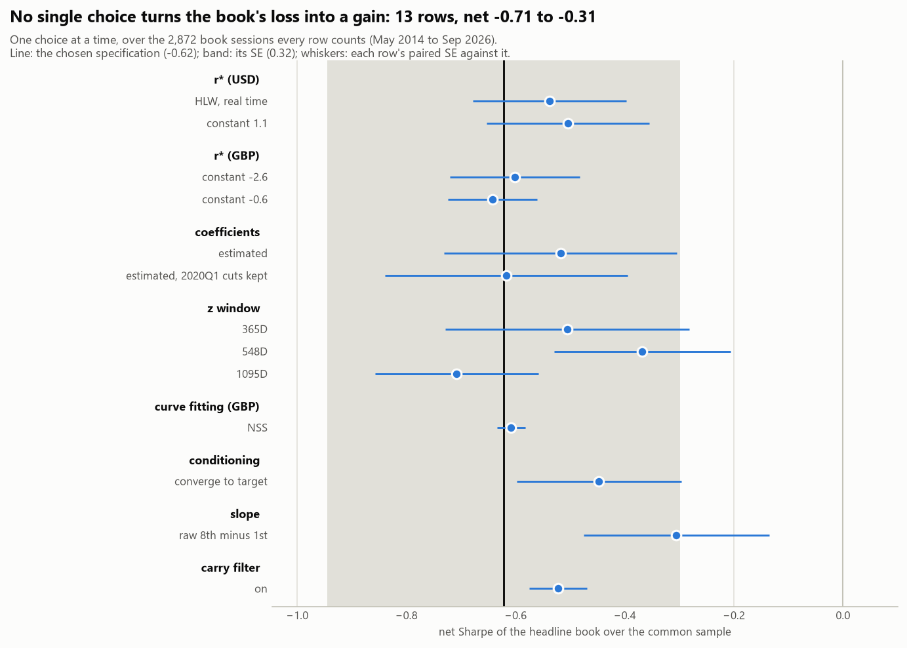

# Robustness: the headline book with one choice at a time moved off the chosen specification

Generated by `scripts/build_robustness.py` from `data/panel/` and the cache, book sessions 2011-03-04 .. 2026-09-29. Do not edit by hand. The rows are `config/strategy.yml: robustness`; the grid is `strategy/robustness.py`, the book `strategy/portfolio.py` (reports/portfolio.md), the sleeves week 8's (reports/costs.md). Every choice is a row in notes/DECISIONS.md, section V.

## The answer

**In one line: no single choice turns the book's loss into a gain.** Net of costs, over the 2,872 book sessions every row counts, the 13 rows net from -0.71 (z window: 1095D) to -0.31 (slope: raw 8th minus 1st), around the chosen specification's -0.62 (0.32). 11 of the 13 net more than the chosen specification: it was fixed in config before the grid ran, so it is the reference here, not a cell picked from it.

- **One choice at a time.** Each of the 13 rows moves one of 8 choices (r* (USD), r* (GBP), coefficients, z window, curve fitting (GBP), conditioning, slope and carry filter) off its chosen value and leaves every other where the book has it, so interactions between choices are not run. A row changes the signal only: its sleeves are built on the baseline's legs, so the marks, the instruments, carry, roll, costs, the unit P&L and the covariance are the baseline's, checked on every row. Every cell is the headline book: inverse-vol (the headline, proposed), shrunk covariance, 5% ex-ante vol, the gross DV01 cap, hysteresis (1, 0), flat at the ELB, at the configured costs, no drawdown control. The primary cell is its net Sharpe over the common sample, the 2,872 book sessions from May 2014 to Sep 2026 on which every row has an eligible signal (counted by the ELB treatment, with a z behind the position), so the rows differ only in what the signal did on the same days.
- **No row moves the book by as much as one SE of its Sharpe (0.32).** The largest moves: slope: raw 8th minus 1st +0.32 (paired SE 0.17), z window: 548D +0.25 (paired SE 0.16) and conditioning: converge to target +0.17 (paired SE 0.15). Rows share the sessions and most of the positions, so the noise in a difference is the paired SE, sd(x_row - x_chosen) / sd(x_chosen) / sqrt(years), well under the SE of either Sharpe. Against it, no row moves the book by more than two and 9 by less than one (r* (USD): HLW, real time, r* (USD): constant 1.1, r* (GBP): constant -2.6, r* (GBP): constant -0.6, coefficients: estimated, coefficients: estimated, 2020Q1 cuts kept, z window: 365D, z window: 1095D and curve fitting (GBP): NSS). The paired SE is iid; its Newey-West version (Bartlett weights to 21 sessions) is lower on 10 of the 13 rows, and the bands' edges are not sharp: under it the book moves by 1.02 paired SEs at r* (USD): constant 1.1 (0.79 iid: one to two, not under one), 2.09 paired SEs at slope: raw 8th minus 1st (1.86 iid: over two, not one to two) and 2.30 paired SEs at carry filter: on (1.90 iid: over two, not one to two).
- **What the result is and is not sensitive to.** The book's loss does not hinge on one choice: every row loses money net, and no row moves its net Sharpe by as much as one SE (0.32). Against the paired SE, z window, conditioning, slope and carry filter move it by more than one paired SE, every such move upward: the chosen specification sits low among its neighbours, and no neighbour earns (the best, slope: raw 8th minus 1st, nets -0.31). Noise alone would put about 4.1 of 13 independent moves beyond one paired SE and 0.6 beyond two; 4 and 0 are, so the count is about what chance gives, and the band alone is not evidence that the result is sensitive to those choices. Under r* (USD), r* (GBP), coefficients and curve fitting (GBP) it moves by less than one paired SE. The USD outright loses in every row (-1.07 to -0.73); what moves it most is r* (USD): constant 1.1 (+0.24, 1.7 paired SEs). The GBP outright earns in every row (+0.12 to +0.75); what moves it most is coefficients: estimated, 2020Q1 cuts kept (-0.55, 1.6 paired SEs). The book's insensitivity to r* (GBP) and coefficients hides the GBP outright's, the one sleeve that earns in every row: it moves by 1.3 paired SEs under r* (GBP) (constant -0.6, -0.19) and 1.6 paired SEs under coefficients (estimated, 2020Q1 cuts kept, -0.55).
- **Each sleeve alone** (week 8's vol-scaled sleeve, net, over its own common sample): USD outright -1.07 to -0.73 (negative in every row; chosen -0.97, moved most by r* (USD): constant 1.1, +0.24, 1.7 paired SEs); GBP outright +0.12 to +0.75 (positive in every row; chosen +0.67, moved most by coefficients: estimated, 2020Q1 cuts kept, -0.55, 1.6 paired SEs); USD 2s10s -0.16 to +0.23 (positive in 1 of 14; chosen -0.10, moved most by slope: raw 8th minus 1st, +0.33, 1.0 paired SEs); GBP 2s10s -0.67 to +0.06 (positive in 1 of 14; chosen -0.45, moved most by slope: raw 8th minus 1st, +0.51, 1.3 paired SEs); GBP - USD 2y -0.24 to +0.21 (positive in 2 of 14; chosen -0.23, moved most by coefficients: estimated, +0.44, 1.8 paired SEs). A row that changes one currency's block leaves the sleeves that do not trade it exactly at their chosen cells.
- **What the slope row trades.** The USD 2s10s's z correlates 0.85 with the USD outright's under raw 8th minus 1st and -0.07 chosen, and nets +0.23 against -0.10; the GBP 2s10s's z correlates 0.94 with the GBP outright's under raw 8th minus 1st and 0.17 chosen, and nets +0.06 against -0.45: the raw slope re-trades most of the level on the curve (why the traded slope is orthogonalised), so the row tests the level's timing on the curve more than it tests the slope.
- **Before costs the book earns in 3 of the 14 specifications (z window: 365D, z window: 548D and slope: raw 8th minus 1st), at most +0.12.** Its gross Sharpe runs from -0.26 to +0.12 (chosen -0.17): no row's gross covers its costs.
- **The note on r\*, in GBP: a constant r\* moves the quoted gap, and the z absorbs less of it than the plan says.** Constant -2.6 and constant -0.6 are constant offsets of the chosen constant -1.6. Each pp of r* moves the gap at the backtest horizon by 27.7bp the other way where the rule's goal is off the floor in both, and that is the number the brief quotes: on 2026-09-25 it is +136.0bp at the chosen value, +163.7 at constant -2.6 and +108.2 at constant -0.6. Where the goal is floored in both the gap does not move. Over the 2,208 sessions every row counts for the GBP outright it is floored on 7.2% at the chosen value (23.1% at constant -2.6 and 5.1% at constant -0.6; over every session, the years both models spend flat in the ELB state included, 48%, 58% and 44%), so the shift is not constant (its sd is 13.4bp and 13.7bp) and a trailing z cannot remove all of it: corr(z, the chosen z) is 0.88 and 0.96, and on those sessions the z changes sign on 12.6% and 4.9% (12.5% and 3.5% of every session) and the GBP outright's side on 16.8% and 8.9% (10.6% and 7.1%). The z is the chosen one's only where neither model's goal has been floored over the trailing 730D (the largest change in z there is 1e-13): on 185 and 1,043 of the 2,208. The plan's 'the z-score absorbs a constant r* offset almost entirely' holds away from the floor and not near it: it fails most at constant -2.6 (corr 0.88), where the goal is floored on 23.1% of the counted sessions against 7.2%. For trading it is nearly free for the book, less so for the sleeve: the GBP outright nets +0.47 at constant -2.6 and +0.47 at constant -0.6 against +0.67 chosen (0.8 and 1.3 paired SEs), the book -0.60 and -0.64 against -0.62 (0.2 and 0.2 paired SEs).
- **In USD, the r\* rows are not constant offsets of the chosen SEP longer-run dot** (the offset's sd over the sample: 0.29pp at HLW, real time and 0.61pp at constant 1.1), so the z has a moving offset to absorb: corr(z) 0.96 and 0.91, sign changes 7.8% and 9.4%, the latest gap +9.4bp becomes +14.7 and +12.1. Of the 2,872 sessions every row counts for the USD outright, HLW, real time uses Taylor's 2% before the first vintage on 465 (16.2%, to 2016-03-04) and the vintage dated 2020-04-01 (0.03%), which stood from 2020-09-03 to 2023-05-18, on 509 (17.7%): a current vintage on 66%. The USD outright nets -0.76 and -0.73 against -0.97 chosen; the book -0.54 and -0.50. Constant 1.1 rounds the chosen r*'s mean over the sessions with a published value, 1.08 (1.13 with the stand-in before the first): a hindsight number.
- **The signal before sizing and costs: IC(21).** The rank correlation of each sleeve's z with the rate component of its unit P&L over the 21 sessions after the execution lag, over the sessions on which every row has a z outside its ELB state: USD outright -0.21 to -0.05 (t -3.3 to -0.8; chosen -0.11, negative in every row); GBP outright +0.14 to +0.40 (t +1.8 to +4.9; chosen +0.40, positive in every row); USD 2s10s +0.03 to +0.14 (t +0.5 to +2.2; chosen +0.10, positive in every row); GBP 2s10s -0.02 to +0.17 (t -0.3 to +2.3; chosen +0.06, positive in 13 of 14); GBP - USD 2y -0.04 to +0.06 (t -0.5 to +0.8; chosen -0.03, positive in 2 of 14). The IC keeps its sign in every row for 3 of the 5 sleeves. Its t uses Newey-West with Bartlett weights to 21 lags, which allows for the overlap of the forward windows and not for the z's own persistence: the rank products' autocorrelation 21 sessions apart is 0.32 (USD outright), 0.12 (GBP outright), 0.00 (USD 2s10s), -0.07 (GBP 2s10s) and -0.04 (GBP - USD 2y) for the chosen specification, and where it is positive the t overstates the precision. The non-overlapping check, the IC on one session in 21 (at least 101 each) from each of the 21 start offsets, gives the chosen specification USD outright -0.11 (-0.18 to -0.06), GBP outright +0.40 (+0.33 to +0.46), USD 2s10s +0.10 (+0.03 to +0.19), GBP 2s10s +0.06 (-0.04 to +0.14) and GBP - USD 2y -0.03 (-0.10 to +0.02); its mean has the IC's sign in 70 of the 70 row-sleeve cells. The carry filter row changes the rule, not the z, so its IC is the chosen one's.
- **The estimated rule from its first estimate.** Its coefficients first rest on data on 2014-07-01 (USD) and 2017-01-03 (GBP); before that they are the prior, the imposed values. From 2017-01-03 (the later) the chosen specification nets -0.35 (0.35) over the common sample, and estimated -0.20 and estimated, 2020Q1 cuts kept -0.33. The sleeve the estimate moves most there is GBP outright: +0.67 chosen, +0.14 estimated and +0.11 estimated, 2020Q1 cuts kept.
- **Each row on its own sample.** The chosen specification counts 2,976 sessions and nets -0.62 (0.32) there: reports/portfolio.md's headline, whose reports/results/portfolio.json has -0.619012 over 2,976 (checked: the build stops if they differ). The ELB state is the model's, so a row can count other sessions: r* (USD): constant 1.1 counts 2,898 and nets -0.49 there (-0.50 on the common sample), its ELB-state sessions 1,055 against 977 (USD); r* (GBP): constant -0.6 counts 3,038 and nets -0.64 there (-0.64 on the common sample), its ELB-state sessions 1,687 against 1,771 (GBP); conditioning: converge to target counts 3,504 and nets -0.52 there (-0.45 on the common sample), its ELB-state sessions 397 against 977 (USD) and 1,753 against 1,771 (GBP).

## One line per choice

The headline book's net Sharpe over the common sample: the chosen value (*), each alternative with its move from it and the paired SE of that move, the range against one SE of a Sharpe, and the sleeve the choice moves most. The chosen specification is the reference, not the best cell.

- **r* (USD)**: SEP longer-run dot* -0.62; HLW, real time -0.54 (+0.08, paired SE 0.14); constant 1.1 -0.50 (+0.12, paired SE 0.15). Range 0.12, under one SE (0.32). The sleeve it moves most: USD outright, +0.24 at constant 1.1.
- **r* (GBP)**: constant -1.6* -0.62; constant -2.6 -0.60 (+0.02, paired SE 0.12); constant -0.6 -0.64 (-0.02, paired SE 0.08). Range 0.04, under one SE (0.32). The sleeve it moves most: GBP outright, -0.20 at constant -2.6.
- **coefficients**: imposed* -0.62; estimated -0.52 (+0.10, paired SE 0.21); estimated, 2020Q1 cuts kept -0.62 (+0.00, paired SE 0.22). Range 0.10, under one SE (0.32). The sleeve it moves most: GBP outright, -0.55 at estimated, 2020Q1 cuts kept.
- **z window**: 730D* -0.62; 365D -0.51 (+0.12, paired SE 0.22); 548D -0.37 (+0.25, paired SE 0.16); 1095D -0.71 (-0.09, paired SE 0.15). Range 0.34, over one SE (0.32). The sleeve it moves most: GBP 2s10s, +0.31 at 548D.
- **curve fitting (GBP)**: log-linear* -0.62; NSS -0.61 (+0.01, paired SE 0.03). Range 0.01, under one SE (0.32). The sleeve it moves most: GBP - USD 2y, +0.05 at NSS.
- **conditioning**: hold-flat* -0.62; converge to target -0.45 (+0.17, paired SE 0.15). Range 0.17, under one SE (0.32). The sleeve it moves most: USD outright, +0.18 at converge to target.
- **slope**: orthogonal to the level* -0.62; raw 8th minus 1st -0.31 (+0.32, paired SE 0.17). Range 0.32, under one SE (0.32). The sleeve it moves most: GBP 2s10s, +0.51 at raw 8th minus 1st.
- **carry filter**: off* -0.62; on -0.52 (+0.10, paired SE 0.05). Range 0.10, under one SE (0.32). The sleeve it moves most: USD outright, +0.11 at on.

## How the grid is run

**A row** is one alternative value of one choice, every other choice at its chosen value. It overrides the currency blocks' `rule`, `signal` or `market.curve.method`, or the book's `signal` or `positions.carry_filter`, and nothing else (the config refuses a wider override). Its signal is rebuilt from `data/panel/`'s sessions, meetings and macro through the chain's own entry points, rerunning only the stages the override reaches: the market path from the cache for a curve fit, the model path for anything in the rule, the gap and its z always. With no override the same path rebuilds `data/panel/`'s model and signal bit for bit (checked before the first rebuild in each currency). Rebuilt rows are kept in `data/panel/robustness/` under a fingerprint of everything they read.

**The invariant.** A row's sleeves are built on the baseline's legs: the marks (the Bank's own curve under NSS too), the instrument selected, carry, roll and costs are the baseline's, and so are the unit P&L, the sigma the sleeves are sized on and the book's covariance. What moves is the component, its z, the ELB state (the model's: it moves with r*, the coefficients and the conditioning) and the carry gate.

**The cells.** The book is the headline: inverse-vol (the headline, proposed), shrunk covariance, 5% ex-ante vol, the gross DV01 cap, hysteresis (1, 0), flat at the ELB, at the configured costs, no drawdown control. The sleeves are each alone, week 8's vol-scaled sleeve at the book's rule. A session has an eligible signal where the ELB treatment counts it and a z stands behind the position held into it or the one put on at its close; the common sample is the sessions on which every row has one (for the book: any sleeve with one, as the book counts its sessions). Sharpe and its SE are week 8's: mean over sd of daily net P&L, annualised by the calendar's sessions a year, SE sqrt((1 + SR^2/2)/years), iid, for a Sharpe the least the uncertainty can be. The paired SE of a row's move is sd(x_row - x_chosen) / sd(x_chosen) / sqrt(years): two cells over the same sessions share most of their positions, so their difference is less noisy than either. It is iid too, and for a difference that is not a bound either way: its Newey-West version (Bartlett weights to 21 sessions) is beside it in the grid, lower on 10 of the 13 rows.

## The grid: net Sharpe over the common sample (primary)

Common sample: 2,872 book sessions, 2014-05-05 to 2026-09-29 (11.4 years); **SE(SR) there is 0.32** at the chosen specification's -0.62. Each sleeve over its own common sample: USD outright 2,872 sessions from May 2014 (SE 0.36), GBP outright 2,208 sessions from Aug 2016 (SE 0.37), USD 2s10s 2,872 sessions from May 2014 (SE 0.30), GBP 2s10s 2,208 sessions from Aug 2016 (SE 0.35) and GBP - USD 2y 2,156 sessions from Aug 2016 (SE 0.34). * the chosen value.

| choice | value | book | change | paired SE | Newey-West | USD outright | GBP outright | USD 2s10s | GBP 2s10s | GBP - USD 2y |
| --- | --- | --- | --- | --- | --- | --- | --- | --- | --- | --- |
| r* (USD) | SEP longer-run dot* | -0.62 (0.32) |  |  |  | -0.97 | +0.67 | -0.10 | -0.45 | -0.23 |
|  | HLW, real time | -0.54 | +0.08 | 0.14 | 0.12 | -0.76 | +0.67 | -0.16 | -0.45 | -0.15 |
|  | constant 1.1 | -0.50 | +0.12 | 0.15 | 0.12 | -0.73 | +0.67 | -0.07 | -0.45 | -0.12 |
| r* (GBP) | constant -1.6* | -0.62 (0.32) |  |  |  | -0.97 | +0.67 | -0.10 | -0.45 | -0.23 |
|  | constant -2.6 | -0.60 | +0.02 | 0.12 | 0.15 | -0.97 | +0.47 | -0.10 | -0.49 | -0.14 |
|  | constant -0.6 | -0.64 | -0.02 | 0.08 | 0.07 | -0.97 | +0.47 | -0.10 | -0.41 | -0.24 |
| coefficients | imposed* | -0.62 (0.32) |  |  |  | -0.97 | +0.67 | -0.10 | -0.45 | -0.23 |
|  | estimated | -0.52 | +0.10 | 0.21 | 0.23 | -1.05 | +0.14 | -0.05 | -0.24 | +0.21 |
|  | estimated, 2020Q1 cuts kept | -0.62 | +0.00 | 0.22 | 0.24 | -1.07 | +0.12 | -0.06 | -0.29 | +0.09 |
| z window | 730D* | -0.62 (0.32) |  |  |  | -0.97 | +0.67 | -0.10 | -0.45 | -0.23 |
|  | 365D | -0.51 | +0.12 | 0.22 | 0.22 | -0.99 | +0.60 | -0.01 | -0.53 | -0.09 |
|  | 548D | -0.37 | +0.25 | 0.16 | 0.15 | -0.74 | +0.66 | -0.05 | -0.14 | -0.05 |
|  | 1095D | -0.71 | -0.09 | 0.15 | 0.13 | -0.87 | +0.45 | -0.09 | -0.67 | -0.19 |
| curve fitting (GBP) | log-linear* | -0.62 (0.32) |  |  |  | -0.97 | +0.67 | -0.10 | -0.45 | -0.23 |
|  | NSS | -0.61 | +0.01 | 0.03 | 0.02 | -0.97 | +0.67 | -0.10 | -0.48 | -0.17 |
| conditioning | hold-flat* | -0.62 (0.32) |  |  |  | -0.97 | +0.67 | -0.10 | -0.45 | -0.23 |
|  | converge to target | -0.45 | +0.17 | 0.15 | 0.15 | -0.79 | +0.74 | -0.12 | -0.51 | -0.20 |
| slope | orthogonal to the level* | -0.62 (0.32) |  |  |  | -0.97 | +0.67 | -0.10 | -0.45 | -0.23 |
|  | raw 8th minus 1st | -0.31 | +0.32 | 0.17 | 0.15 | -0.97 | +0.67 | +0.23 | +0.06 | -0.23 |
| carry filter | off* | -0.62 (0.32) |  |  |  | -0.97 | +0.67 | -0.10 | -0.45 | -0.23 |
|  | on | -0.52 | +0.10 | 0.05 | 0.04 | -0.86 | +0.75 | -0.10 | -0.45 | -0.18 |

## Gross Sharpe over the common sample

| choice | value | book | USD outright | GBP outright | USD 2s10s | GBP 2s10s | GBP - USD 2y |
| --- | --- | --- | --- | --- | --- | --- | --- |
| r* (USD) | SEP longer-run dot* | -0.17 (0.30) | -0.65 | +0.89 | +0.02 | -0.19 | -0.13 |
|  | HLW, real time | -0.08 | -0.45 | +0.89 | -0.03 | -0.19 | -0.05 |
|  | constant 1.1 | -0.04 | -0.38 | +0.89 | +0.04 | -0.19 | -0.02 |
| r* (GBP) | constant -1.6* | -0.17 (0.30) | -0.65 | +0.89 | +0.02 | -0.19 | -0.13 |
|  | constant -2.6 | -0.13 | -0.65 | +0.72 | +0.02 | -0.22 | -0.03 |
|  | constant -0.6 | -0.19 | -0.65 | +0.70 | +0.02 | -0.12 | -0.14 |
| coefficients | imposed* | -0.17 (0.30) | -0.65 | +0.89 | +0.02 | -0.19 | -0.13 |
|  | estimated | -0.04 | -0.74 | +0.40 | +0.08 | +0.02 | +0.34 |
|  | estimated, 2020Q1 cuts kept | -0.13 | -0.76 | +0.39 | +0.07 | -0.03 | +0.22 |
| z window | 730D* | -0.17 (0.30) | -0.65 | +0.89 | +0.02 | -0.19 | -0.13 |
|  | 365D | +0.04 | -0.63 | +0.87 | +0.12 | -0.21 | +0.02 |
|  | 548D | +0.12 | -0.43 | +0.90 | +0.07 | +0.13 | +0.06 |
|  | 1095D | -0.26 | -0.55 | +0.68 | +0.02 | -0.40 | -0.09 |
| curve fitting (GBP) | log-linear* | -0.17 (0.30) | -0.65 | +0.89 | +0.02 | -0.19 | -0.13 |
|  | NSS | -0.16 | -0.65 | +0.89 | +0.02 | -0.22 | -0.08 |
| conditioning | hold-flat* | -0.17 (0.30) | -0.65 | +0.89 | +0.02 | -0.19 | -0.13 |
|  | converge to target | -0.01 | -0.48 | +0.96 | -0.00 | -0.25 | -0.10 |
| slope | orthogonal to the level* | -0.17 (0.30) | -0.65 | +0.89 | +0.02 | -0.19 | -0.13 |
|  | raw 8th minus 1st | +0.11 | -0.65 | +0.89 | +0.35 | +0.30 | -0.13 |
| carry filter | off* | -0.17 (0.30) | -0.65 | +0.89 | +0.02 | -0.19 | -0.13 |
|  | on | -0.09 | -0.55 | +0.97 | +0.01 | -0.19 | -0.09 |

## Each row on its own sample

The book over the sessions the row itself has an eligible signal on, net and gross (SE), from the first; and the ELB-state sessions of each currency's model under the row.

| row | sessions counted | from | net | gross | ELB-state sessions (USD) | ELB-state sessions (GBP) |
| --- | --- | --- | --- | --- | --- | --- |
| the chosen specification | 2,976 | 2014-01-13 | -0.62 (0.32) | -0.15 (0.29) | 977 | 1,771 |
| r* (USD): HLW, real time | 2,976 | 2014-01-13 | -0.54 (0.31) | -0.06 (0.29) | 977 | 1,771 |
| r* (USD): constant 1.1 | 2,898 | 2014-05-05 | -0.49 (0.31) | -0.03 (0.30) | 1,055 | 1,771 |
| r* (GBP): constant -2.6 | 2,950 | 2014-01-13 | -0.61 (0.32) | -0.13 (0.29) | 977 | 1,855 |
| r* (GBP): constant -0.6 | 3,038 | 2014-01-13 | -0.64 (0.32) | -0.17 (0.29) | 977 | 1,687 |
| coefficients: estimated | 2,995 | 2014-01-13 | -0.54 (0.31) | -0.05 (0.29) | 977 | 1,734 |
| coefficients: estimated, 2020Q1 cuts kept | 2,979 | 2014-01-13 | -0.63 (0.32) | -0.13 (0.29) | 956 | 1,771 |
| z window: 365D | 2,976 | 2014-01-13 | -0.51 (0.31) | +0.05 (0.29) | 977 | 1,771 |
| z window: 548D | 2,976 | 2014-01-13 | -0.36 (0.30) | +0.14 (0.29) | 977 | 1,771 |
| z window: 1095D | 2,976 | 2014-01-13 | -0.72 (0.33) | -0.25 (0.30) | 977 | 1,771 |
| curve fitting (GBP): NSS | 2,976 | 2014-01-13 | -0.61 (0.32) | -0.14 (0.29) | 977 | 1,771 |
| conditioning: converge to target | 3,504 | 2012-03-05 | -0.52 (0.29) | -0.01 (0.27) | 397 | 1,753 |
| slope: raw 8th minus 1st | 2,976 | 2014-01-13 | -0.32 (0.30) | +0.12 (0.29) | 977 | 1,771 |
| carry filter: on | 2,976 | 2014-01-13 | -0.52 (0.31) | -0.07 (0.29) | 977 | 1,771 |

## IC(21) on the rate component

The rank IC of each sleeve's z with the next 21 sessions of the rate component of its unit P&L, after the execution lag (Newey-West t, Bartlett to 21 lags, in brackets), over the sessions on which every row has a z outside its ELB state: a signal-level number, free of sizing, costs and the book. The t allows for the overlap of the forward windows, not for the z's persistence past 21 sessions: where that leaves the rank products autocorrelated (USD outright and GBP outright), the t overstates the precision. Sessions: USD outright 2,850, GBP outright 2,186, USD 2s10s 2,850, GBP 2s10s 2,186 and GBP - USD 2y 2,134.

| row | USD outright | GBP outright | USD 2s10s | GBP 2s10s | GBP - USD 2y |
| --- | --- | --- | --- | --- | --- |
| the chosen specification | -0.11 (-1.6) | +0.40 (+4.9) | +0.10 (+1.4) | +0.06 (+0.8) | -0.03 (-0.4) |
| r* (USD): HLW, real time | -0.11 (-1.5) | +0.40 (+4.9) | +0.11 (+1.6) | +0.06 (+0.8) | -0.03 (-0.4) |
| r* (USD): constant 1.1 | -0.05 (-0.8) | +0.40 (+4.9) | +0.14 (+2.2) | +0.06 (+0.8) | -0.01 (-0.2) |
| r* (GBP): constant -2.6 | -0.11 (-1.6) | +0.35 (+4.3) | +0.10 (+1.4) | -0.02 (-0.3) | -0.00 (-0.0) |
| r* (GBP): constant -0.6 | -0.11 (-1.6) | +0.38 (+4.8) | +0.10 (+1.4) | +0.08 (+1.2) | -0.04 (-0.5) |
| coefficients: estimated | -0.18 (-2.8) | +0.14 (+1.9) | +0.09 (+1.4) | +0.14 (+1.9) | +0.06 (+0.8) |
| coefficients: estimated, 2020Q1 cuts kept | -0.21 (-3.3) | +0.14 (+1.8) | +0.08 (+1.3) | +0.15 (+2.0) | +0.06 (+0.7) |
| z window: 365D | -0.08 (-1.2) | +0.37 (+4.4) | +0.10 (+1.4) | +0.13 (+1.8) | -0.01 (-0.1) |
| z window: 548D | -0.10 (-1.4) | +0.39 (+4.7) | +0.07 (+1.0) | +0.11 (+1.5) | -0.01 (-0.1) |
| z window: 1095D | -0.13 (-1.8) | +0.40 (+4.9) | +0.09 (+1.5) | +0.01 (+0.2) | -0.04 (-0.5) |
| curve fitting (GBP): NSS | -0.11 (-1.6) | +0.40 (+4.9) | +0.10 (+1.4) | +0.05 (+0.7) | -0.03 (-0.4) |
| conditioning: converge to target | -0.18 (-2.6) | +0.40 (+4.9) | +0.03 (+0.5) | +0.09 (+1.2) | -0.02 (-0.3) |
| slope: raw 8th minus 1st | -0.11 (-1.6) | +0.40 (+4.9) | +0.13 (+1.9) | +0.17 (+2.3) | -0.03 (-0.4) |
| carry filter: on | -0.11 (-1.6) | +0.40 (+4.9) | +0.10 (+1.4) | +0.06 (+0.8) | -0.03 (-0.4) |

The non-overlapping check: the IC on one session in 21, whose forward windows do not overlap, from each of the 21 start offsets; the mean and, in brackets, the lowest and highest.

| row | USD outright | GBP outright | USD 2s10s | GBP 2s10s | GBP - USD 2y |
| --- | --- | --- | --- | --- | --- |
| the chosen specification | -0.11 (-0.18 to -0.06) | +0.40 (+0.33 to +0.46) | +0.10 (+0.03 to +0.19) | +0.06 (-0.04 to +0.14) | -0.03 (-0.10 to +0.02) |
| r* (USD): HLW, real time | -0.11 (-0.16 to -0.05) | +0.40 (+0.33 to +0.46) | +0.11 (+0.04 to +0.19) | +0.06 (-0.04 to +0.14) | -0.03 (-0.09 to +0.02) |
| r* (USD): constant 1.1 | -0.05 (-0.14 to -0.00) | +0.40 (+0.33 to +0.46) | +0.14 (+0.05 to +0.23) | +0.06 (-0.04 to +0.14) | -0.01 (-0.08 to +0.03) |
| r* (GBP): constant -2.6 | -0.11 (-0.18 to -0.06) | +0.34 (+0.28 to +0.42) | +0.10 (+0.03 to +0.19) | -0.02 (-0.15 to +0.06) | -0.00 (-0.08 to +0.05) |
| r* (GBP): constant -0.6 | -0.11 (-0.18 to -0.06) | +0.38 (+0.33 to +0.43) | +0.10 (+0.03 to +0.19) | +0.09 (-0.00 to +0.17) | -0.04 (-0.11 to +0.01) |
| coefficients: estimated | -0.19 (-0.28 to -0.13) | +0.14 (+0.07 to +0.22) | +0.09 (+0.01 to +0.20) | +0.13 (+0.04 to +0.22) | +0.06 (-0.01 to +0.10) |
| coefficients: estimated, 2020Q1 cuts kept | -0.21 (-0.31 to -0.15) | +0.14 (+0.08 to +0.22) | +0.09 (+0.00 to +0.20) | +0.14 (+0.04 to +0.23) | +0.06 (-0.02 to +0.10) |
| z window: 365D | -0.08 (-0.17 to -0.01) | +0.36 (+0.32 to +0.42) | +0.09 (+0.03 to +0.18) | +0.13 (+0.05 to +0.21) | -0.00 (-0.10 to +0.06) |
| z window: 548D | -0.10 (-0.18 to -0.04) | +0.39 (+0.34 to +0.46) | +0.07 (-0.01 to +0.16) | +0.11 (+0.01 to +0.16) | -0.00 (-0.08 to +0.06) |
| z window: 1095D | -0.13 (-0.19 to -0.08) | +0.40 (+0.33 to +0.46) | +0.09 (+0.02 to +0.18) | +0.02 (-0.03 to +0.09) | -0.04 (-0.12 to +0.00) |
| curve fitting (GBP): NSS | -0.11 (-0.18 to -0.06) | +0.39 (+0.33 to +0.46) | +0.10 (+0.03 to +0.19) | +0.05 (-0.03 to +0.12) | -0.03 (-0.10 to +0.01) |
| conditioning: converge to target | -0.18 (-0.24 to -0.14) | +0.40 (+0.34 to +0.46) | +0.03 (-0.02 to +0.10) | +0.09 (-0.02 to +0.19) | -0.02 (-0.08 to +0.01) |
| slope: raw 8th minus 1st | -0.11 (-0.18 to -0.06) | +0.40 (+0.33 to +0.46) | +0.13 (+0.09 to +0.17) | +0.17 (+0.11 to +0.22) | -0.03 (-0.10 to +0.02) |
| carry filter: on | -0.11 (-0.18 to -0.06) | +0.40 (+0.33 to +0.46) | +0.10 (+0.03 to +0.19) | +0.06 (-0.04 to +0.14) | -0.03 (-0.10 to +0.02) |

## The estimated rule from its first estimate

Net Sharpe over the common sample from the first estimate on: book from 2017-01-03, USD outright from 2014-07-01, GBP outright from 2017-01-03, USD 2s10s from 2014-07-01, GBP 2s10s from 2017-01-03 and GBP - USD 2y from 2017-01-03 (the latest first estimate among the currencies each trades). The book's SE in brackets.

| row | book | USD outright | GBP outright | USD 2s10s | GBP 2s10s | GBP - USD 2y |
| --- | --- | --- | --- | --- | --- | --- |
| the chosen specification | -0.35 (0.35) | -0.97 | +0.67 | -0.08 | -0.37 | -0.18 |
| coefficients: estimated | -0.20 (0.34) | -1.06 | +0.14 | -0.03 | -0.16 | +0.29 |
| coefficients: estimated, 2020Q1 cuts kept | -0.33 (0.35) | -1.08 | +0.11 | -0.04 | -0.22 | +0.16 |

## What each row does to the level signal

Per row and currency it changes, the gap at the backtest horizon against the chosen one: the change in bp (mean and sd over sessions), the latest gap and its change (the number the brief quotes), corr(z, the chosen z) and the share of sessions whose z changes sign (over sessions with a z in both), r*'s offset from the chosen r* (pp), the share of sessions with the rule's goal on the floor (chosen, row, and in exactly one); over the sessions every row counts for the currency's outright, the z's sign changes, the goal floored, and the sessions on which neither model's goal has been floored over the trailing z window (floor-free, where a constant r* leaves the z as it is); and the ELB-state sessions.

| row | currency | gap change, mean (sd) | latest gap | corr(z) | z changes sign | r* offset, mean (sd) | goal floored: chosen, row, differ | counted: z changes sign; floored, chosen and row; floor-free | ELB-state sessions |
| --- | --- | --- | --- | --- | --- | --- | --- | --- | --- |
| r* (USD): HLW, real time | USD | +3.9 (8.0) | +14.7 (+5.3) | 0.960 | 7.8% | -0.17 (0.29) | 25%, 25%, 0.0% | 10.0%; 0.1%, 0.1%; 1,939 of 2,872 | 977 to 977 |
| r* (USD): constant 1.1 | USD | -3.4 (10.5) | +12.1 (+2.8) | 0.908 | 9.4% | -0.03 (0.61) | 25%, 27%, 2.0% | 9.4%; 0.1%, 0.1%; 1,862 of 2,872 | 977 to 1,055 |
| r* (GBP): constant -2.6 | GBP | +13.4 (13.4) | +163.7 (+27.8) | 0.882 | 12.5% | -1.00 (0.00) | 48%, 58%, 10.7% | 12.6%; 7.2%, 23.1%; 185 of 2,208 | 1,771 to 1,855 |
| r* (GBP): constant -0.6 | GBP | -15.0 (13.7) | +108.2 (-27.7) | 0.960 | 3.5% | +1.00 (0.00) | 48%, 44%, 3.2% | 4.9%; 7.2%, 5.1%; 1,043 of 2,208 | 1,771 to 1,687 |
| coefficients: estimated | USD | +9.1 (28.8) | +21.1 (+11.7) | 0.878 | 13.4% | +0.00 (0.00) | 25%, 25%, 0.0% | 17.1%; 0.1%, 0.1%; 1,939 of 2,872 | 977 to 977 |
| coefficients: estimated | GBP | +20.4 (43.5) | +129.6 (-6.4) | 0.708 | 12.7% | +0.00 (0.00) | 48%, 47%, 0.9% | 21.1%; 7.2%, 7.2%; 1,043 of 2,208 | 1,771 to 1,734 |
| coefficients: estimated, 2020Q1 cuts kept | USD | +9.7 (34.8) | +21.8 (+12.4) | 0.853 | 15.6% | +0.00 (0.00) | 25%, 24%, 0.5% | 20.0%; 0.1%, 0.1%; 1,939 of 2,872 | 977 to 956 |
| coefficients: estimated, 2020Q1 cuts kept | GBP | +20.3 (44.4) | +125.4 (-10.6) | 0.694 | 13.2% | +0.00 (0.00) | 48%, 48%, 0.9% | 22.1%; 7.2%, 7.2%; 1,043 of 2,208 | 1,771 to 1,771 |
| z window: 365D | USD | +0.0 (0.0) | +9.4 (+0.0) | 0.834 | 12.7% | +0.00 (0.00) | 25%, 25%, 0.0% | 14.8%; 0.1%, 0.1%; 2,444 of 2,872 | 977 to 977 |
| z window: 365D | GBP | +0.0 (0.0) | +136.0 (+0.0) | 0.906 | 13.2% | +0.00 (0.00) | 48%, 48%, 0.0% | 11.7%; 7.2%, 7.2%; 1,547 of 2,208 | 1,771 to 1,771 |
| z window: 548D | USD | +0.0 (0.0) | +9.4 (+0.0) | 0.974 | 5.5% | +0.00 (0.00) | 25%, 25%, 0.0% | 6.3%; 0.1%, 0.1%; 2,190 of 2,872 | 977 to 977 |
| z window: 548D | GBP | +0.0 (0.0) | +136.0 (+0.0) | 0.971 | 6.3% | +0.00 (0.00) | 48%, 48%, 0.0% | 5.4%; 7.2%, 7.2%; 1,294 of 2,208 | 1,771 to 1,771 |
| z window: 1095D | USD | +0.0 (0.0) | +9.4 (+0.0) | 0.959 | 8.2% | +0.00 (0.00) | 25%, 25%, 0.0% | 9.7%; 0.1%, 0.1%; 1,437 of 2,872 | 977 to 977 |
| z window: 1095D | GBP | +0.0 (0.0) | +136.0 (+0.0) | 0.961 | 13.2% | +0.00 (0.00) | 48%, 48%, 0.0% | 12.4%; 7.2%, 7.2%; 537 of 2,208 | 1,771 to 1,771 |
| curve fitting (GBP): NSS | GBP | -0.2 (0.8) | +138.2 (+2.2) | 0.999 | 0.8% | +0.00 (0.00) | 48%, 48%, 0.0% | 0.4%; 7.2%, 7.2%; 1,043 of 2,208 | 1,771 to 1,771 |
| conditioning: converge to target | USD | +4.1 (9.8) | +22.3 (+13.0) | 0.943 | 6.4% | +0.00 (0.00) | 25%, 10%, 14.8% | 6.4%; 0.1%, 0.1%; 1,939 of 2,872 | 977 to 397 |
| conditioning: converge to target | GBP | +8.3 (16.7) | +140.4 (+4.4) | 0.987 | 2.5% | +0.00 (0.00) | 48%, 47%, 0.4% | 4.4%; 7.2%, 7.2%; 1,043 of 2,208 | 1,771 to 1,753 |

### The traded side

Share of each sleeve's sessions with a z in both on which the row's rule (hysteresis under the ELB treatment) holds another side than the chosen specification's; in brackets, over the sleeve's common sample, the sessions every row counts. Every session with a z includes years both sit flat in the ELB state.

| row | USD outright | GBP outright | USD 2s10s | GBP 2s10s | GBP - USD 2y |
| --- | --- | --- | --- | --- | --- |
| r* (USD): HLW, real time | 11.6% (14.9%) | 0.0% (0.0%) | 9.8% (11.7%) | 0.0% (0.0%) | 3.6% (6.0%) |
| r* (USD): constant 1.1 | 15.5% (18.4%) | 0.0% (0.0%) | 19.9% (22.7%) | 0.0% (0.0%) | 6.1% (10.2%) |
| r* (GBP): constant -2.6 | 0.0% (0.0%) | 10.6% (16.8%) | 0.0% (0.0%) | 11.8% (16.8%) | 8.3% (13.3%) |
| r* (GBP): constant -0.6 | 0.0% (0.0%) | 7.1% (8.9%) | 0.0% (0.0%) | 12.2% (18.8%) | 4.0% (4.2%) |
| coefficients: estimated | 21.5% (27.5%) | 25.1% (39.9%) | 16.1% (19.2%) | 18.2% (28.6%) | 20.7% (31.6%) |
| coefficients: estimated, 2020Q1 cuts kept | 23.0% (29.4%) | 26.5% (43.6%) | 16.1% (19.2%) | 17.6% (27.4%) | 20.7% (32.1%) |
| z window: 365D | 22.2% (27.3%) | 16.7% (26.7%) | 31.4% (37.5%) | 28.3% (45.5%) | 20.7% (32.2%) |
| z window: 548D | 10.5% (13.4%) | 8.6% (13.5%) | 23.5% (28.0%) | 16.3% (26.0%) | 11.5% (17.0%) |
| z window: 1095D | 13.9% (16.0%) | 12.4% (19.3%) | 27.3% (30.2%) | 16.0% (23.9%) | 13.5% (20.3%) |
| curve fitting (GBP): NSS | 0.0% (0.0%) | 0.4% (0.8%) | 0.0% (0.0%) | 0.8% (1.3%) | 1.1% (1.8%) |
| conditioning: converge to target | 22.5% (12.0%) | 5.6% (8.2%) | 28.1% (27.9%) | 15.2% (22.6%) | 3.3% (4.7%) |
| slope: raw 8th minus 1st | 0.0% (0.0%) | 0.0% (0.0%) | 41.3% (47.9%) | 34.0% (54.1%) | 0.0% (0.0%) |
| carry filter: on | 2.3% (2.9%) | 0.4% (0.6%) | 2.6% (3.1%) | 0.0% (0.0%) | 1.1% (1.8%) |

## Checks (the build stops if one fails)

- With no override, the rebuild reproduces `data/panel/`'s model and signal bit for bit in every currency a row rebuilds.
- Every row's unit P&L is the baseline's, the same objects and the same bits, on all 3,927 book sessions; its covariance is the baseline's; its legs are the baseline's (a row that asks for another leg stops the build).
- No row adds or drops a session against the baseline's signal.
- Every eligible session is one the row's book and sleeves count.
- The chosen specification on its own sample is reports/results/portfolio.json's headline: its net Sharpe to the file's six figures, and its sessions.
